# NykaaAssist — AI Architecture

> **Enterprise AI Customer Support Architecture**
>
> NykaaAssist is a security-first, retrieval-grounded, deterministic AI customer-support agent designed to answer Nykaa policy questions, retrieve order information, detect insufficient knowledge, and escalate unresolved or high-risk cases to human support.
>
> **Architecture Status:** Tasks 1–26 fully implemented, integrated, and verified (Task 21 Multi-Tool MCP, Task 22 Timeouts & Retries, Task 23 Final System Integration & Regression, Task 24 Context Compression for Grounded RAG, Task 25 Answer Verification Agent, Task 26 Human Feedback / Verification Loop; Task 27 Planned)
> **Primary Runtime:** FastAPI + LangGraph
> **Knowledge Layer:** ChromaDB + Dense Embeddings + BM25 + RRF + Deterministic Reranker + Context Compressor + Knowledge Gate + Answer Verifier
> **Operational Layer:** MCP 5-Tool Ecosystem (order status, shipment tracking, return status, return creation, loyalty status)
> **Resilience Layer:** Bounded Retries (exponential backoff & jitter), Thread Timeout Protection (10.0s Node, 30.0s Global), Idempotent Return Registry
> **Memory:** SQLite checkpointing + SQLite feedback persistence
> **Security:** Input/Output Guardrails + PII masking + Prompt Injection Defense + PII-scrubbed feedback review queue
> **Deployment Target:** Containerized FastAPI service behind HTTPS reverse proxy/load balancer

---

## Table of Contents

1. [Architecture Overview](#1-architecture-overview)
2. [Architecture Principles](#2-architecture-principles)
3. [Complete System Architecture](#3-complete-system-architecture)
4. [Layered Architecture](#4-layered-architecture)
5. [API and Service Layer](#5-api-and-service-layer)
6. [Agent Architecture](#6-agent-architecture)
7. [Agent State](#7-agent-state)
8. [Agent Request Lifecycle](#8-agent-request-lifecycle)
9. [Router Layer](#9-router-layer)
10. [Query Rewriting Layer](#10-query-rewriting-layer)
11. [RAG Architecture](#11-rag-architecture)
12. [Document Processing Pipeline](#12-document-processing-pipeline)
13. [Hybrid Retrieval](#13-hybrid-retrieval)
14. [Reranking Layer](#14-reranking-layer)
    * [Context Compression Layer (Task 24)](#141-context-compression-layer-task-24)
15. [Knowledge Gate](#15-knowledge-gate)
16. [Grounded Generation](#16-grounded-generation)
    * [Answer Verification Agent (Task 25)](#161-answer-verification-agent-task-25)
17. [MCP Architecture](#17-mcp-architecture)
18. [Order Intelligence Flow](#18-order-intelligence-flow)
19. [Human-in-the-Loop Escalation](#19-human-in-the-loop-escalation)
    * [Human Feedback / Verification Loop (Task 26)](#191-human-feedback--verification-loop-task-26)
20. [Memory and Checkpointing](#20-memory-and-checkpointing)
21. [Security Architecture](#21-security-architecture)
22. [PII Protection](#22-pii-protection)
23. [Prompt Injection Defense](#23-prompt-injection-defense)
24. [Output Guardrails](#24-output-guardrails)
25. [Observability and Logging](#25-observability-and-logging)
26. [Data Flow](#26-data-flow)
27. [Failure and Recovery Paths](#27-failure-and-recovery-paths)
28. [Live Hosting Architecture](#28-live-hosting-architecture)
29. [Production Request Flow](#29-production-request-flow)
30. [Deployment Components](#30-deployment-components)
31. [Scaling Strategy](#31-scaling-strategy)
32. [Production Security](#32-production-security)
33. [Environment Configuration](#33-environment-configuration)
34. [Repository Architecture](#34-repository-architecture)
35. [Technology Stack](#35-technology-stack)
36. [Architecture Decisions](#36-architecture-decisions)
37. [End-to-End Example](#37-end-to-end-example)
38. [Summary](#38-summary)

---

# 1. Architecture Overview

NykaaAssist is designed as a layered AI customer-support platform.

The architecture separates:

* customer-facing API responsibilities
* agent orchestration
* retrieval and knowledge grounding
* deterministic order operations
* security and guardrails
* persistent conversation state
* human escalation
* observability

The central design principle is:

> **The LLM must never be trusted as the source of truth for business-critical information.**

Instead:

* policy answers are grounded in the Knowledge Base
* order information comes from the Order Service through MCP
* retrieval is verified before generation
* unsafe inputs are blocked before entering the agent
* outputs are validated before reaching the customer
* unresolved cases can be escalated to human support

---

# 2. Architecture Principles

## 2.1 Grounded AI

The model should answer only from verified knowledge.

```text
Customer Question
       |
       v
   Retrieval
       |
       v
    Reranking
       |
       v
Context Compressor
       |
       v
 Knowledge Gate
       |
   +---+---+
   |       |
 PASS   FALLBACK
   |       |
   v       v
Answer   Escalate
```

---

## 2.2 Deterministic Business Logic

Critical business decisions should not depend on probabilistic LLM behavior.

Examples:

* order lookup
* order ID validation
* escalation threshold
* PII masking
* prompt injection detection
* response schema validation
* checkpoint recovery

---

## 2.3 Security Before Intelligence

The architecture follows:

```text
Security
   ↓
Intent
   ↓
Knowledge
   ↓
Reasoning
   ↓
Validation
   ↓
Response
```

Not:

```text
User
 ↓
LLM
 ↓
Security
```

---

## 2.4 Fail Closed

Whenever the system cannot confidently establish a safe and grounded answer:

```text
Uncertain
   ↓
Do not invent
   ↓
Fallback / Escalate
```

---

# 3. Complete System Architecture

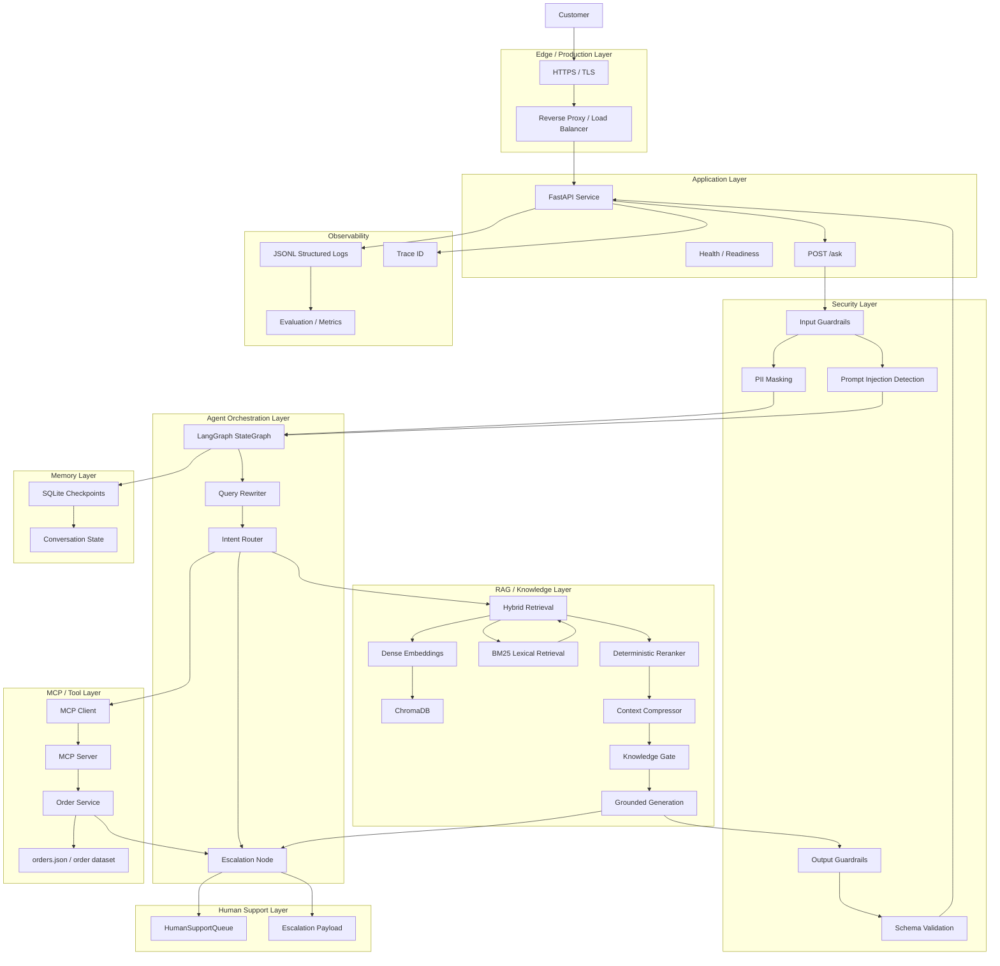

---

# 4. Layered Architecture

NykaaAssist can be understood as eight major layers.

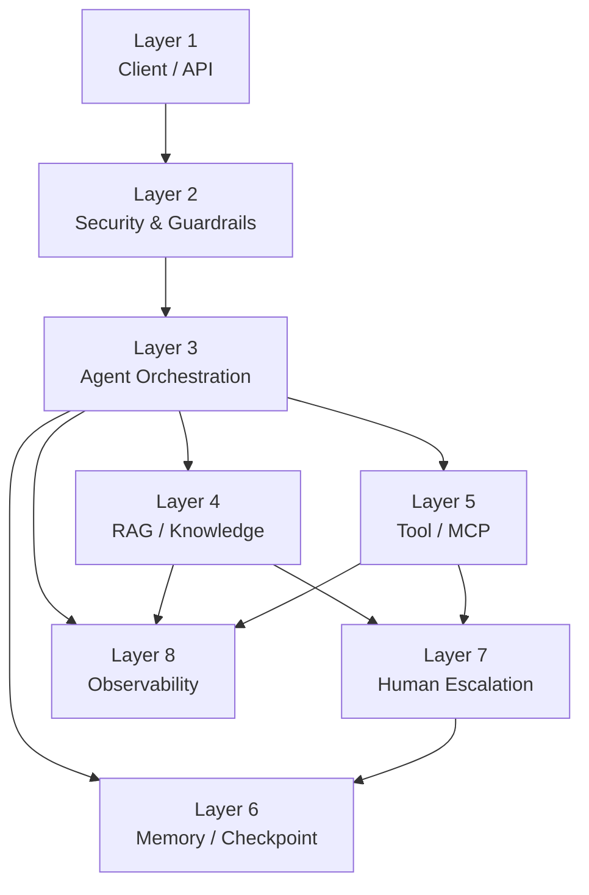

---

# 5. API and Service Layer

The FastAPI service is the external application boundary.

## Primary endpoints

```text
GET  /health
POST /ask
POST /add-document
```

## API flow

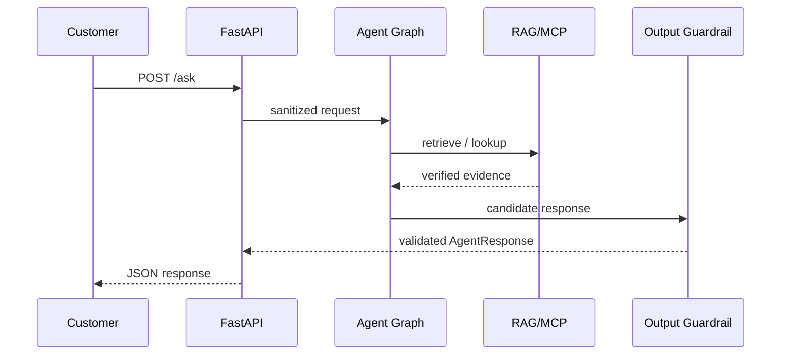

---

# 6. Agent Architecture

The agent is implemented as a LangGraph StateGraph.

The graph provides explicit state transitions instead of an uncontrolled autonomous loop.

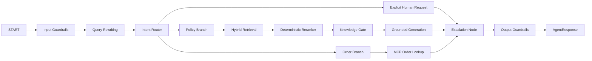

---

# 7. Agent State

The graph operates over structured state.

Conceptually:

```text
AgentState
│
├── user_query
├── normalized_query
├── rewritten_query
├── intent
│
├── retrieved_documents
├── reranked_documents
├── knowledge_gate_result
│
├── order_id
├── order_result
├── escalation_score
│
├── generated_answer
├── response_type
├── confidence
│
├── escalation_payload
├── trace_id
│
└── checkpoint metadata
```

The state is checkpointed so that interrupted workflows can resume safely.

---

# 8. Agent Request Lifecycle

A normal policy question follows:

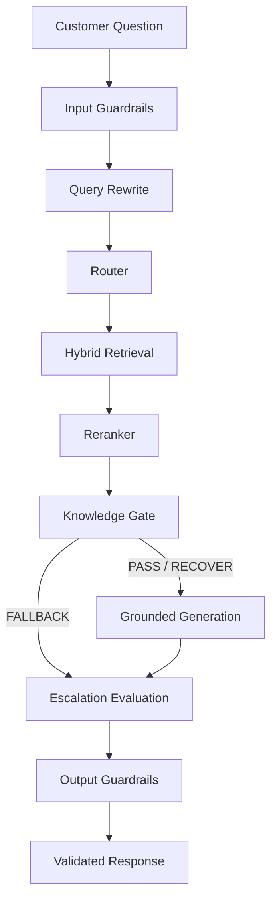

---

# 9. Router Layer

The router determines the high-level request type.

## Main intents

```text
POLICY
ORDER
EXPLICIT_ESCALATION
```

### Policy

Examples:

```text
What is Nykaa's return policy?
Can I cancel an order?
How long does delivery take?
```

### Order

Examples:

```text
Where is my order NYK-00001?
Check NYK-00025
```

### Explicit escalation

Examples:

```text
Connect me with a human.
I want to talk to an agent.
Please transfer me to support.
```

---

# 10. Query Rewriting Layer

Query rewriting improves retrieval quality without changing the customer's original intent.

```text
Original Query
      |
      v
Normalization
      |
      v
Intent / Context Analysis
      |
      v
Deterministic Rewrite
      |
      v
Retrieval Query
```

The system retains both:

```text
original_query
rewritten_query
```

The original customer query must never be discarded.

---

# 11. RAG Architecture

The RAG subsystem is responsible for policy and knowledge retrieval.

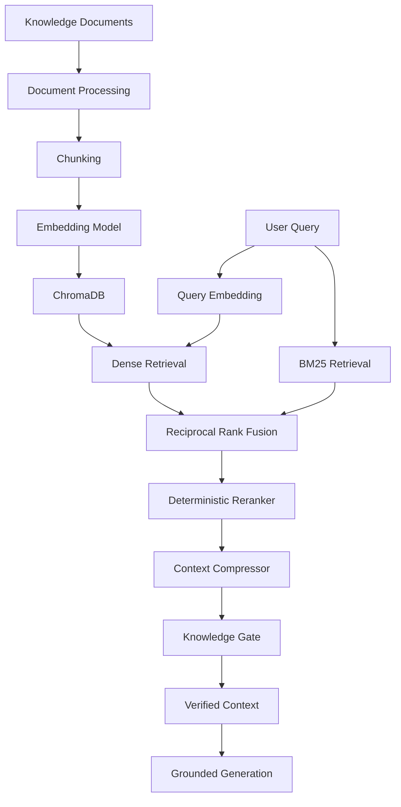

---

# 12. Document Processing Pipeline

Knowledge documents are transformed into searchable chunks.

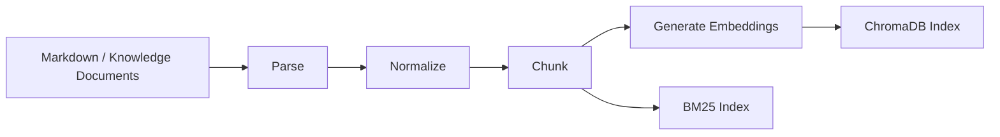

---

# 13. Hybrid Retrieval

NykaaAssist does not depend exclusively on semantic search.

It combines:

```text
Dense Retrieval
+
BM25 Lexical Retrieval
+
Reciprocal Rank Fusion
```

## Dense retrieval

Useful for:

* semantic similarity
* paraphrased questions
* conceptual matching

## BM25

Useful for:

* exact terms
* product names
* policy terminology
* keyword-heavy queries

## RRF

The retrieved rankings are merged using Reciprocal Rank Fusion.

Conceptually:

```text
Dense Results
      \
       \
        → RRF → Candidate Pool
       /
      /
BM25 Results
```

---

# 14. Reranking Layer

The deterministic reranker evaluates the candidate pool using multiple signals.

Conceptually:

```text
Reranker Score
│
├── Semantic Similarity
├── Query Coverage
├── Topic Affinity
└── RRF Score
```

The architecture intentionally keeps reranking deterministic.

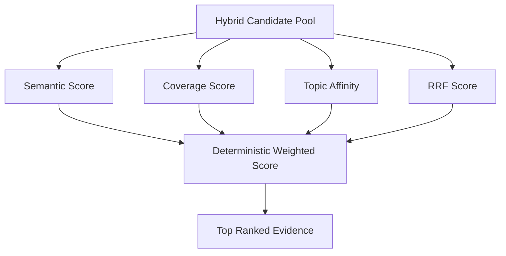

---

## 14.1 Context Compression Layer (Task 24)

Operating deterministically between the Reranker and the Knowledge Gate, the Context Compression layer extracts verbatim relevant sentences from the top-ranked candidate chunks while removing cognitive noise and irrelevant cross-category policy sentences.

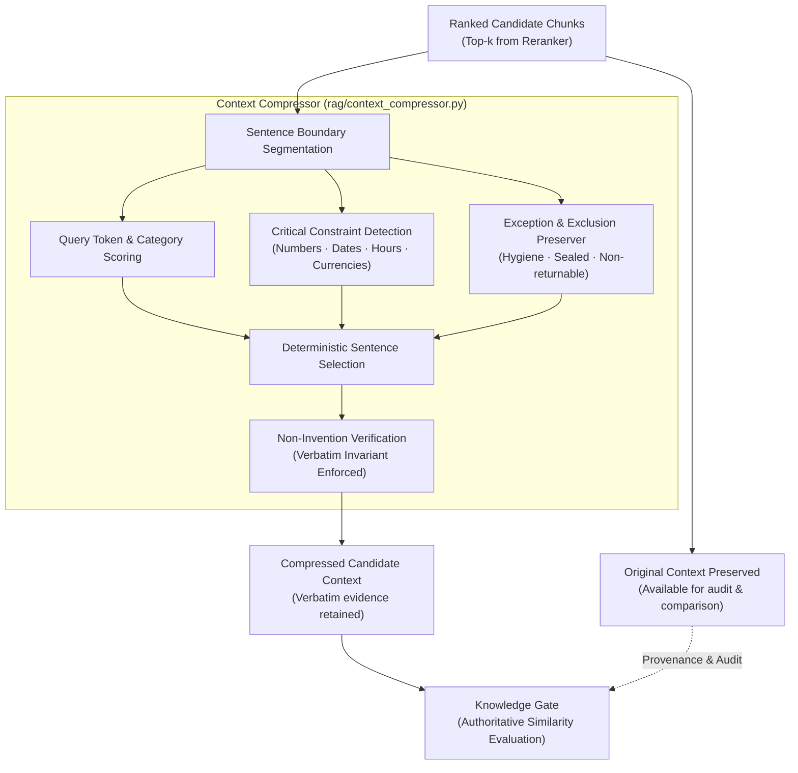

### Core Contracts & Invariants

1. **Strict Non-Invention Invariant**:
   - The compressor may remove information, but must **never** invent information.
   - 100% of characters in the compressed context originate verbatim from the retrieved source candidate chunks.
   - Paraphrasing, generative re-writing, and hallucinated policies are strictly prohibited.

2. **Original Context Preservation & Provenance**:
   - The original text is never destructively overwritten in-place without preserving provenance.
   - Each candidate preserves `original_text` alongside `text` (compressed), along with chunk `id`, `metadata`, `similarity`, `rrf_score`, `rerank_score`, `coverage_score`, and `topic_affinity`.
   - The system allows direct comparison between original and compressed context for debugging, evaluation, and observability.

3. **Critical Evidence Prioritization**:
   - Sentences containing policy numbers, time windows (e.g. "15 days", "24-48 hours"), monetary amounts, return conditions, and explicit exclusions (e.g. "opened seal", "hygiene reasons", "non-returnable") are given high-priority preservation weights.

4. **Fail-Open Fallback**:
   - If a query is empty, context is empty, candidates are malformed, or an unexpected exception occurs, the compressor immediately returns the original context untouched.

5. **Authoritative Downstream Signals**:
   - The Knowledge Gate similarity floor (`DEFAULT_MIN_SIMILARITY_FLOOR = 0.35`) and dense semantic similarity remain authoritative.

---

# 15. Knowledge Gate

The Knowledge Gate answers a critical question:

> **Do we actually have enough evidence to answer this question?**

Retrieval alone does not guarantee answerability.

The Knowledge Gate evaluates signals such as:

```text
Semantic similarity
Lexical coverage
Reranker score
Topic affinity
Candidate consensus
```

## Decision flow

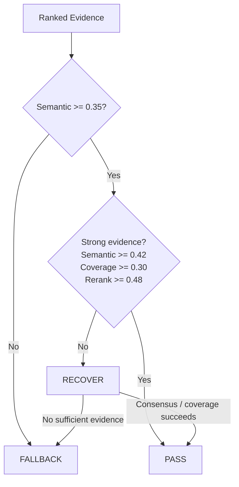

### Important architectural rule

The Knowledge Gate prevents the generation layer from confidently answering unsupported questions.

```text
Retrieval finds evidence
        ↓
Reranker orders evidence
        ↓
Context Compressor reduces irrelevant sentences
        ↓
Knowledge Gate verifies sufficiency
        ↓
Generation uses verified evidence
```

---

# 16. Grounded Generation

Grounded generation receives verified context.

The generator should not independently invent business policies.

```text
Verified Context
      +
Customer Question
      ↓
Grounded Generator
      ↓
Structured Candidate Response
```

If evidence is insufficient:

```text
No confident generation
        ↓
Deterministic fallback
        ↓
Possible escalation
```

## 16.1 Answer Verification Agent (Task 25)

The Answer Verification Agent is a deterministic, offline-safe post-generation verification layer placed in the LangGraph execution flow immediately after draft answer generation and before final delivery or escalation.

```mermaid
flowchart TD
    GEN["Draft Answer Generated<br/>(Policy RAG / Operational MCP)"]
    AV{"Answer Verification Agent<br/>(PASS / REVISE / REJECT)"}
    
    PASS_NODE["Verified Answer PASS<br/>Proceed to Output Guardrails / Escalation"]
    REVISE_NODE{"Attempt < 2?<br/>(Max 2 Attempts)"}
    REPAIR["Deterministic Evidence Repair<br/>Prune unsupported sentences / align numbers"]
    REJECT_NODE["Safe Rejection Node<br/>Emit safe fallback refusal & trigger escalation"]

    GEN --> AV
    AV -->|All claims supported & consistent| PASS_NODE
    AV -->|Partially grounded / repairable mismatch| REVISE_NODE
    AV -->|Direct contradiction / major hallucination / injection| REJECT_NODE

    REVISE_NODE -->|Yes| REPAIR
    REVISE_NODE -->|No (Exhausted)| REJECT_NODE
    REPAIR --> AV
```

### Decision Taxonomy and Execution Contract

1. **PASS**:
   - Every factual claim in the draft answer is verified against authoritative evidence (retrieved/compressed chunks for policy inquiries, or MCP tool results for operational inquiries).
   - Zero contradictions, zero unsupported claims, zero prompt injection directives.
   - Standard safe fallback refusal responses ("I don't have enough grounded information...") are confirmed safe and passed through.

2. **REVISE**:
   - The answer is partially grounded but contains repairable discrepancies (e.g. an unverified auxiliary sentence or a numerical mismatch against evidence where units match).
   - The system initiates deterministic repair (`repair_answer()`): prunes unsupported sentences while retaining verified ones, and replaces misaligned numbers with evidence numbers.
   - Bounded by a strict maximum of 2 verification attempts.

3. **REJECT**:
   - The answer contains material contradictions against evidence or tool outputs (e.g. claiming non-returnable categories can be returned, or claiming delivered status when tool reports placed).
   - The answer is completely unsupported, or prompt injection is detected in query/answer payload, or repair attempts are exhausted.
   - The unsupported draft is permanently discarded, safe fallback refusal is substituted, and human support escalation is triggered.

### Empirical Evaluation Metrics
- **Total Evaluated Benchmark Queries**: 40
- **Verification Decision Accuracy**: 85.0%
- **Unsupported Detection Rate**: 100.0%
- **Contradiction Detection Rate**: 100.0%
- **False PASS Rate (Target: 0.000)**: **0.0000**
- **Safe Rejection Rate**: 100.0%
- **Successful Repair Rate**: 100.0%
- **Unit & Integration Suite**: 20 / 20 PASSED (`agent/answer_verification_tests.py`)
- **Master Regression Suite**: 50 / 50 PASSED (`eval/final_regression.py`)

---

# 17. MCP Multi-Tool Architecture

MCP provides a clean, secure boundary between the AI agent orchestration layer and deterministic operational tools. In Task 21, this layer was expanded from a single tool into an authoritative 5-tool operational ecosystem:

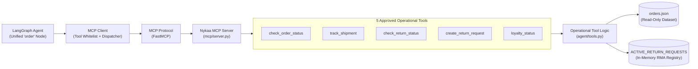

### Approved MCP Tools
1. **`check_order_status(record_id: str)`**: Authoritative order status, item details, delivery date, delay flag, and escalation score.
2. **`track_shipment(order_id: str)`**: Deep shipment tracking including carrier details, tracking numbers, transit checkpoints, and delay flags.
3. **`check_return_status(order_id: str)`**: Return window evaluation against 15-day policy, category rules, and delivery confirmation.
4. **`create_return_request(order_id: str, reason: str)`**: Controlled side-effecting return creation with eligibility verification, thread-safe in-memory RMA deduplication, and zero disk mutation.
5. **`loyalty_status(customer_id: str)`**: Customer loyalty points and tier evaluation derived deterministically from customer spend (`CUST-XXXXX` $\to$ `NYK-XXXXX`).

---

# 18. Multi-Tool Operational Intelligence Flow

Operational queries (order, shipment, return, loyalty) bypass RAG for authoritative transactional and status data, routing into the unified `"order"` operational dispatcher node:

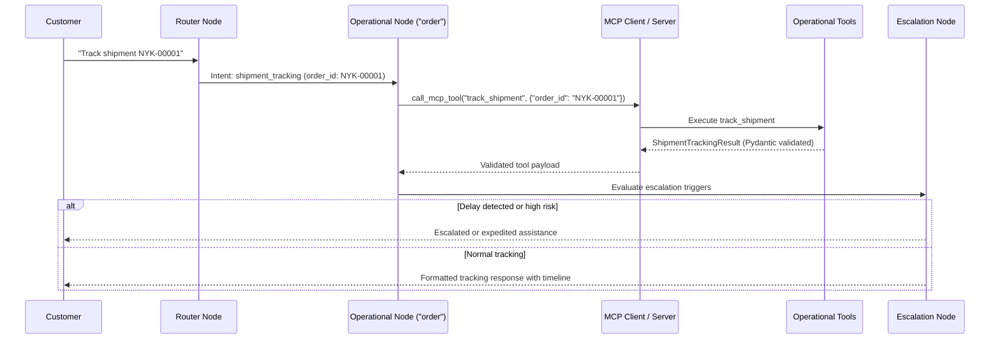

### In-Memory Return Idempotency
When a customer requests a return via `create_return_request(order_id, reason)`:
- System validates order existence and delivery status from `orders.json`.
- System verifies return window eligibility ($\le 15$ days).
- System checks `ACTIVE_RETURN_REQUESTS` in memory under thread lock:
  - If a return request already exists for this order, it returns the existing record with `status="Duplicate Request"`.
  - If not, it generates a deterministic RMA number `RMA-{ORDER_HASH}-{REASON_HASH}` and registers the request in memory.
  - The seeded dataset file `orders.json` is never mutated on disk.

---

# 19. Human-in-the-Loop Escalation

Task 20 introduces structured escalation.

## Escalation triggers

### Trigger 1 — Policy uncertainty

```text
Knowledge Gate = FALLBACK
```

### Trigger 2 — Severe order delay

```text
escalation_score >= 0.68
```

### Trigger 3 — Missing order

```text
status = "Not Found"
```

### Trigger 4 — Explicit human request

```text
Customer explicitly asks for human support
```

---

## Escalation architecture

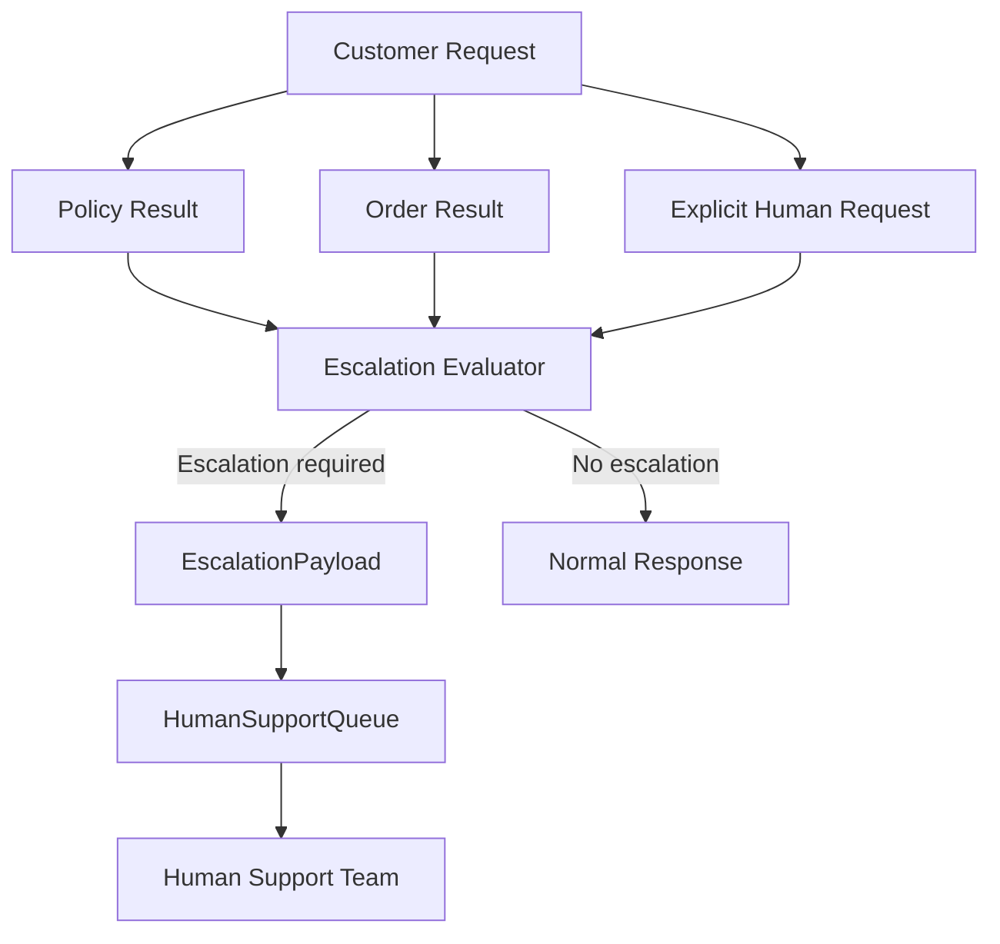

---

## Escalation Payload

The structured payload contains:

```text
requires_human
escalation_id
category
priority
reason
conversation_context
recommended_action
order_id
escalation_score
confidence
trace_id
```

---

## 19.1 Human Feedback / Verification Loop (Task 26)

Task 26 introduces a structured human feedback collection, SQLite persistence, and review-only triage architecture correlated with Task 25 verification traces:

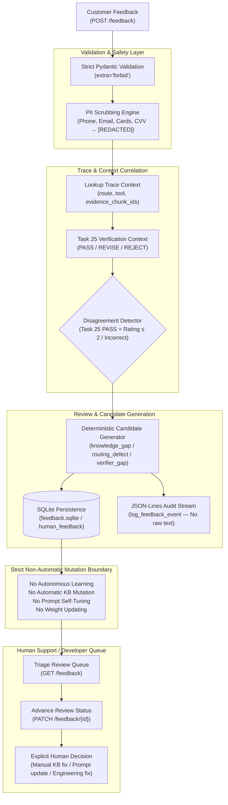

### Strict Non-Automatic Mutation Boundary

A foundational architectural requirement of NykaaAssist is that user feedback must **NEVER** automatically modify the running system. Specifically:

1. **Zero Autonomous Knowledge Base Mutation**: Feedback cannot write to `knowledge_base/*.md`, nor can it inject chunks directly into ChromaDB or Okapi BM25 indices.
2. **Zero Automated Prompt Tuning**: Feedback text cannot be interpolated into system prompts or template instructions.
3. **Zero Autonomous Model Weight Training**: Feedback ratings and comments are never fed into online training loops or automated gradient updates.
4. **Zero Policy Mutation**: Business rules, cancellation windows, and escalation score weights remain immutable unless changed through approved software engineering changes.
5. **Human-in-the-Loop Triage Only**: Low ratings, errors, and disagreement signals are converted into structured `ImprovementCandidate` records stored in SQLite for review by support engineers and domain administrators.

### Correlation with Task 25 Verification

The feedback service links directly to Task 25 Answer Verification context:
- When an answer is evaluated by Task 25, the decision (`PASS`, `REVISE`, `REJECT`), verification status, active route, tool called, and evidence chunk IDs are registered under the request's `trace_id`.
- When feedback is submitted with that `trace_id`, the system performs automated **Disagreement Detection**:
  - If Task 25 evaluated the answer as `PASS`, but the human reviewer gave a negative rating (`rating <= 2`) or flagged the answer as `"incorrect"`, `disagreement_flag` is set to `True`.
  - Disagreement records are prioritized in the review queue and generate a `verifier_gap` candidate recommendation.

### Review-Only Improvement Candidates

Three deterministic improvement candidate categories are generated:
- `knowledge_gap`: Generated when evidence chunks were missing, retrieved similarity was low, or policy coverage was incomplete. Recommends authoring or updating specific markdown policy documentation.
- `routing_defect`: Generated when an order query was misclassified as a policy query or vice-versa. Recommends intent router retraining or keyword adjustment.
- `verifier_gap`: Generated when the Task 25 Answer Verifier passed a response that customer feedback demonstrated was incorrect. Recommends refining claim verification rules or tightening evidence matching criteria.

### Review Queue Lifecycle

Feedback records advance through explicit, validated state transitions:
```text
pending  ───>  in_review  ───>  resolved
   │                             │
   └─────────────────────────────┴───>  dismissed
```
Transitions are audited and timestamped in `feedback.sqlite`.

---

# 20. Memory and Checkpointing

NykaaAssist uses SQLite checkpointing to preserve graph state.

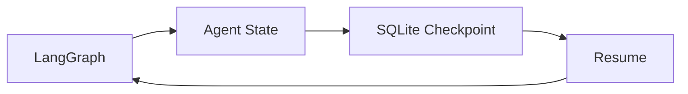

## Why checkpointing exists

Without checkpointing:

```text
Request
  ↓
Long workflow
  ↓
Process crash
  ↓
State lost
```

With checkpointing:

```text
Request
  ↓
State
  ↓
Checkpoint
  ↓
Process crash
  ↓
Restore
  ↓
Continue
```

---

# 21. Security Architecture

Security is implemented as multiple defensive layers.

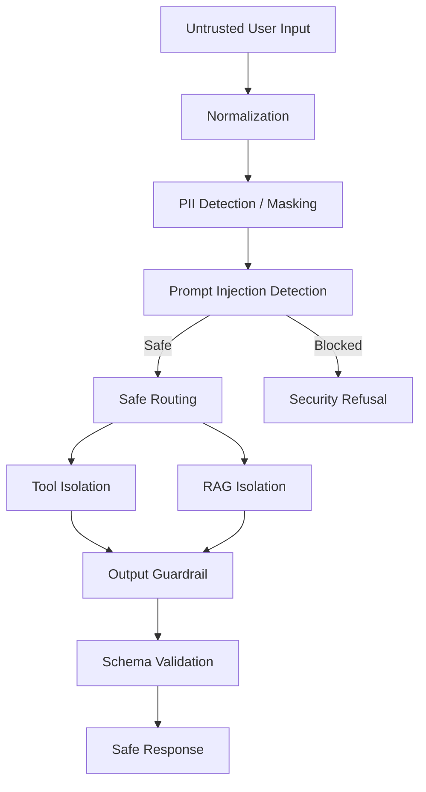

---

# 22. PII Protection

PII must not leak into:

* logs
* checkpoints
* escalation queue
* generated context
* internal traces

Potential PII includes:

```text
Phone numbers
Email addresses
Credit-card numbers
CVV
Passwords
Authentication secrets
API keys
Tokens
```

The architecture follows:

```text
Raw Input
   ↓
PII Detection
   ↓
Mask
   ↓
Safe Internal State
   ↓
Logs / Queue / Checkpoint
```

---

# 23. Prompt Injection Defense

Prompt injection is intercepted before it reaches the knowledge or tool layer.

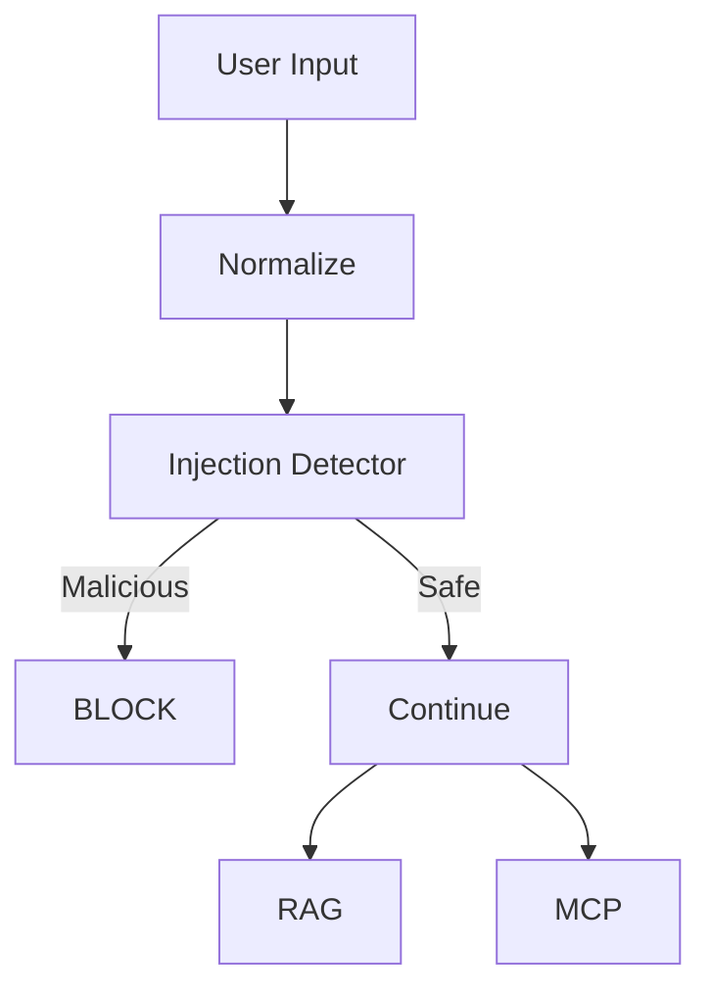

Blocked requests must:

```text
not execute tools
not query sensitive systems
not create escalation tickets
not reach generation
```

---

# 24. Output Guardrails

Every final response passes through output validation.

```text
Generated Response
       ↓
Groundedness Check
       ↓
Safety Validation
       ↓
Pydantic Validation
       ↓
AgentResponse
```

The response schema ensures that the API does not accidentally return malformed data.

---

# 25. Observability and Logging

The service uses structured JSON-lines logging.

Conceptually:

```json
{
  "timestamp": "...",
  "trace_id": "...",
  "event": "...",
  "status": "...",
  "latency_ms": 0
}
```

Logs must not contain raw PII or secrets.

---

## Trace ID

Every request receives a trace ID.

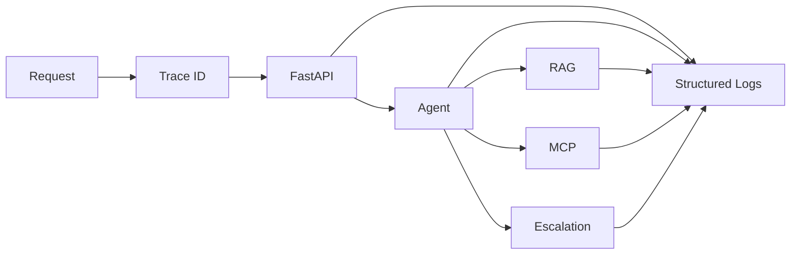

This makes one request traceable across the system without storing sensitive customer data.

---

# 26. Data Flow

The complete data flow is:

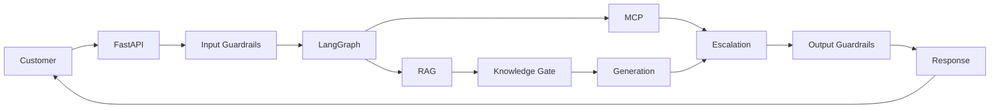

---

# 27. Failure and Recovery Paths

The architecture intentionally defines failure behavior and operational resilience.

## RAG failure

```text
Retrieval Failure
      ↓
Knowledge Gate
      ↓
Fallback
      ↓
Possible Human Escalation
```

## MCP failure & Retries

```text
MCP Network Drop / Transient Failure
      ↓
Retry Policy (max 3 attempts, 2.0x backoff)
      ├── Recovered → Continue Execution
      └── Exhausted
            ↓
      Timeout / Retry Exhausted Error
            ↓
      Safe Fallback Status
            ↓
      Escalation Triage to HumanSupportQueue
```

## Node & Global Timeouts

```text
Node Execution (Policy / Order)
      ↓
execute_with_timeout (10.0s Node / 30.0s Global)
      ├── Completed Within Budget → Continue
      └── Timeout Exceeded
            ↓
      Worker Threadpool Detached (wait=False)
            ↓
      Safe Fail-Closed Fallback Response
            ↓
      High-Priority Triage to HumanSupportQueue
```

## Validation failure

```text
Invalid Response
      ↓
Output Guardrail
      ↓
Reject
      ↓
Safe fallback
```

## Process failure

```text
Process Crash
      ↓
SQLite Checkpoint
      ↓
Restore State
      ↓
Resume
```

---

# 28. Live Hosting Architecture

For production deployment, the system can be hosted as a containerized service.

```mermaid
flowchart TB

    USER["Customer Browser / Mobile Client"]

    DNS["DNS"]

    CDN["CDN / Edge"]

    HTTPS["HTTPS"]

    LB["Load Balancer / Reverse Proxy"]

    APP1["NykaaAssist API Instance 1"]

    APP2["NykaaAssist API Instance 2"]

    RAGSTORE["Persistent RAG Storage"]

    CHECKPOINT["Persistent Checkpoint Storage"]

    MCP["MCP Service"]

    ORDERS["Order Data / Production Order Service"]

    LOGS["Centralized Logs"]

    MON["Monitoring"]

    USER --> DNS
    DNS --> CDN
    CDN --> HTTPS
    HTTPS --> LB

    LB --> APP1
    LB --> APP2

    APP1 --> RAGSTORE
    APP2 --> RAGSTORE

    APP1 --> CHECKPOINT
    APP2 --> CHECKPOINT

    APP1 --> MCP
    APP2 --> MCP

    MCP --> ORDERS

    APP1 --> LOGS
    APP2 --> LOGS

    LOGS --> MON
```

---

# 29. Production Request Flow

A live request travels through the infrastructure like this:

```mermaid
sequenceDiagram

    participant U as Customer
    participant E as Edge
    participant API as FastAPI
    participant G as Guardrails
    participant A as LangGraph
    participant R as RAG
    participant M as MCP
    participant H as Escalation
    participant O as Output Guardrail

    U->>E: HTTPS Request
    E->>API: Forward Request

    API->>G: Validate / Sanitize
    G->>A: Safe Request

    A->>A: Rewrite + Route

    alt Policy Question
        A->>R: Hybrid Retrieval
        R-->>A: Ranked Evidence
        A->>A: Knowledge Gate
        A->>A: Grounded Generation
    else Order Question
        A->>M: MCP Tool Call
        M-->>A: Order Result
    else Human Request
        A->>H: Explicit Escalation
    end

    A->>H: Evaluate Escalation
    H-->>A: Payload / No Escalation

    A->>O: Final Candidate
    O-->>API: Validated AgentResponse
    API-->>U: HTTPS JSON Response
```

---

# 30. Deployment Components

A production deployment can contain:

| Component                 | Responsibility                   |
| ------------------------- | -------------------------------- |
| Edge/CDN                  | TLS termination, edge protection |
| Reverse Proxy             | Routing and request handling     |
| FastAPI                   | Public application API           |
| LangGraph                 | Agent orchestration              |
| ChromaDB                  | Vector retrieval                 |
| BM25 Index                | Lexical retrieval                |
| Reranker                  | Evidence ordering                |
| Knowledge Gate            | Evidence sufficiency             |
| MCP Client                | Tool communication               |
| MCP Server                | Tool exposure                    |
| Order Service             | Order information                |
| SQLite / Persistent Store | Checkpoint state                 |
| Queue                     | Human escalation                 |
| Structured Logs           | Observability                    |
| Monitoring                | Health and metrics               |

---

# 31. Scaling Strategy

## Development

```text
Single machine
│
├── FastAPI
├── LangGraph
├── ChromaDB
├── SQLite
└── MCP Server
```

---

## Small production deployment

```text
Load Balancer
      |
  +---+---+
  |       |
API-1   API-2
  |       |
  +---+---+
      |
Persistent Storage
```

---

## Larger production architecture

For horizontal scaling:

```text
                    Load Balancer
                         |
          +--------------+--------------+
          |              |              |
       API-1          API-2          API-3
          |              |              |
          +--------------+--------------+
                         |
              Shared Persistent Layer
                         |
        +----------------+----------------+
        |                |                |
   Vector Store     Checkpoint DB    Order Service
```

The in-memory `HumanSupportQueue` is suitable for the local deterministic architecture.

For a multi-instance production support queue, it should eventually be replaced by a shared durable queue such as:

```text
Redis
Kafka
RabbitMQ
Cloud Queue
Database-backed queue
```

That replacement should be treated as a future production scaling concern rather than silently changing the deterministic local architecture.

---

# 32. Production Security

Production traffic should use:

```text
HTTPS
TLS
Secure headers
Environment secrets
Authentication / authorization
Rate limiting
Request size limits
Input validation
PII masking
Prompt injection defense
Tool isolation
Structured logging
```

Secrets must never be stored directly in source code.

Production credentials should be supplied through:

```text
Environment variables
Secret managers
Deployment platform secrets
```

---

# 33. Environment Configuration

Conceptually:

```text
ENVIRONMENT=production

MOCK_LLM=0

ENABLE_KNOWLEDGE_GATE=1

VECTOR_STORE_PATH=<persistent-storage>

CHECKPOINT_PATH=<persistent-storage>

MCP_SERVER_URL=<internal-service>

LOG_LEVEL=INFO
```

Development may use deterministic mock behavior.

Production can enable the configured LLM only through explicit environment configuration.

---

# 34. Repository Architecture

The repository is organized by responsibility.

```text
chole-bhaature/
│
├── agent/
│   ├── graph.py
│   ├── guardrails.py
│   ├── memory.py
│   ├── rewrite.py
│   ├── reranker.py
│   ├── schema.py
│   ├── escalation.py
│   └── test_*.py
│
├── rag/
│   ├── chunking.py
│   ├── embed_index.py
│   ├── lexical.py
│   ├── hybrid.py
│   ├── reranker.py
│   ├── knowledge_gate.py
│   ├── generate.py
│   └── evaluate_retrieval.py
│
├── mcp/
│   ├── server.py
│   └── client.py
│
├── service/
│   ├── main.py
│   └── logging_utils.py
│
├── resilience/
│   └── checkpoint_resume.py
│
├── eval/
│   ├── test_queries.json
│   ├── rag_triad.py
│   └── *_evaluation.py
│
├── transcripts/
│
├── logs/
│
├── orders.json
├── orders.csv
├── dataset.py
│
├── PRD.md
├── TRD.md
├── PHASES.md
├── README.md
├── AI_INSTRUCTION.md
└── AI_ARCHITECTURE.md
```

---

# 35. Technology Stack

## Application

```text
Python
FastAPI
Pydantic
```

## Agent

```text
LangGraph
Deterministic routing
State-based orchestration
```

## RAG

```text
ChromaDB
Sentence Transformers
BM25
Reciprocal Rank Fusion
Deterministic Reranker
Knowledge Gate
```

## Tooling

```text
Model Context Protocol
MCP Client
MCP Server
```

## Persistence

```text
SQLite
Checkpointing
```

## Security

```text
PII masking
Prompt injection detection
Input normalization
Output validation
Schema validation
```

## Observability

```text
JSONL logging
Trace IDs
Evaluation scripts
RAG Triad
Retrieval metrics
```

---

# 36. Architecture Decisions

## ADR-01 — LangGraph for orchestration

**Decision:** Use LangGraph StateGraph.

**Reason:**

* explicit state
* deterministic transitions
* checkpoint support
* interrupt/resume
* testable nodes

---

## ADR-02 — Hybrid Retrieval

**Decision:** Dense + BM25 + RRF.

**Reason:**

Dense retrieval handles semantic similarity while BM25 handles exact terminology.

---

## ADR-03 — Deterministic Reranker

**Decision:** Use deterministic multi-feature reranking.

**Reason:**

The system should remain reproducible and testable.

---

## ADR-04 — Knowledge Gate

**Decision:** Verify evidence before generation.

**Reason:**

High retrieval similarity alone does not guarantee answerability.

---

## ADR-05 — MCP for operational tools

**Decision:** Access order operations through MCP.

**Reason:**

Provides a clean boundary between the agent and operational tools.

---

## ADR-06 — SQLite checkpointing

**Decision:** Persist agent state using SQLite.

**Reason:**

Supports deterministic local development and interrupt/resume semantics.

---

## ADR-07 — Human escalation

**Decision:** Implement escalation as a dedicated agent node.

**Reason:**

Separates business triage from output safety validation.

---

# 37. End-to-End Example

Consider:

```text
"Where is my order NYK-00001?"
```

## Step 1 — API

FastAPI receives the request.

```text
POST /ask
```

---

## Step 2 — Input Guardrails

The request is normalized and checked.

```text
PII → masked if required
Injection → checked
```

---

## Step 3 — Query Rewriting

The system identifies:

```text
Intent = ORDER
Order ID = NYK-00001
```

---

## Step 4 — Router

The router selects:

```text
ORDER branch
```

---

## Step 5 — MCP

The agent calls:

```text
check_order_status(NYK-00001)
```

---

## Step 6 — Order Service

The order service returns structured data.

```text
order_id
status
created_at
expected_delivery
delayed_shipment_flag
escalation_score
```

---

## Step 7 — Escalation Evaluation

Suppose:

```text
escalation_score = 0.71
```

Since:

```text
0.71 >= 0.68
```

the system creates:

```text
category = ORDER_DELAY
priority = HIGH
requires_human = true
```

---

## Step 8 — Queue

The structured escalation payload is placed into:

```text
HumanSupportQueue
```

---

## Step 9 — Output Guardrails

The customer response is validated.

---

## Step 10 — Customer

The customer receives a safe response explaining the situation and that the issue has been escalated.

---

# 38. Summary

NykaaAssist is designed as a **controlled AI system rather than an uncontrolled chatbot**.

The architecture can be summarized as:

```mermaid
flowchart TB

    CUSTOMER["Customer"]

    SECURITY["SECURITY"]
    AGENT["AGENT ORCHESTRATION"]
    KNOWLEDGE["KNOWLEDGE / RAG"]
    TOOLS["TOOLS / MCP"]
    MEMORY["MEMORY"]
    ESCALATION["HUMAN ESCALATION"]
    VALIDATION["OUTPUT VALIDATION"]

    CUSTOMER --> SECURITY
    SECURITY --> AGENT

    AGENT --> KNOWLEDGE
    AGENT --> TOOLS
    AGENT --> MEMORY

    KNOWLEDGE --> ESCALATION
    TOOLS --> ESCALATION

    ESCALATION --> VALIDATION
    VALIDATION --> CUSTOMER
```

The core philosophy is:

```text
                ┌───────────────────────┐
                │       CUSTOMER        │
                └───────────┬───────────┘
                            │
                            ▼
                ┌───────────────────────┐
                │       SECURITY        │
                │  PII + Injection      │
                └───────────┬───────────┘
                            │
                            ▼
                ┌───────────────────────┐
                │       AGENT           │
                │      LangGraph        │
                └───────┬───────┬───────┘
                        │       │
              ┌─────────┘       └─────────┐
              ▼                           ▼
      ┌───────────────┐           ┌───────────────┐
      │      RAG      │           │      MCP      │
      │ Knowledge     │           │ Operational   │
      │ Retrieval     │           │ Tools         │
      └───────┬───────┘           └───────┬───────┘
              │                           │
              └─────────────┬─────────────┘
                            ▼
                ┌───────────────────────┐
                │   KNOWLEDGE / RISK    │
                │       DECISION        │
                └───────────┬───────────┘
                            │
                ┌───────────┴───────────┐
                ▼                       ▼
          ┌───────────┐           ┌─────────────┐
          │  ANSWER   │           │   HUMAN     │
          │           │           │ ESCALATION  │
          └─────┬─────┘           └──────┬──────┘
                │                        │
                └──────────┬─────────────┘
                           ▼
                ┌───────────────────────┐
                │  OUTPUT GUARDRAILS    │
                │  Schema + Grounding   │
                └───────────┬───────────┘
                            │
                            ▼
                ┌───────────────────────┐
                │       CUSTOMER        │
                └───────────────────────┘
```

## Final Architecture Principle

> **Retrieve what is known. Verify what is retrieved. Never invent what is unknown. Protect what is sensitive. Escalate what requires a human.**

That is the architectural foundation of NykaaAssist.
