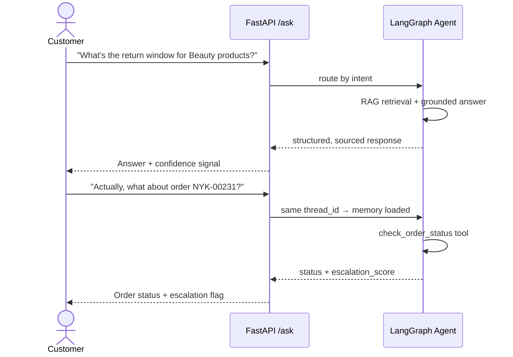

# Product Requirements Document (PRD) — NykaaAssist

## 1. Problem Statement

Nykaa's customer-support team fields a high volume of repetitive queries — return windows,
refund timelines, delivery SLAs, order status — that don't require human judgment but
currently escalate to a human agent by default. This creates avoidable wait times for
customers and avoidable load on support staff.

**NykaaAssist** solves this by combining a grounded knowledge base (for policy questions)
with a live order-lookup tool (for order-specific questions), orchestrated by a single
agent that knows which one to use, remembers context across a conversation, and refuses to
guess when it doesn't have grounded information.

## 2. Goals

1. Answer policy questions using **only** retrieved, grounded context — never hallucinate.
2. Answer order-status questions with a computed, justified **escalation signal**, not a
   raw status dump.
3. Maintain conversation memory across turns within a session.
4. Protect customer PII in both the live request path and the logs.
5. Be demonstrably resilient to transient failures, timeouts, and mid-run interruptions.
6. Be operable and gradable **without any paid API key** (`MOCK_LLM` default).

### Non-Goals

- Real payment processing or actual order fulfillment integration.
- Masking free-text PII (customer name, delivery address) — explicitly out of scope per
  brief, since no reliable pattern exists to match under a keyless masker.
- A production-grade UI — this capstone is a backend/API deliverable only.
- Multi-language support (English-only knowledge base for this version).

## 3. Personas

| Persona | Need |
|---|---|
| **Customer** | Wants an instant, accurate answer to "can I return this" or "where's my order" without waiting in a queue. |
| **Support Agent** | Wants the agent to pre-answer routine questions and flag only genuinely risky orders (via `escalation_score`) for human attention. |
| **Grader / Reviewer** | Wants to reproduce every result deterministically from a public repo with zero setup friction. |

## 4. User Stories

| # | As a... | I want to... | So that... |
|---|---|---|---|
| U1 | Customer | Ask "what's the return window for footwear?" | I get a grounded, sourced answer instantly |
| U2 | Customer | Ask "where is order X" | I get live status + a sense of whether it needs escalation |
| U3 | Customer | Ask a follow-up in the same conversation | The agent remembers what we already discussed |
| U4 | Customer | Accidentally paste my phone number | It never appears unmasked in logs or model input |
| U5 | Support Agent | See a numeric `escalation_score` | I can triage without reading every order manually |
| U6 | Grader | Interrupt a run mid-way and resume it | I can verify checkpointing works without re-running completed steps |
| U7 | Grader | Call the order tool from a separate MCP client | I can verify the tool is protocol-standardized, not hardcoded into the agent |
| U8 | Customer | Ask a detailed policy question with multiple caveats | I get a focused answer based on relevant policy rules without distracting irrelevant sentences |
| U9 | Customer / Reviewer | Submit structured feedback on an agent response | Low ratings and contradictions are captured into a review queue for human evaluation without mutating production rules |

## 5. Functional Requirements

| Ref | Requirement | Maps to Brief |
|---|---|---|
| FR-1 | Generate ≥40 deterministic orders covering every category/status value, with delayed-shipment rate in 10–30% | Part 1, Task 1 |
| FR-2 | Author ≥12 knowledge-base documents covering every required topic | Part 1, Task 2 |
| FR-3 | Chunk + embed + index documents under two strategies in two ChromaDB collections | Part 1, Task 3 |
| FR-4 | Generate grounded answers from top-k retrieved chunks; empirically calibrated fallback threshold | Part 1, Task 4 |
| FR-5 | Score both chunking strategies with Precision@3 / Recall@3 and recommend one | Part 1, Task 5 |
| FR-6 | Compute a designed `escalation_score` combining delay + recency | Part 2, Task 6 |
| FR-7 | LangGraph agent with ≥4 nodes and conditional routing to both tools | Part 2, Task 7 |
| FR-8 | Persisted, multi-turn memory with a clean-reset control case | Part 2, Task 8 |
| FR-9 | Every response validated against a structured JSON Schema | Part 2, Task 9 |
| FR-10 | Input PII masking + prompt-injection detection; output groundedness refusal | Part 2, Task 10 |
| FR-11 | ≥2 FastAPI endpoints with Pydantic models | Part 3, Task 11 |
| FR-12 | JSON-Lines structured logs with trace ID, PII masked before write | Part 3, Task 12 |
| FR-13 | RAG-triad scoring (context relevance, groundedness, answer relevance) across 15 queries | Part 3, Task 13 |
| FR-14 | `check_order_status` exposed via `fastmcp`, called from a separate client | Part 4, Task 14 |
| FR-15 | SQLite checkpointing with proven no-re-execution resume | Part 4, Task 15 |
| FR-16 | Controlled Query Rewriting layer (intent clarification, pronoun resolution, raw query preservation, guardrail isolation) | Phase 5, Task 16 |
| FR-17 | Hybrid Retrieval (Dense ChromaDB vector + sparse pure-Python Okapi BM25 with Cormack Reciprocal Rank Fusion k=60, Top-1 accuracy +25%) | Phase 5, Task 17 |
| FR-18 | Deterministic Cross-Feature Reranker (Dense similarity, lexical token coverage, topic affinity, RRF prior with 3-tier tie-breaking over Top-10 pool) | Phase 5, Task 18 |
| FR-19 | Knowledge Gate Evidence Verification (Deterministic multi-signal gate evaluating dense similarity floor 0.35, token coverage 0.30, rerank score 0.48, topic affinity, candidate margin, with 1-step bounded recovery and PASS/RECOVER/FALLBACK decisions; 100% fallback recall, 0% false fallbacks, 0 hallucinations) | Phase 6, Task 19 |
| FR-20 | Human-in-the-Loop Escalation (Dedicated LangGraph escalation node, strict Pydantic EscalationPayload, 4 deterministic triggers [policy uncertainty, severe order delay >= 0.68, missing order, explicit customer request], PII-sanitized conversation context, zero tickets on prompt injection, bounded thread-safe in-memory HumanSupportQueue capacity 1000, 100% precision and recall on 35-query benchmark) | Phase 6, Task 20 |
| FR-21 | Multi-Tool Operational MCP Ecosystem (5 approved tools [check_order_status, track_shipment, check_return_status, create_return_request, loyalty_status] dispatched via unified LangGraph "order" node; strict Pydantic schemas with extra="forbid"; thread-safe in-memory return idempotency with deterministic RMA; deterministic customer spend-to-points loyalty mapping; 100% routing, schema validity, and security zero-call rate on 40-query benchmark) | Phase 7, Task 21 |
| FR-22 | Operational Resilience, Timeouts & Retries (Bounded retries with exponential backoff and jitter, per-node timeout 10.0s, global timeout 30.0s, safe triage to `HumanSupportQueue`, zero duplicate RMAs under retry replay, 100% benchmark pass rate) | Phase 7, Task 22 |
| FR-23 | Master System Integration & Final Regression (FastAPI service polish with 5-tool operational dispatch and PII masking, 16-point integration suite, 50-query master regression benchmark with 100% pass rate, 0 duplicate RMAs, 0 PII leaks, HITL precision/recall 1.000, and full regression across Tasks 1–22) | Phase 7, Task 23 |
| FR-24 | Context Compression for Grounded RAG (Deterministic sentence-level context reduction between Reranker and Knowledge Gate; strict Non-Invention Invariant where compressed text contains verbatim source sentences only; preserves policy conditions, numerical constraints, time windows, and exclusions; preserves candidate provenance and similarity floor 0.35; fail-open fallback to uncompressed context on anomalies or empty results; verified across 18 unit/integration tests and measured benchmark reducing context by 11.1% while preserving 100% Top-1 accuracy and 100% Groundedness) | Phase 8, Task 24 |
| FR-25 | Answer Verification Agent (Deterministic, offline-safe post-generation verification agent placed between answer generation and human escalation; implements three-way decision taxonomy [PASS, REVISE, REJECT]; treats MCP tool outputs as authoritative for operational facts; verifies policy claims against retrieved/compressed evidence; executes deterministic evidence-based repair on repairable numerical mismatches or auxiliary claims [max 2 attempts]; safe rejection to fallback refusal and human escalation upon irrecoverable or contradicted claims; achieves 0.0000 False PASS rate, 100% contradiction detection, 100% safe rejection, and 100% repair success across 40 benchmark queries; 20/20 unit/integration tests passed) | Phase 8, Task 25 |
| FR-26 | Human Feedback / Verification Loop (Structured feedback models with extra="forbid"; SQLite human_feedback persistence; mandatory PII scrubbing before persistence and logging; trace correlation with Task 25 verification status, route, tool, and evidence; automated disagreement detection between Task 25 PASS and human dissatisfaction; review-only improvement candidate generation [knowledge_gap, routing_defect, verifier_gap]; REST endpoints POST/GET/PATCH /feedback; strictly review-only boundary where feedback NEVER mutates production knowledge, models, prompts, or policies automatically; 25/25 unit tests passed; 20-case evaluation benchmark with 100% validation accuracy, 100% PII scrubbing rate, 0.000 PII leak rate, 100% disagreement detection, and 100% candidate precision) | Phase 9, Task 26 |

## 6. User Journey (Happy Path)

## 7. Success Metrics / Acceptance Criteria

Directly inherited from the brief's acceptance criteria (see `README.md` §6 for the
reproduction parameters that must be filled in):

- Dataset structural thresholds met (category counts, status coverage, 10–30% delay band).
- Both chunking strategies indexed and scored on the same ≥5 queries with visible per-query
  arithmetic.
- ≥5 in-scope + 1 out-of-scope query demo, fallback correctly triggered.
- Graph demonstrably routes to **both** tools on different queries.
- Multi-turn memory shown present, then shown absent in a fresh thread.
- Both guardrail classes demonstrably firing on a deliberate test case each.
- 15/15 test queries scored on all three RAG-triad dimensions, plus three averages.
- MCP round trip succeeds for ≥2 record IDs from a separate client process.
- Checkpoint resume provably skips already-completed nodes.
- Retry recovers a simulated transient failure; both timeout classes fire cleanly.
- Task 22 Operational Resilience: bounded retries with exponential backoff & deterministic jitter, clean thread pool node-level timeout (10.0s), global graph timeout (30.0s), zero duplicate RMAs under retry replay, and automatic escalation triage to HumanSupportQueue.
- Task 23 Master System Integration: 16/16 integration tests passed, 50/50 master regression benchmark queries passed, 0 duplicate RMAs, 0 PII leaks, HITL precision & recall = 1.000, and 100% pass rate across historical test suites (Tasks 1–22).
- Task 24 Context Compression: deterministic sentence-level context reduction operating between Reranker and Knowledge Gate; strictly enforces Non-Invention Invariant (100% verbatim source sentences, 0 hallucinated facts); preserves candidate metadata, provenance, and authoritative semantic similarity floor (0.35); fail-open fallback on empty query, empty context, or compressor exceptions; 18/18 unit/integration tests passed; measured 11.1% context character and word reduction while maintaining 100% Groundedness and Top-1 accuracy.
- Task 25 Answer Verification Agent: post-generation verification agent enforcing three-way PASS/REVISE/REJECT decision taxonomy; authoritative tool consistency and retrieved-evidence policy grounding; bounded evidence-based repair (max 2 attempts); fail-closed safe rejection to fallback refusal; 0.0000 False PASS rate, 100% contradiction detection, 100% safe rejection, and 100% repair success across 40 benchmark queries; 20/20 unit/integration tests passed.
- Task 26 Human Feedback / Verification Loop: Pydantic structured feedback schema; SQLite persistence in feedback.sqlite; PII scrubbing of all comments before storage/logging (phone, email, card, CVV); trace correlation with Task 25 verification context; automated disagreement signal when agent passed but customer gave negative feedback; review workflow transitions (pending -> in_review -> resolved/dismissed); non-automatic mutation boundary preventing autonomous changes to KB, weights, prompts, or policies; 25/25 unit tests passed; 20-case evaluation benchmark with 100% validation accuracy, 0.000 PII leak rate, and 100% improvement candidate precision.

## 8. Assumptions & Constraints

- All LLM-dependent behavior (generation, judging) must work under `MOCK_LLM` with zero
  network access; a real LLM is optional and additive only.
- Embeddings and vector search run fully locally (SentenceTransformers + ChromaDB).
- No paid account, credit card, or cloud service is required anywhere in the stack.
- Only fabricated data is used for names, addresses, phone numbers, and card numbers.

## 9. Risks & Mitigations

| Risk | Mitigation |
|---|---|
| Delayed-shipment percentage lands outside 10–30% on first generation | Regenerate via seed/weight changes, never hand-edit records (per brief) |
| Untested similarity threshold fails to separate in/out-of-scope queries | Empirically measure both clusters before choosing threshold (Task 4) |
| Flawed or hallucinated draft answer reaches user despite retrieval | Answer Verification Agent (Task 25) performs post-generation claim checking, auto-repair, and safe rejection to fallback |
| Customer feedback introduces prompt injection or attempts to mutate policies | Strict non-automatic boundary: feedback is treated purely as inert review data, scrubbed of PII, and routed to an internal review queue with zero automated mutation of KB, weights, or prompts |
| Escalation score is a disguised boolean OR | Formula must be a genuine weighted combination, justified against the dataset's own distribution |
| Checkpoint resume accidentally re-executes completed nodes | Explicit printed proof of loaded-vs-executed nodes required in transcript |
| PII leaks into logs | Same masking function applied to both the model-input path and the logging path |
| Hanging external or local operations stall LangGraph pipeline | Strict per-node timeout (`execute_with_timeout`) and global graph budget (`GlobalTimeoutGuard`) with safe customer fallback |
| Flaky network drops cause false negative customer escalations | Bounded retries with exponential backoff and jitter (`RetryPolicy`, recovery $\ge$ 95%) |
| Retry replays trigger duplicate return authorizations (RMAs) | In-memory thread-safe `ACTIVE_RETURN_REQUESTS` registry guaranteeing 0 duplicate RMAs |
| Context compression accidentally removes critical policy exception or invents rules | Deterministic sentence boundary scoring with explicit numerical/date and exception clause detectors, strict non-invention validator, and fail-open to original context |

