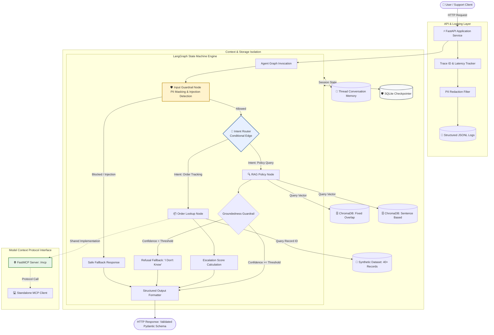
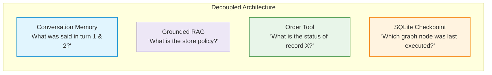
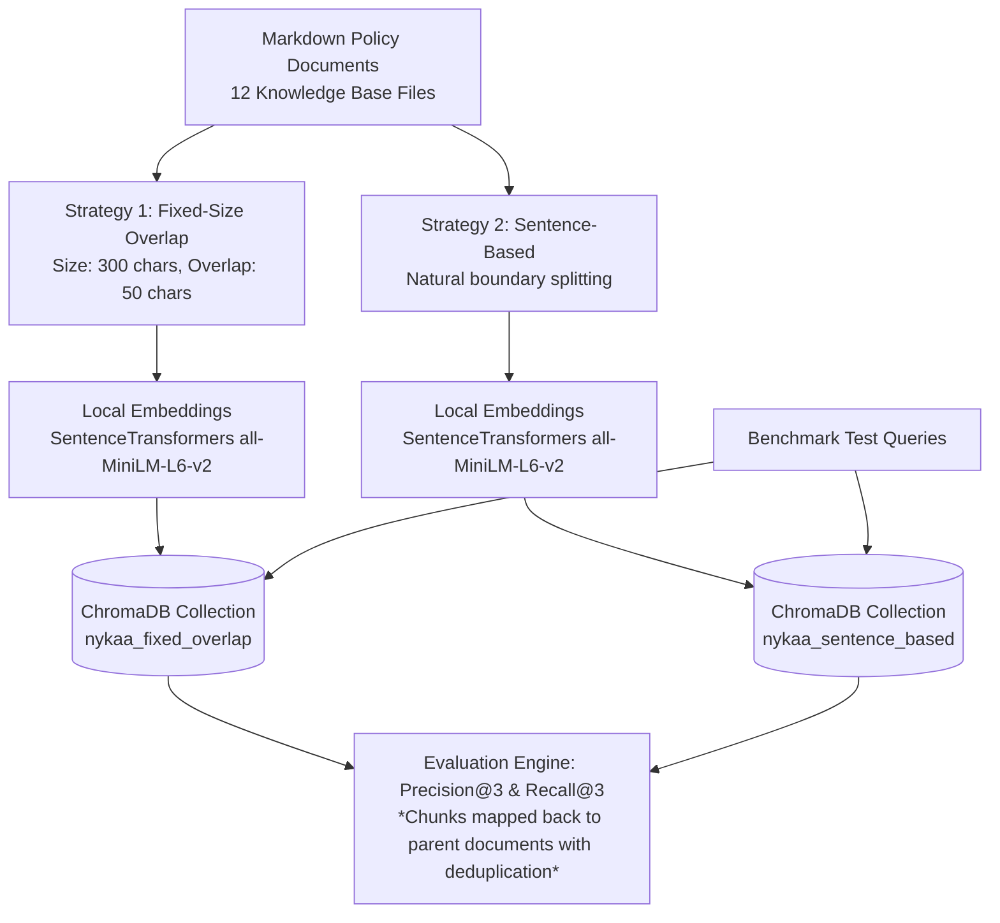
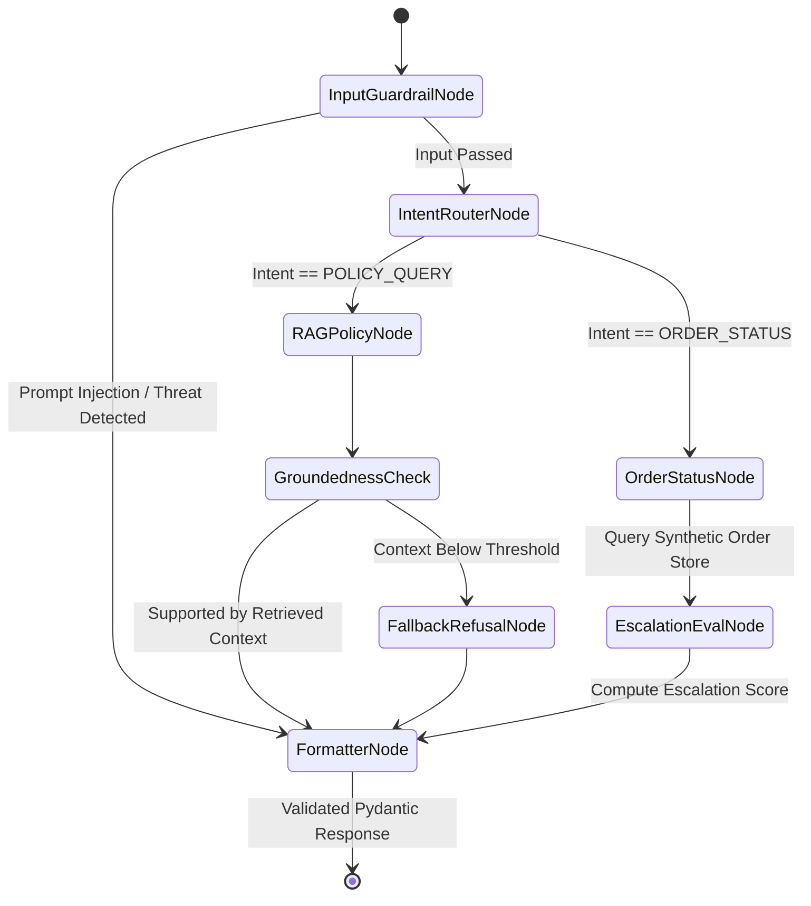
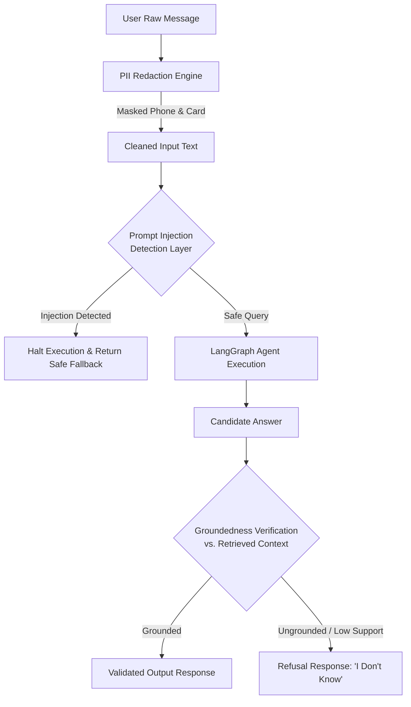
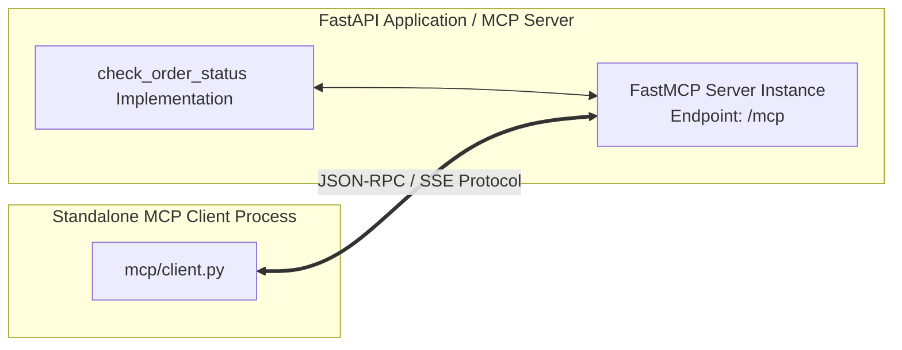
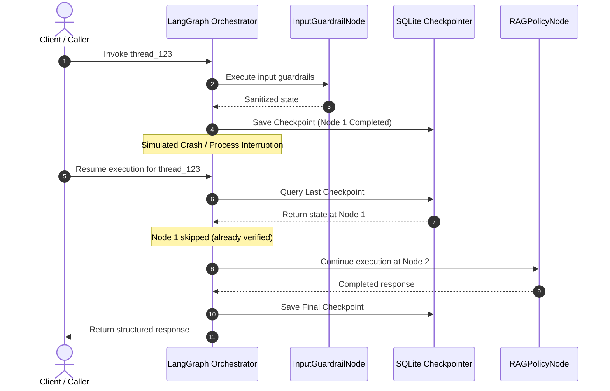
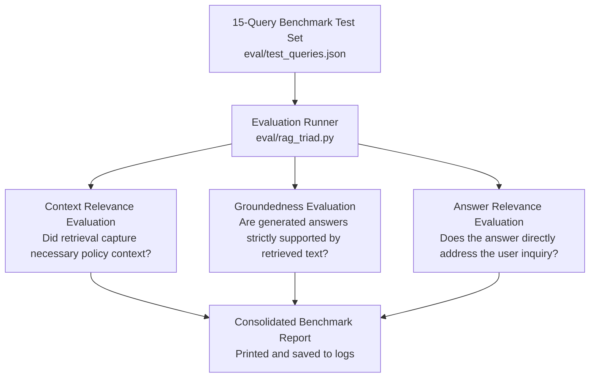

# Nykaa Domain Support Agent (LangGraph)

[](https://www.python.org/)
[](https://www.langchain.com/)
[](https://fastapi.tiangolo.com/)
[](https://www.trychroma.com/)
[](https://modelcontextprotocol.io/)
[](LICENSE)

NykaaAssist is a capstone implementation of a grounded, stateful e-commerce support agent combining Retrieval-Augmented Generation (RAG), LangGraph multi-agent orchestration, structured synthetic order lookups, security guardrails, FastAPI web services, Model Context Protocol (MCP) tool exposure, SQLite state checkpointing, and resilience mechanisms.

> [!IMPORTANT]
> **Scope & Operational Boundary Disclaimer**  
> **Public Nykaa Research ≠ Capstone Knowledge Base ≠ Live Nykaa Internal Systems**  
> This project is an academic capstone implementation designed for deterministic evaluation. It does **not** connect to, access, or interface with real Nykaa internal customer databases, live order tracking systems, or proprietary internal APIs. All order records, user profiles, and operational scenarios are synthetically generated under controlled parameters.

---

## 📋 Table of Contents

- [1. System Architecture](#1-system-architecture)
- [2. Architectural Concepts & Separation of Concerns](#2-architectural-concepts--separation-of-concerns)
- [3. Synthetic Order Dataset](#3-synthetic-order-dataset)
- [4. Knowledge Base Specification](#4-knowledge-base-specification)
- [5. Retrieval-Augmented Generation (RAG) & Dual Chunking](#5-retrieval-augmented-generation-rag--dual-chunking)
- [6. LangGraph Orchestrator & State Flow](#6-langgraph-orchestrator--state-flow)
- [7. Order Status Tool & Escalation Logic](#7-order-status-tool--escalation-logic)
- [8. Security, Privacy & Guardrail Pipeline](#8-security-privacy--guardrail-pipeline)
- [9. Model Context Protocol (MCP) Integration](#9-model-context-protocol-mcp-integration)
- [10. Resilience, Fault Tolerance & Checkpointing](#10-resilience-fault-tolerance--checkpointing)
- [11. FastAPI Service & Structured Logging](#11-fastapi-service--structured-logging)
- [12. Quantitative Evaluation Suite](#12-quantitative-evaluation-suite)
- [13. Repository Structure](#13-repository-structure)
- [14. Quick Start & Execution Guide](#14-quick-start--execution-guide)
- [15. License & Academic Integrity](#15-license--academic-integrity)

---

## 1. System Architecture

The following diagram illustrates the end-to-end request lifecycle across the API gateway, guardrail filters, LangGraph state machine, retrieval engines, synthetic data tools, and checkpointing persistence layers.



---

## 2. Architectural Concepts & Separation of Concerns

To prevent architectural ambiguity, the four distinct state and data mechanisms in this repository are decoupled as follows:

| Mechanism | Component | Function & Scope | Storage Lifecycle |
| :--- | :--- | :--- | :--- |
| **Conversation Memory** | `agent/memory.py` | Tracks dialogue history across multiple turns for an active `thread_id`. Allows fresh conversation resets. | Volatile / Persistent per session identifier. |
| **Grounded RAG** | `rag/` | Retrieves factual policy knowledge from controlled markdown documentation. Never modifies policy documents during runtime. | Read-only vector collections (`ChromaDB`). |
| **Synthetic Order Tool** | `dataset.py` & `agent/tools.py` | Queries structured records for order status, shipment dates, delays, and categories. | Read-only synthetic dataset. |
| **Execution Checkpoint** | `langgraph-checkpoint-sqlite` | Records step-level graph execution states so that interrupted executions can resume without repeating completed nodes. | Durable SQLite database (`checkpoints.sqlite`). |



---

## 3. Synthetic Order Dataset

The synthetic order dataset (`dataset.py`) provides structured e-commerce transactions for deterministic tool evaluations without exposing real customer information.

### Dataset Specifications

- **Total Records:** ≥ 40 deterministic records.
- **Reproducibility:** Initialized via fixed seed (`seed=42`).
- **Required Fields:**
  - `record_id`: Unique alphanumeric transaction identifier (e.g., `ORD-1001`).
  - `category`: Product category (one of 5 required classes).
  - `status`: Fulfillment status (one of 5 required lifecycle states).
  - `order_value_inr`: Floating-point order value in Indian Rupees (INR).
  - `days_since_created`: Integer between `0` and `30` inclusive.
  - `delayed_shipment`: Boolean indicator representing fulfillment delays.

### Distribution & Constraints

| Field | Required Classes / Ranges | Distribution Constraints |
| :--- | :--- | :--- |
| **Category** | `Apparel`, `Electronics`, `Home`, `Footwear`, `Beauty` | Minimum **3 records** per category. |
| **Status** | `Placed`, `Shipped`, `Delivered`, `Returned`, `Refunded` | Representative of complete order lifecycle. |
| **Days Since Created** | `0` to `30` days | Uniformly distributed across active processing windows. |
| **Delayed Shipment** | `True` / `False` | **10% to 30%** delayed distribution across total records. |

---

## 4. Knowledge Base Specification

The policy knowledge base (`knowledge_base/`) consists of 12 distinct policy documents. Each document contains approximately 2 to 5 targeted sentences defining domain constraints:

1. **Return Window by Product Category** (`return_window.md`): Return timelines (e.g., 15 days for Apparel, non-returnable policy for intimate Beauty items).
2. **COD Refund Timelines** (`cod_refund_timelines.md`): Cash-on-delivery NEFT transfer processing windows (typically 5–7 business days).
3. **Delivery SLAs** (`delivery_sla.md`): Standard metro delivery commitments (2–4 days) vs. non-metro regional logistics (5–8 days).
4. **Reverse-Pickup Eligibility** (`reverse_pickup.md`): Geographic coverage rules, pickup attempts, and packaging requirements.
5. **Warranty Terms by Category** (`warranty_terms.md`): Brand warranty vs. platform replacement eligibility across electronics and appliances.
6. **Order-Cancellation Policy** (`cancellation_policy.md`): Pre-shipment cancellation rules vs. post-dispatch rejection guidelines.
7. **Loyalty-Points Redemption** (`loyalty_points.md`): Reward point conversion rates, minimum redemption thresholds, and expiration schedules.
8. **Payment-Failure & Retry Policy** (`payment_failure_retry.md`): Gateway timeout hold rules and automatic reversal timeframes (24–48 hours).
9. **Size-Exchange Policy** (`size_exchange.md`): Variant replacement eligibility for footwear and apparel without price difference penalties.
10. **Damaged-Item Claim Process** (`damaged_item_claims.md`): Unboxing proof mandates and 48-hour reporting windows.
11. **International Shipping Restrictions** (`international_shipping.md`): Cross-border customs, hazardous liquid prohibitions, and non-supported destinations.
12. **Customer-Support Escalation Matrix** (`escalation_matrix.md`): Tier-1 automated bot resolution, Tier-2 team lead transfer, and supervisor escalation triggers.

---

## 5. Retrieval-Augmented Generation (RAG) & Dual Chunking

To evaluate vector search effectiveness on retail policies, the indexing pipeline (`rag/`) implements and benchmarks two distinct chunking strategies stored in separate ChromaDB collections.



### Chunking Strategies
- **Strategy 1 (Fixed-size with overlap):** Character/token chunking preserving contiguous token boundaries with sliding window overlap.
- **Strategy 2 (Sentence-based):** Sentence segmentation splitting text at linguistic termination marks to preserve natural semantic assertions.

### Retrieval Metric Formulation
Evaluation uses at least 5 standard in-scope test queries. Chunks are mapped back to their parent document before computing metrics. Duplicate parent document hits in top-$K$ results are deduplicated to ensure proper document-level scoring:

$$\text{Precision@3} = \frac{|\text{Retrieved Unique Parent Documents} \cap \text{Relevant Documents}|}{\min(3, |\text{Retrieved Unique Parent Documents}|)}$$

$$\text{Recall@3} = \frac{|\text{Retrieved Unique Parent Documents} \cap \text{Relevant Documents}|}{|\text{Relevant Documents}|}$$

### Retrieval Calibration & Out-of-Scope Fallback
The similarity threshold determines whether the agent possesses sufficient context to formulate a response or must trigger an "I don't know" fallback:
- **Empirical Calibration Set:** At least 3 in-scope queries and at least 2 out-of-scope queries are passed through the vector search layer.
- **Candidate Configuration:** Initial experimental baseline threshold is set at a candidate value ($\tau_{\text{candidate}} \approx 0.65$), subject to empirical validation via `rag/generate.py`.
- **Fallback Guarantee:** Out-of-scope queries falling below the calibrated threshold produce a structured refusal response, mitigating hallucinated answers.

| Calibration Parameter | Initial Candidate Value | Final Calibrated Value | Validation Source |
| :--- | :--- | :--- | :--- |
| **In-Scope Similarity (Top-1)** | *Baseline estimate: ~0.80* | *Populated from script* | `python rag/generate.py` |
| **Out-of-Scope Similarity (Top-1)** | *Baseline estimate: ~0.45* | *Populated from script* | `python rag/generate.py` |
| **Decision Cutoff Threshold ($\tau$)** | `0.65` (*Candidate*) | *Populated from script* | `python rag/generate.py` |

---

## 6. LangGraph Orchestrator & State Flow

The agent orchestrator (`agent/graph.py`) uses LangGraph to manage complex state transitions and conditional routing across at least 4 discrete nodes:



### Node Responsibilities
1. `guardrail_node`: Executes PII redaction and prompt injection scans on the incoming user payload.
2. `intent_router_node`: A conditional edge function that inspects conversation state and classifies the routing branch (`POLICY_QUERY` vs. `ORDER_STATUS`).
3. `rag_policy_node`: Queries ChromaDB, evaluates retrieval confidence against the calibrated threshold, and runs output groundedness checks.
4. `order_status_node`: Calls the order status tool, retrieves order metadata, and executes escalation scoring.
5. `formatter_node`: Enforces response compliance against the structured Pydantic schema.

---

## 7. Order Status Tool & Escalation Logic

### Tool Signature
```python
def check_order_status(record_id: str) -> dict:
    """Looks up synthetic order metadata by record ID.
    
    Returns:
        dict: Record details (status, category, days, delay) or not-found status.
    """
```

### Escalation Score Formulation
The system computes an escalation metric $S \in [0.0, 1.0]$ to evaluate whether a customer interaction requires priority routing:

$$S = w_1 \cdot (1 - \text{Sentiment}) + w_2 \cdot \left(\frac{\min(\text{Attempts}, 3)}{3}\right) + w_3 \cdot \left(\frac{\min(\text{OrderValue}, 15000)}{15000}\right) + w_4 \cdot \mathbb{I}_{\text{delayed}}$$

- **Candidate Weights:** $w_1 = 0.35$ (Sentiment), $w_2 = 0.25$ (Turn count / repeated queries), $w_3 = 0.20$ (Order value weight), $w_4 = 0.20$ (Delay penalty).
- **Candidate Escalation Threshold:** $S \ge 0.70$ (*Initial candidate parameter, calibrated during agent test suite execution*).
- Interactions exceeding this threshold flag the structured response with `escalate_to_human: true`.

---

## 8. Security, Privacy & Guardrail Pipeline



### Data Privacy & PII Masking
- **Privacy-Oriented Design:** The system applies privacy-by-design principles, performing data minimization prior to persistence or logging.
- **Targeted Masking Categories:**
  - 10-digit telephone numbers (e.g., `+91 98765 43210` $\rightarrow$ `[PHONE_MASKED]`).
  - Credit/debit card numbers and 4-digit card sequences (e.g., `4111 2222 3333 4444` $\rightarrow$ `[CARD_MASKED]`).
  - Personal email addresses (e.g., `user@domain.com` $\rightarrow$ `[EMAIL_MASKED]`).
- *Note: This project is an academic implementation designed with privacy safeguards; it has not undergone formal regulatory certification.*

### Prompt Injection Mitigation
- Evaluates incoming prompts against signature-based and semantic override patterns (e.g., attempts to ignore prior instructions or alter role definitions).
- Prompts identified as injection vectors trigger an immediate safe fallback without propagating to the LLM/reasoning nodes.

### Groundedness Guardrail
- Answers generated via the RAG pathway are checked against the retrieved document chunks.
- Claims unsupported by the source text are suppressed to reduce unsupported assertions and hallucinations.

---

## 9. Model Context Protocol (MCP) Integration

The order query capability is exposed as an interoperable tool using the Model Context Protocol (`fastmcp`):



- **Server Component (`mcp/server.py`):** Exposes `check_order_status` at the `/mcp` route.
- **Client Component (`mcp/client.py`):** Independent client script that connects to `/mcp`, discovers tools via protocol handshake, and invokes `check_order_status`.
- **Validation Protocol:** The client suite tests at least two distinct record IDs (e.g., an in-transit order and a delivered order) over the wire to verify protocol interoperability.

---

## 10. Resilience, Fault Tolerance & Checkpointing

### SQLite Checkpointing (`langgraph-checkpoint-sqlite`)
Graph state transitions are durably recorded in SQLite checkpointer tables:
1. When execution begins, an initial checkpoint record is created for the `thread_id`.
2. Each node completion atomically writes updated state variables to the SQLite store.
3. If an external failure or interruption occurs during node execution, the agent resumes from the last completed node without re-executing previous nodes.



### Bounded Retries & Timeouts
- **Exponential Backoff with Jitter:** Transient tool or vector store lookup failures trigger bounded retries with randomized jitter to prevent thundering herd behavior:
  $$t_{\text{backoff}} = \min(t_{\text{max}}, t_{\text{initial}} \cdot 2^{\text{attempt}}) \pm \text{jitter}$$
  - Initial Interval: `1.0s`
  - Maximum Interval: `8.0s`
  - Maximum Retry Attempts: `3`
- **Execution Timeouts:**
  - Per-Node Timeout: `5.0s` per execution node.
  - Global Workflow Timeout: `15.0s` across complete agent lifecycle.

---

## 11. FastAPI Service & Structured Logging

### Endpoints
The web tier (`service/main.py`) exposes typed REST endpoints using Pydantic contracts:
- `POST /ask`: Primary inference endpoint accepting `QueryRequest` (query text, thread ID) and returning `QueryResponse` (structured answer, intent, escalation flag, trace ID).
- `POST /add-document`: Administrative endpoint permitting in-memory knowledge base additions with immediate ChromaDB vector reindexing.

### Structured JSON-Lines (JSONL) Logging
All transactions emit structured logs to JSON-Lines loggers with raw PII redacted:
```json
{
  "timestamp": "2026-09-04T12:00:00.123Z",
  "trace_id": "trc-8f3a9e2b-10c5",
  "thread_id": "thr-customer-452",
  "endpoint": "/ask",
  "intent": "ORDER_STATUS",
  "latency_ms": 142.6,
  "status_code": 200,
  "escalated": false,
  "sanitized_query": "Where is my order [CARD_MASKED]?"
}
```

---

## 12. Quantitative Evaluation Suite

The quantitative evaluation suite validates retrieval accuracy and generation quality without fabricated scores.



### Benchmark Dataset Composition
- **Total Queries:** 15 standardized test cases (`eval/test_queries.json`).
- **Coverage:** All 12 knowledge-base policy topics represented.
- **Edge Cases:** At least 2 queries formulated outside supported knowledge domains to verify refusal behavior.

### Evaluation Metrics (RAG-Triad)
- **Context Relevance:** Fraction of retrieved context chunks that contain necessary facts to answer the query.
- **Groundedness:** Degree to which assertions in the output can be directly traced to retrieved context chunks.
- **Answer Relevance:** Semantic alignment between the user's explicit question and the provided answer.

| Evaluation Dimension | Target Metric Range | Measured Capstone Result | Measurement Tool |
| :--- | :--- | :--- | :--- |
| **Document Precision@3 (Fixed)** | Optimization Target | *Populated from script* | `python rag/evaluate_retrieval.py` |
| **Document Recall@3 (Fixed)** | Optimization Target | *Populated from script* | `python rag/evaluate_retrieval.py` |
| **Document Precision@3 (Sentence)** | Optimization Target | *Populated from script* | `python rag/evaluate_retrieval.py` |
| **Document Recall@3 (Sentence)** | Optimization Target | *Populated from script* | `python rag/evaluate_retrieval.py` |
| **RAG-Triad: Context Relevance** | $\ge 0.75$ Target | *Populated from script* | `python eval/rag_triad.py` |
| **RAG-Triad: Groundedness** | $\ge 0.85$ Target | *Populated from script* | `python eval/rag_triad.py` |
| **RAG-Triad: Answer Relevance** | $\ge 0.80$ Target | *Populated from script* | `python eval/rag_triad.py` |

> *Note: Final numerical metric entries are populated dynamically by running the respective benchmark scripts in the verification pipeline below.*

---

## 13. Repository Structure

```
E-commerce/
├── README.md                     # Official Capstone Documentation
├── requirements.txt              # Project Dependencies
│
├── dataset.py                    # Task 1: Deterministic Synthetic Order Generator (40+ records)
│
├── knowledge_base/               # Task 2: Controlled Policy Documents (12 Files)
│   ├── return_window.md          # 1. Return window by category
│   ├── cod_refund_timelines.md   # 2. Cash-on-delivery refund timelines
│   ├── delivery_sla.md           # 3. Shipping SLAs and transit windows
│   ├── reverse_pickup.md         # 4. Reverse logistics eligibility
│   ├── warranty_terms.md         # 5. Warranty terms by product class
│   ├── cancellation_policy.md    # 6. Cancellation criteria
│   ├── loyalty_points.md         # 7. Points balance & redemption rules
│   ├── payment_failure_retry.md  # 8. Payment retry and auto-refund policies
│   ├── size_exchange.md          # 9. Apparel and footwear exchange process
│   ├── damaged_item_claims.md    # 10. Damaged goods reporting window
│   ├── international_shipping.md # 11. Cross-border constraints
│   └── escalation_matrix.md      # 12. Support escalation tiers
│
├── rag/                          # Tasks 3-5: Retrieval & Indexing Pipeline
│   ├── chunking.py               # Fixed-size & sentence-based chunking logic
│   ├── embed_index.py            # Local ChromaDB dual-collection indexer
│   ├── generate.py               # Grounded answer generation & threshold calibration
│   └── evaluate_retrieval.py     # Document-level Precision@3 & Recall@3 calculator
│
├── agent/                        # Tasks 6-10: LangGraph Orchestrator & Guardrails
│   ├── tools.py                  # check_order_status & escalation scoring
│   ├── graph.py                  # LangGraph state machine with conditional routing
│   ├── memory.py                 # Multi-turn conversation thread manager
│   ├── schema.py                 # Pydantic request/response schemas
│   └── guardrails.py             # PII redaction, prompt injection & groundedness checks
│
├── service/                      # Tasks 11-12: FastAPI REST Service
│   ├── main.py                   # REST endpoints (/ask, /add-document)
│   └── logging_utils.py          # Redacted JSONL structured logger
│
├── eval/                         # Task 13: RAG-Triad Evaluation Suite
│   ├── test_queries.json         # 15 benchmark test queries (in-scope + out-of-scope)
│   └── rag_triad.py              # LLM-as-judge evaluation script
│
├── mcp/                          # Task 14: Model Context Protocol (FastMCP)
│   ├── server.py                 # FastMCP server exposing check_order_status
│   └── client.py                 # Standalone MCP test client
│
└── resilience/                   # Tasks 15-16: Resilience & Fault Tolerance Demos
    ├── checkpointing_demo.py     # SQLite checkpointing, pause & resume test
    └── timeouts_retries_demo.py  # Exponential backoff, jitter & timeout test
```

---

## 14. Quick Start & Execution Guide

### 1. Environment Setup
```bash
# Clone the repository
git clone https://github.com/Garima09-work/E-commerce.git
cd E-commerce

# Create virtual environment
python -m venv .venv

# Activate virtual environment
# Windows PowerShell:
.venv\Scripts\Activate.ps1
# Linux/macOS:
source .venv/bin/activate

# Install dependencies
pip install -r requirements.txt
```

### 2. Dataset Generation & Vector Indexing
```bash
# Generate deterministic 40+ order dataset
python dataset.py

# Build dual ChromaDB collections (fixed-size vs. sentence-based)
python rag/embed_index.py

# Run retrieval calibration & out-of-scope threshold verification
python rag/generate.py

# Compute Precision@3 and Recall@3 retrieval metrics
python rag/evaluate_retrieval.py
```

### 3. Agent Execution & Web Service
```bash
# Execute local LangGraph conversation loop with guardrails
python agent/graph.py

# Launch FastAPI web application
uvicorn service.main:app --reload --port 8000

# Access interactive OpenAPI documentation: http://127.0.0.1:8000/docs
```

### 4. MCP, Resilience & Evaluation Demos
```bash
# Run standalone MCP server and client integration verification
python mcp/server.py &
python mcp/client.py

# Demonstrate SQLite checkpointing and execution recovery
python resilience/checkpointing_demo.py

# Demonstrate bounded retries, exponential backoff, and timeouts
python resilience/timeouts_retries_demo.py

# Run full 15-query RAG-Triad evaluation report
python eval/rag_triad.py
```

---

## 15. License & Academic Integrity

This project is licensed under the **MIT License**.

All policy documents, synthetic datasets, agent configurations, and evaluation benchmarks are original work prepared for this capstone project. No real customer PII, confidential credentials, or proprietary internal enterprise assets are utilized in this repository.