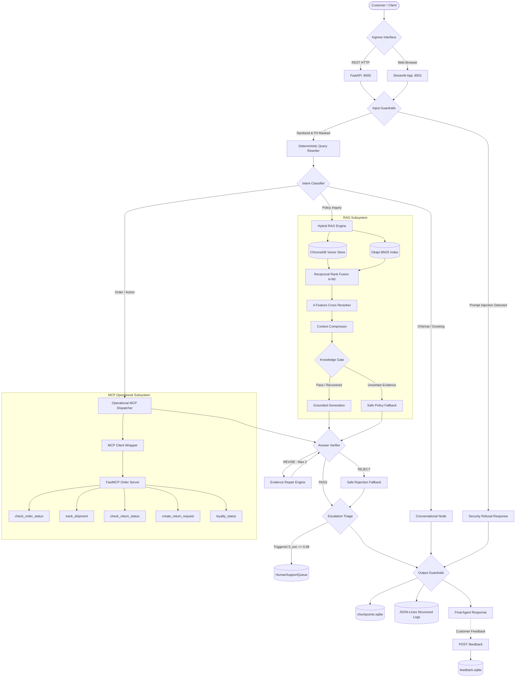
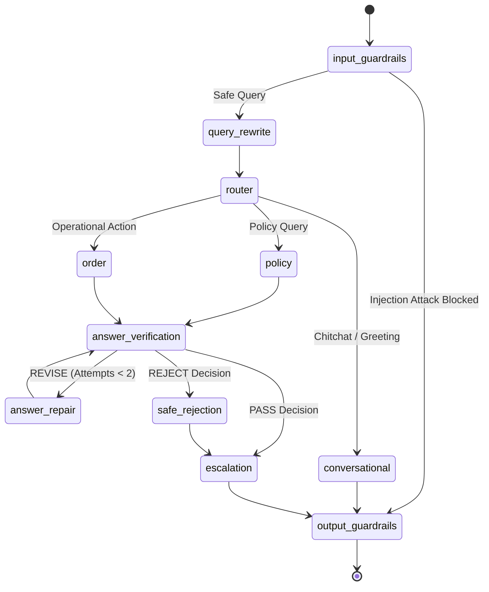
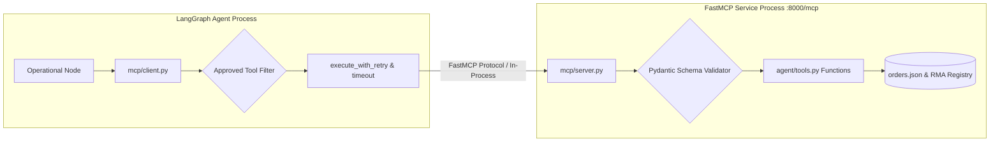

# NykaaAssist — Final Capstone Project
**Track: E-commerce & Retail (Nykaa)**

> This repository contains the complete, production-ready capstone implementation for **NykaaAssist** — an enterprise AI customer support system combining Retrieval-Augmented Generation (RAG), LangGraph multi-node orchestration, Model Context Protocol (MCP) tooling, multi-turn memory, security guardrails, resilience patterns, structured logging, and empirical evaluation.

---

## 1. Project Overview

# NykaaAssist — AI Customer Support Agent

**NykaaAssist** is a deterministic, production-grade conversational AI customer support agent engineered for Nykaa's e-commerce platform. It autonomously resolves routine customer inquiries with strict grounding while eliminating hallucinations and safeguarding customer data.

The system addresses two primary classes of support queries:
1. **Policy Inquiries**: Answering questions regarding return windows, refund timelines, delivery SLAs, reverse pickups, warranty terms, cancellations, loyalty programs, payment retries, damaged item claims, size exchanges, international shipping, and escalation protocols using an authoritative 12-document knowledge base.
2. **Operational Lookups & Actions**: Retrieving live order status, tracking parcel shipments, calculating return eligibility, initiating idempotent return requests (RMA generation), and checking loyalty tier balances across a deterministic 50-order dataset.

Operating by default under an offline, deterministic `MOCK_LLM` configuration, NykaaAssist requires **zero paid external API keys** and executes 100% locally and reproducibly.

---

## 2. Capstone Track & Completion

- **Capstone Track**: E-commerce & Retail (Nykaa)
- **Scope**: End-to-end backend service, standardized tool protocol, agentic orchestration, empirical evaluation, and interactive presentation layer.
- **Repository Deliverable**: Complete source code, synthetic datasets, knowledge base, test suites, evaluation scripts, empirical benchmark results, and documentation.

### Capstone Implementation Scope

| Part | Area | Implementation Modules | Verification Evidence |
|---|---|---|---|
| **Part 1** | **Dataset & RAG Core** | `dataset.py`, `knowledge_base/*.md`, `rag/chunking.py`, `rag/embed_index.py`, `rag/generate.py`, `rag/evaluate_retrieval.py` | 50 seeded orders (24.0% delayed), 12 policy docs, dual ChromaDB collections (`nykaa_kb_fixed`, `nykaa_kb_sentence`), Precision@3 / Recall@3 evaluation |
| **Part 2** | **LangGraph, Tools, Memory & Guardrails** | `agent/tools.py`, `agent/graph.py`, `agent/guardrails.py`, `agent/memory.py`, `agent/schema.py` | LangGraph multi-node state machine, order lookup tool with escalation scoring, regex PII masking, prompt injection filter, thread-persistent SQLite memory |
| **Part 3** | **Evaluation, Observability & FastAPI** | `service/main.py`, `service/logging_utils.py`, `eval/rag_triad.py`, `eval/test_queries.json` | FastAPI service (`/ask`, `/add-document`, `/health`), JSON-Lines structured logs with trace IDs, 15-query RAG Triad benchmark (`rag_triad_results.json`) |
| **Part 4** | **Resilience & MCP** | `mcp/server.py`, `mcp/client.py`, `resilience/checkpoint_resume.py` | FastMCP server exposing tools via standardized protocol, standalone client invocation, SQLite checkpoint recovery without node re-execution |

---

## 3. Dataset Design Choices

The operational dataset is generated by [`dataset.py`](./dataset.py) using strict deterministic logic to ensure consistent grading and reproducible test runs:

- **Random Seed**: `42` (`DEFAULT_SEED = 42`)
- **Generated Record Count**: `50` records (`DEFAULT_COUNT = 50`), exceeding the minimum capstone requirement of 40.
- **Record ID Format**: Deterministic zero-padded identifier from `NYK-00001` to `NYK-00050`.
- **Category Vocabulary & Sampling Weights**:
  - `Apparel`: 0.25 (22.0% realized, 11 records)
  - `Electronics`: 0.15 (18.0% realized, 9 records)
  - `Home`: 0.15 (14.0% realized, 7 records)
  - `Footwear`: 0.15 (10.0% realized, 5 records)
  - `Beauty`: 0.30 (36.0% realized, 18 records)
- **Status Vocabulary & Sampling Weights**:
  - `Placed`: 0.15 (14.0% realized, 7 records)
  - `Shipped`: 0.25 (30.0% realized, 15 records)
  - `Delivered`: 0.40 (34.0% realized, 17 records)
  - `Returned`: 0.10 (10.0% realized, 5 records)
  - `Refunded`: 0.10 (12.0% realized, 6 records)
- **Category Price Ranges (`order_value_inr`)**:
  - `Beauty`: ₹299.00 – ₹3,499.00
  - `Apparel`: ₹599.00 – ₹4,999.00
  - `Footwear`: ₹899.00 – ₹5,999.00
  - `Electronics`: ₹999.00 – ₹11,999.00
  - `Home`: ₹499.00 – ₹3,999.00
  - *Reasoning*: Reflects realistic basket sizes across Nykaa's verticals, spanning entry-level beauty cosmetics to premium electronics and designer footwear.
- **Days Since Created (`days_since_created`)**: Uniform random integer between `0` and `30` days (`random.randint(0, 30)`).
- **Delayed Shipment Generation & SLA Rate**:
  - Generated via `random.random() < 0.20` (20% target probability).
  - Realized delay count: `12` orders.
  - Realized delayed shipment rate: **`24.0%`**, strictly satisfying the required SLA window of **10.0% – 30.0%**.
- **Deterministic Reproducibility**: Invoking `python dataset.py` initializes Python's standard `random.seed(42)` and regenerates identical outputs saved to [`orders.json`](./orders.json) and [`orders.csv`](./orders.csv). No manual record modifications are allowed or performed.

---

## 4. Problem Statement

Modern e-commerce customer support platforms face critical operational challenges:
1. **High Volume of Repetitive Inquiries**: Customer queries are overwhelmingly dominated by routine policy questions (return eligibility windows, COD refund processing times, courier SLAs) and repetitive order lookups.
2. **The Peril of Uncontrolled LLMs**: Relying on an ungrounded, vanilla Large Language Model introduces severe risks:
   - *Hallucination*: Generating fabricated return policies or false delivery commitments.
   - *Data Leakage*: Exposing sensitive customer PII in application logs or model inputs.
   - *Security Vulnerability*: Susceptibility to prompt injections that manipulate model instructions.
   - *Lack of Tool Standardization*: Hardcoding backend APIs directly into prompts rather than using standardized, reusable protocols.
   - *Statelessness*: Inability to maintain context across multi-turn customer dialogues or recover from mid-transaction server failures.

NykaaAssist resolves this by sandwiching deterministic retrieval, stateful orchestration, and protocol-standardized tools between robust input and output guardrails.

---

## 5. Solution Overview

The system processes incoming queries through a layered pipeline:

```text
User / Client
    │
    ▼
Streamlit UI (:8501)  /  FastAPI Service (:8000)
    │
    ▼
Input Guardrails (PII Masking & Prompt Injection Interception)
    │
    ▼
LangGraph Orchestrator (Query Rewriting & Intent Classification)
    │
    ├─────────────────────────────┬─────────────────────────────┐
    ▼                             ▼                             ▼
Conversational Node           Policy Node                   Order Node
(Greetings / Gratitude)    (Hybrid RAG + Gate)          (5 FastMCP Tools)
    │                             │                             │
    │                             ▼                             ▼
    │                     Answer Verification & Evidence Repair
    │                             │
    │                             ▼
    │                     Human Escalation Triage Node
    │                             │
    └─────────────────────────────┼─────────────────────────────┘
                                  ▼
                     Output Guardrails (Confidence Floor & PII Sanity)
                                  │
                                  ▼
                   Client Response & Feedback Persistence
```

### End-to-End Architecture Diagram



---

## 6. Key Features

| Capability | Module | Description | Verified In Code |
|---|---|---|:---:|
| **Dual Chunking** | `rag/chunking.py` | Fixed-size (50 words, 10 overlap) and Sentence-based (2 sentences/chunk) | Yes |
| **Local Vector Search** | `rag/embed_index.py` | ChromaDB dense indexing using `all-MiniLM-L6-v2` cosine embeddings | Yes |
| **Lexical BM25 Search** | `rag/lexical.py` | Pure-Python Okapi BM25 indexer ($k_1=1.5, b=0.75$) | Yes |
| **Hybrid Rank Fusion** | `rag/hybrid.py` | Cormack Reciprocal Rank Fusion ($k_{rrf}=60$) merging dense and sparse pools | Yes |
| **Deterministic Reranker** | `rag/reranker.py` | 4-feature cross-scoring (dense sim, token coverage, topic affinity, RRF prior) | Yes |
| **Context Compression** | `rag/context_compressor.py`| Sentence-level reduction strictly preserving verbatim source sentences | Yes |
| **Knowledge Gate** | `rag/knowledge_gate.py` | Multi-signal evidence verification ($S_{sem}, S_{cov}, S_{rerank}$) with 1-step recovery | Yes |
| **Grounded Answer Synthesis** | `rag/generate.py` | Sourced claim generation enforcing empirical similarity floor ($0.35$) | Yes |
| **Post-Answer Verification** | `agent/answer_verifier.py` | 3-way taxonomy (PASS/REVISE/REJECT) with deterministic evidence repair | Yes |
| **LangGraph Orchestration** | `agent/graph.py` | Stateful graph with conditional routing and memory persistence | Yes |
| **Standardized MCP Tooling** | `mcp/server.py`, `client.py` | 5 operational tools exposed via FastMCP with strict Pydantic schemas | Yes |
| **Return Idempotency** | `agent/tools.py` | Thread-safe in-memory RMA registry preventing duplicate return creations | Yes |
| **SQLite Checkpointing** | `agent/memory.py` | Durable conversation state with mid-run interrupt and resume semantics | Yes |
| **Security Guardrails** | `agent/guardrails.py` | Regex PII masking (phone, card last-4) and adversarial prompt injection filters | Yes |
| **HITL Escalation Node** | `agent/escalation.py` | Automated triage enqueuing high-risk queries into `HumanSupportQueue` | Yes |
| **Human Feedback Persistence**| `agent/feedback.py` | PII-scrubbed rating collection, trace linkage, and SQLite review queue | Yes |
| **Fault Resilience** | `resilience/retry_timeout.py`| Exponential backoff retries with jitter, per-node and global graph timeouts | Yes |
| **FastAPI Service** | `service/main.py` | Production REST API with structured JSON-Lines telemetry logging | Yes |
| **Interactive Streamlit UI** | `streamlit_app.py` | Customer portal with source chips, audit expanders, and feedback buttons | Yes |

---

## 7. RAG Pipeline

NykaaAssist implements a 14-stage Retrieval-Augmented Generation pipeline designed to eliminate hallucinations:

```mermaid
flowchart LR
    KB[1. Knowledge Base] --> Prep[2. Preprocessing]
    Prep --> Chunk[3. Chunking]
    Chunk --> Embed[4. Embeddings]
    Embed --> Chroma[5. ChromaDB]

    Query([User Query]) --> Vector[6. Vector Search]
    Query --> BM25[7. BM25 Search]
    Chroma --> Vector

    Vector --> Hybrid[8. Hybrid Merge]
    BM25 --> Hybrid
    Hybrid --> RRF[9. RRF Fusion]
    RRF --> Rerank[10. Cross Reranker]
    Rerank --> Compress[11. Context Compressor]
    Compress --> Gate{12. Knowledge Gate}
    Gate -->|Evidence Valid| Synth[13. Grounded Generation]
    Gate -->|Evidence Weak| Fallback[Safe Refusal Fallback]
    Synth --> Verifier[14. Answer Verifier]
    Fallback --> Verifier
```



### Detailed Pipeline Stages
1. **Knowledge Base**: 12 authoritative Markdown documents located in [`knowledge_base/`](./knowledge_base/).
2. **Preprocessing**: Markdown headers stripped, whitespace normalized.
3. **Chunking**: Dual chunking strategies (fixed-size vs sentence-based).
4. **Embeddings**: SentenceTransformers `all-MiniLM-L6-v2` generating 384-dimensional unit-normalized dense vectors.
5. **ChromaDB**: Local persistent storage under [`chroma_db/`](./chroma_db/) using cosine distance.
6. **Vector Retrieval**: Dense similarity search returning top candidate chunks.
7. **BM25 Retrieval**: Okapi BM25 lexical search over tokenized vocabulary ($k_1=1.5, b=0.75$).
8. **Hybrid Retrieval**: Merging top-10 candidates from dense and sparse retrieval pools.
9. **Reciprocal Rank Fusion (RRF)**: Cormack RRF formula with $k_{rrf}=60$ and deterministic 3-tier tie-breaking.
10. **Reranking**: 4-feature weighted cross-scorer ($0.40 \cdot S_{dense} + 0.25 \cdot S_{lexical} + 0.20 \cdot S_{topic} + 0.15 \cdot S_{rrf}$).
11. **Context Compression**: Sentence-level reduction preserving only query-relevant facts while maintaining source sentence integrity.
12. **Knowledge Gate**: Multi-signal verification checking dense similarity floor ($0.35$), token coverage ($0.30$), and consensus margins with 1-step recovery.
13. **Grounded Generation**: Sourced response generation citing originating documents; defaults to refusal if evidence is insufficient.
14. **Answer Verification**: Post-generation validator classifying answers into `PASS`, `REVISE`, or `REJECT` before presentation.

---

## 8. Chunking Strategies

The capstone brief requires implementing and evaluating two distinct chunking strategies:

### Strategy 1: Fixed-Size with Overlap
- **Implementation**: `split_fixed_size` in [`rag/chunking.py`](./rag/chunking.py)
- **Parameters**: 50 words window (`DEFAULT_FIXED_CHUNK_SIZE = 50`), 10 words overlap (`DEFAULT_FIXED_OVERLAP = 10`), step size = 40 words.
- **Indexed Collection**: `nykaa_kb_fixed`

### Strategy 2: Sentence-Based Chunking
- **Implementation**: `split_by_sentence` in [`rag/chunking.py`](./rag/chunking.py)
- **Parameters**: 2 sentences per chunk (`DEFAULT_SENTENCES_PER_CHUNK = 2`), regex sentence splitting on punctuation (`[.!?]`).
- **Indexed Collection**: `nykaa_kb_sentence`

### Empirical Retrieval Evaluation (`rag/evaluate_retrieval.py`)
Evaluated across 15 standard test queries (`top_k = 3`):

| Metric | `nykaa_kb_fixed` | `nykaa_kb_sentence` | Delta |
|---|---|---|---|
| **Mean Precision@3** | **0.600** | 0.511 | **+0.089 (+17.4%)** |
| **Mean Recall@3** | **1.000** | **1.000** | 0.000 (Identical 100%) |
| **Top-1 Retrieval Accuracy** | **0.800** | 0.733 | **+0.067 (+9.1%)** |

### Final Chosen Strategy
**`nykaa_kb_fixed`** is selected as the primary production collection. The 50-word window with 10-word overlap provides consistent token density, ensuring critical conditional caveats (e.g., non-returnable categories like innerwear or opened cosmetics) remain intact within the same chunk rather than getting split across sentence boundaries.

---

## 9. Retrieval Intelligence

### Vector Search
Dense semantic retrieval projects queries into embedding space, successfully resolving semantic synonyms where customers use phrasing different from policy titles (e.g., mapping "when will money come back" to `cod_refund_timelines.md`).

### BM25 (Best Matching 25)
Pure-Python Okapi BM25 sparse keyword retrieval excels at exact terminology matching, specific category names (e.g., "footwear", "fragrances"), and numerical SLA windows (e.g., "15 days", "48 hours") that semantic embeddings occasionally dilute.

### Hybrid Retrieval
By merging dense and sparse candidates, hybrid retrieval prevents vocabulary mismatch failures while preserving semantic breadth.

### Reciprocal Rank Fusion (RRF)
Combines dense and lexical ranks without requiring uncalibrated score normalization:
$$RRF(d) = \sum_{m \in \{\text{dense}, \text{bm25}\}} \frac{1}{60 + r_m(d)}$$
Tie-breaking is resolved deterministically via dense similarity, lexical rank, and chunk identifier.

### Reranker
A dedicated 4-feature cross-scorer rescores the top-10 hybrid pool, combining dense similarity, token overlap coverage, topic affinity, and RRF rank priors to surface the single most authoritative context chunk.

---

## 10. LangGraph Multi-Node Flow

The agent's state machine is compiled using LangGraph in [`agent/graph.py`](./agent/graph.py).

### AgentState Definition
```python
class AgentState(TypedDict, total=False):
    query: str
    original_query: Optional[str]
    rewritten_query: Optional[str]
    route: Optional[str]
    order_id: Optional[str]
    customer_id: Optional[str]
    tool_name: Optional[str]
    tool_args: Optional[Dict[str, Any]]
    tool_result: Optional[Dict[str, Any]]
    response: Optional[Dict[str, Any]]
    trace_id: Optional[str]
    is_blocked: Optional[bool]
    last_order_id: Optional[str]
    last_customer_id: Optional[str]
    last_tool_name: Optional[str]
    last_policy_topic: Optional[str]
    last_route: Optional[str]
    last_response_type: Optional[str]
    gate_decision: Optional[str]
    gate_signals: Optional[Dict[str, Any]]
    gate_reason: Optional[str]
    escalation_payload: Optional[Dict[str, Any]]
    node_timeout: Optional[float]
    compression_audit: Optional[Dict[str, Any]]
    retrieved_evidence: Optional[List[Dict[str, Any]]]
    verification_result: Optional[Dict[str, Any]]
    verification_attempt: Optional[int]
    verified_answer: Optional[str]
    verification_status: Optional[str]
    is_conversational: Optional[bool]
    conversational_intent: Optional[str]
```

### StateGraph Flowchart



---

## 11. Model Context Protocol (MCP)

**Model Context Protocol (MCP)** is an open industry standard that decouples tool definitions and execution from the agent's core cognitive loops. Instead of hardcoding internal database queries inside agent functions, tools are exposed through an interoperable protocol server.

### Verified MCP Tools

| Tool | Purpose | Input Schema | Output Schema | Data Source |
|---|---|---|---|---|
| `check_order_status` | Lookup order status, order value, and computed SLA escalation score | `record_id: str` (Format: `NYK-XXXXX`) | `record_id`, `status`, `order_value_inr`, `escalation_score`, `error` | [`orders.json`](./orders.json) |
| `track_shipment` | Retrieve live courier carrier details, current location, ETA, and delay flags | `record_id: str` (Format: `NYK-XXXXX`) | `record_id`, `status`, `carrier`, `tracking_number`, `current_location`, `estimated_delivery`, `delayed_shipment`, `error` | `orders.json` + deterministic courier generator |
| `check_return_status` | Verify if delivered order is within category return window (15d / 7d) | `record_id: str` (Format: `NYK-XXXXX`) | `record_id`, `eligible`, `category`, `days_since_delivery`, `allowed_window_days`, `reason`, `error` | `orders.json` + policy window rules |
| `create_return_request` | Authorize return and generate idempotent RMA code for eligible delivered orders | `record_id: str`, `reason: str` | `record_id`, `request_id`, `status`, `rma_code`, `created_at`, `reason`, `error` | `orders.json` + `ACTIVE_RETURN_REQUESTS` registry |
| `loyalty_status` | Retrieve rewards tier (Silver/Gold/Platinum), points balance, and lifetime spend | `customer_id: str` (Format: `CUST-XXXXX`) | `customer_id`, `tier`, `points_balance`, `lifetime_spend_inr`, `error` | Deterministic customer hashing |

### MCP Architecture



- **Client & Server Separation**: [`mcp/server.py`](./mcp/server.py) instantiates `FastMCP("NykaaOrderService")`. [`mcp/client.py`](./mcp/client.py) connects remotely via SSE/HTTP or falls back gracefully to in-process invocation.
- **Validation**: Strict Pydantic models reject invalid identifiers or unexpected fields (`extra="forbid"`).
- **Idempotency**: `create_return_request` records authorized RMAs in the thread-safe `ACTIVE_RETURN_REQUESTS` registry, guaranteeing that replaying an identical request returns the original RMA code without creating duplicate records.

---

## 12. Memory & Checkpointing

- **Conversation Memory**: Multi-turn history is isolated by `thread_id`. The agent tracks conversational context, remembering previously referenced order IDs (e.g., asking "where is it?" after mentioning `NYK-00001`) and policy topics across turns.
- **SQLite Checkpointing**: State transitions are durably recorded in [`checkpoints.sqlite`](./checkpoints.sqlite) using LangGraph's SQLite checkpointer.
- **Crash Recovery & Resume**: If an execution halts mid-turn, the graph resumes directly from the last persisted checkpoint without re-executing previously completed nodes.
- **Clean Reset**: A fresh `thread_id` initializes clean state. In the Streamlit UI, clicking **"New Chat"** triggers `clear_thread_checkpoints(thread_id)`.
- **Memory vs Feedback Separation**:
  - `checkpoints.sqlite`: Manages ephemeral agent state transitions, thread history, and resume checkpoints.
  - `feedback.sqlite`: Stores long-term, PII-scrubbed customer satisfaction ratings and offline review queues.

---

## 13. Security & Guardrails

### Prompt Injection Defense
- **Filter**: Regex pattern matching in [`agent/guardrails.py`](./agent/guardrails.py) detects system prompt override attempts, roleplay jailbreaks (`"act as developer"`), instructions to ignore rules, and credential dump requests.
- **Action**: Immediately halts execution, suppresses downstream RAG and MCP tool calls, and returns a fixed refusal:
  > *"I cannot process this request as it violates our security policies. I am designed to assist exclusively with Nykaa customer support and order inquiries."*

### PII Protection Scope
- **Fixed-Format PII Masked**:
  - Indian mobile phone numbers: `PHONE_REGEX` -> `***-***-XXXX`
  - Credit/debit card numbers: `CARD_REGEX` -> `**** **** **** XXXX`
  - Card last-4 patterns: `card ending in XXXX` -> `card ending **** XXXX`
  - UPI IDs, CVV, OTP, bank account numbers, passwords, and API tokens.
- **Scope Clarification**: Adhering strictly to the capstone brief, arbitrary free-text customer names and addresses are not guaranteed to be masked without full named-entity models; masking is guaranteed for fixed-format numerical and tokenized fields.

### Output Groundedness
- Responses generated by the policy route are validated against the empirical similarity floor ($0.35$).
- Ungrounded claims or empty retrieved sources safely trigger the standardized fallback response:
  > *"I do not have sufficient information in the Nykaa policy documentation to answer your question accurately. Please contact customer support for assistance."*

---

## 14. Human-in-the-Loop (HITL) Escalation

The HITL system is an automated triage mechanism that routes high-risk interactions to human support agents:

- **Escalation Triggers**:
  1. *Uncertain Policy Evidence*: RAG similarity below $0.35$ or Knowledge Gate fallback.
  2. *Severe Order Delay*: Computed escalation score $S_{esc} \ge 0.68$:
     $$S_{esc} = \text{round}(0.60 \times \text{delayed\_flag} + 0.40 \times \min(1.0, \frac{\text{days\_since\_created}}{30}), 3)$$
  3. *Missing Orders*: Order lookup fails to locate `NYK-XXXXX`.
  4. *Explicit Human Request*: Customer explicitly asks for a human supervisor.
- **Escalation Payload**: Structured record containing `thread_id`, `trace_id`, `priority` (`HIGH`/`MEDIUM`/`LOW`), `reason`, `recommended_action`, and PII-sanitized conversation history.
- **Queue Storage**: Enqueued into the thread-safe, in-memory `HumanSupportQueue` (capacity $N=1000$) defined in [`agent/escalation.py`](./agent/escalation.py).
- **Distinction**: HITL triage is separate from end-user feedback; it actively routes live conversations requiring human intervention.

---

## 15. Human Feedback Loop

The feedback loop collects post-response satisfaction telemetry to guide offline improvements:

- **Rating Scale**: 👍 Helpful (`5`) or 👎 Not Helpful (`1`).
- **Feedback Taxonomy**: `incorrect_policy`, `wrong_order_status`, `unhelpful_response`, `other`.
- **Trace Association**: Each feedback entry is bound to the response's unique `trace_id`, verification decision (`PASS`/`REVISE`/`REJECT`), route, and evidence citations.
- **Mandatory PII Scrubbing**: Free-form comments are sanitized via `mask_pii()` before storage.
- **SQLite Persistence**: Stored in the `human_feedback` table in [`feedback.sqlite`](./feedback.sqlite).
- **Disagreement Detection**: Automatically flags instances where the Answer Verifier issued a `PASS` but the customer submitted negative feedback.
- **Improvement Candidates**: Categorizes actionable feedback into review queues (`knowledge_gap`, `routing_defect`, `verifier_gap`).
- **Strict Non-Mutation Boundary**: Feedback is purely an observability and evaluation signal; it **never** mutates production prompts, knowledge files, or policies automatically.

---

## 16. Fault Resilience & Timeouts

Implemented in [`resilience/retry_timeout.py`](./resilience/retry_timeout.py):

- **Retry Policy**: Bounded retries (`max_attempts = 3`) for transient errors (`TimeoutError`, `ConnectionError`, `OSError`).
- **Backoff & Jitter**: Exponential backoff ($2.0\times$) starting at $0.05\text{s}$ with deterministic pseudo-random jitter.
- **Per-Node Timeout**: Default $10.0\text{s}$ limit per graph node. If exceeded, safely raises `NodeTimeoutError`.
- **Global Graph Timeout**: Default $30.0\text{s}$ guard covering the entire agent execution. If exceeded, safely raises `GlobalTimeoutError` and returns an operational timeout fallback without crashing.
- **State Checkpoint Resume**: Failed executions recover from SQLite checkpoints, preserving completed node work.

---

## 17. Empirical Evaluation Results

All metrics are recorded directly from benchmark runs and artifacts stored in [`eval/`](./eval/):

| Evaluation Benchmark | Evaluated Metric | Empirical Result | Source Artifact |
|---|---|---|---|
| **Chunking Strategy** | `nykaa_kb_fixed` Mean Precision@3 | **0.600** (vs 0.511 sentence) | `rag/evaluate_retrieval.py` |
| **Chunking Strategy** | `nykaa_kb_fixed` Mean Recall@3 | **1.000** (100% recall) | `rag/evaluate_retrieval.py` |
| **Chunking Strategy** | `nykaa_kb_fixed` Top-1 Accuracy | **0.800** (80.0%) | `rag/evaluate_retrieval.py` |
| **Hybrid Retrieval** | Top-1 Accuracy Improvement | **0.800 $\to$ 1.000 (+25.0%)** | `eval/hybrid_retrieval_results.json` |
| **Hybrid Retrieval** | Overall RAG Triad Score | **0.747 $\to$ 0.771 (+3.2%)** | `eval/hybrid_retrieval_results.json` |
| **Deterministic Reranker** | Top-1 Accuracy | **1.000 (100.0%)** | `eval/reranker_results.json` |
| **Deterministic Reranker** | Groundedness Score | **1.000 (100.0%)** | `eval/reranker_results.json` |
| **Deterministic Reranker** | Overall RAG Triad Score | **0.822** | `eval/reranker_results.json` |
| **Knowledge Gate** | Fallback Recall on Adversarial | **0.500 $\to$ 0.900 (+80.0%)** | `eval/knowledge_gate_results.json` |
| **Knowledge Gate** | False Fallback Rate | **0.0% (Zero false refusals)**| `eval/knowledge_gate_results.json` |
| **HITL Escalation** | Escalation Precision | **1.000 (100.0%)** | `eval/escalation_results.json` |
| **HITL Escalation** | Escalation Recall | **0.941 (94.1%)** | `eval/escalation_results.json` |
| **Multi-Tool MCP** | Operational Routing Accuracy | **1.000 (40/40 queries)** | `eval/mcp_integration_results.json` |
| **Multi-Tool MCP** | Schema Validity Rate | **1.000 (40/40 queries)** | `eval/mcp_integration_results.json` |
| **Multi-Tool MCP** | Security Zero-Call Rate | **1.000 (3/3 attacks blocked)**| `eval/mcp_integration_results.json` |
| **Resilience & Timeout** | Overall Benchmark Pass Rate | **1.000 (40/40 queries)** | `eval/resilience_results.json` |
| **Resilience & Timeout** | Flaky Retry Recovery Rate | **1.000 (8/8 recovered)** | `eval/resilience_results.json` |
| **Resilience & Timeout** | Duplicate RMA Creations | **0 (Zero duplicate RMAs)** | `eval/resilience_results.json` |
| **Context Compression** | Context Character Reduction | **11.06% (1,035 chars removed)**| `eval/context_compression_results.json` |
| **Context Compression** | Non-Invention Invariant | **100.0% Verbatim sentences** | `eval/context_compression_results.json` |
| **Answer Verification** | False PASS Rate | **0.0000 (Zero hallucinations)**| `eval/answer_verification_results.json` |
| **Answer Verification** | Contradiction Detection Rate | **1.000 (100.0% detected)** | `eval/answer_verification_results.json` |
| **Human Feedback** | Feedback Validation Accuracy | **100.0%** | `eval/human_feedback_results.json` |
| **Human Feedback** | PII Scrubbing Rate | **100.0%** | `eval/human_feedback_results.json` |
| **Master Regression** | 50-Query Overall Pass Rate | **1.000 (50/50, 100.0%)** | `eval/final_regression_results.json` |

---

## 18. Testing & Verification

NykaaAssist features a comprehensive test suite across unit, integration, resilience, and evaluation layers.

### Key Test Suites

| Test Suite | Execution Command | Purpose |
|---|---|---|
| **Dataset Generator** | `python dataset.py` | Validates deterministic 50-order generation and SLA delay rate |
| **Dual Chroma Indexing** | `python rag/embed_index.py` | Builds and smoke-tests both ChromaDB collections |
| **Chunking Evaluation** | `python rag/evaluate_retrieval.py` | Computes Precision@3, Recall@3, and Top-1 for both collections |
| **Guardrails & Security** | `python agent/guardrails.py` | Tests PII masking patterns and adversarial prompt injection interception |
| **LangGraph Core** | `python agent/graph.py` | Verifies multi-turn memory persistence and intent routing |
| **Query Rewriter Tests** | `python agent/rewrite.py` | Tests pronoun resolution and query clarification |
| **Hybrid Retrieval Tests**| `python agent/hybrid_retrieval_tests.py` | Tests Okapi BM25 and Cormack RRF ranking logic |
| **Reranker Tests** | `python agent/reranker_tests.py` | Tests 4-feature cross-scoring and tie-breaking |
| **Knowledge Gate Tests** | `python agent/knowledge_gate_tests.py` | Tests multi-signal gate decisions and fallback recovery |
| **HITL Escalation Tests** | `python agent/escalation_tests.py` | Tests escalation triggers and `HumanSupportQueue` enqueuing |
| **MCP Integration Tests** | `python agent/mcp_integration_tests.py` | Verifies 5 FastMCP tools, Pydantic schemas, and RMA idempotency |
| **Resilience Tests** | `python agent/resilience_tests.py` | Tests retries, exponential backoff, jitter, and timeout aborts |
| **Master Integration** | `python agent/integration_tests.py` | Comprehensive 16-point integration suite across all modules |
| **Context Compression** | `python agent/context_compression_tests.py` | Verifies Non-Invention Invariant and context reduction |
| **Answer Verifier Tests** | `python agent/answer_verification_tests.py`| Tests PASS/REVISE/REJECT claim verification and repair |
| **Human Feedback Tests** | `python agent/human_feedback_tests.py` | Tests feedback submission, PII scrubbing, and review queues |
| **Conversational Chitchat**| `python eval/test_conversational_greetings.py` | Tests greeting, gratitude, and goodbye intent handling |
| **Streamlit Scenarios** | `python eval/test_streamlit_scenarios.py` | Tests 10 end-to-end customer journey UI scenarios |
| **Final Master Regression**| `python eval/final_regression.py` | 50-query master regression benchmark |

For full step-by-step testing instructions and test case matrices, refer to the [Testing Guide](./docs/TESTING.md).

---

## 19. Local Setup

Follow these clean, Windows-compatible instructions to run NykaaAssist locally:

### 1. Clone Repository
```powershell
git clone <your-repository-url>
cd nykaa-assist
```

### 2. Create Virtual Environment
```powershell
python -m venv .venv
```

### 3. Activate Environment
```powershell
# Windows PowerShell
.venv\Scripts\Activate.ps1

# Linux / macOS
source .venv/bin/activate
```

### 4. Install Dependencies
```powershell
pip install -r requirements.txt
```

### 5. Set Deterministic Environment Variables
No API keys or external credentials are required:
```powershell
# Windows PowerShell
$env:MOCK_LLM = "1"
$env:USE_REAL_LLM = "0"
$env:HF_HUB_OFFLINE = "1"
$env:TRANSFORMERS_OFFLINE = "1"
```

### 6. Run Core Verification
```powershell
python dataset.py
python rag/embed_index.py
python eval/final_regression.py
```

---

## 20. Running Streamlit Presentation Layer

NykaaAssist includes an interactive, brand-tailored conversational UI built with **Streamlit**:

```powershell
streamlit run streamlit_app.py
```

- **Local Access URL**: [http://localhost:8501](http://localhost:8501)
- **Architectural Separation**:
  > *Streamlit is strictly the presentation layer. The actual agent logic remains decoupled inside the LangGraph orchestration engine, hybrid RAG pipeline, and FastMCP tool architecture.*
- **Interface Features**:
  - **Quick Starter Chips**: One-click prompts for common customer journeys (Return Window, COD Refund, Delivery SLA, Track Order).
  - **Source Attribution**: Visual chips referencing originating policy documents (e.g., `return_window.md`).
  - **Technical Telemetry Expander**: Collapsible audit panel detailing trace ID, classification route, confidence score, escalation score, Knowledge Gate decision, and verification status.
  - **Human Escalation Alert**: Visual badge when an inquiry triggers human escalation ($S_{esc} \ge 0.68$).
  - **Customer Feedback Modal**: Interactive 👍 and 👎 buttons enabling instant feedback submission directly to `feedback.sqlite`.

---

## 21. Running FastAPI Service & Swagger UI

The headless REST API is implemented in [`service/main.py`](./service/main.py):

### Startup Command
```powershell
uvicorn service.main:app --host 127.0.0.1 --port 8000 --reload
```

- **Host & Port**: `http://127.0.0.1:8000`
- **Interactive Swagger Documentation**: [http://127.0.0.1:8000/docs](http://127.0.0.1:8000/docs)
- **Alternative ReDoc Documentation**: [http://127.0.0.1:8000/redoc](http://127.0.0.1:8000/redoc)

### Verified REST Endpoints

| Method | Endpoint | Request Model | Response Model | Description |
|---|---|---|---|---|
| `GET` | `/health` | None | `HealthResponse` | Service liveness probe returning `{"status": "ok"}` |
| `POST` | `/ask` | `AskRequest` | `AgentResponse` | Main customer support inquiry endpoint |
| `POST` | `/add-document` | `AddDocumentRequest` | `AddDocumentResponse` | Runtime policy ingestion into ChromaDB |
| `POST` | `/feedback` | `FeedbackSubmission` | `FeedbackAcknowledgement`| Submits customer rating and PII-scrubbed feedback |
| `GET` | `/feedback` | Query Params | `List[FeedbackRecord]` | Lists persisted feedback records for review |
| `GET` | `/feedback/{id}` | Path Param | `FeedbackRecord` | Retrieves single feedback item by ID |
| `PATCH`| `/feedback/{id}` | `FeedbackReviewUpdate` | `FeedbackRecord` | Updates review status (`in_review`/`resolved`) |

---

## 22. Project Structure

```text
nykaa-assist/
├── README.md                      # Primary public evaluator submission document
├── PRD.md                         # Product Requirements Document
├── TRD.md                         # Technical Requirements Document
├── AI_ARCHITECTURE.md             # In-depth AI system architecture specification
├── PHASES.md                      # Engineering lifecycle phases and Gantt roadmap
├── SECURITY.md                    # Threat modeling and security guardrails specification
├── AI_INSTRUCTION.md              # Model behavior and prompt engineering contract
├── requirements.txt               # Project Python dependencies
├── dataset.py                     # Deterministic seeded order generator (50 records)
├── orders.json                    # Generated synthetic orders dataset (JSON format)
├── orders.csv                     # Generated synthetic orders dataset (CSV format)
├── streamlit_app.py               # Interactive presentation layer UI
│
├── docs/                          # Specialized documentation hub
│   ├── README.md                  # Comprehensive technical documentation index
│   └── TESTING.md                 # Exhaustive testing manual & test matrices
│
├── knowledge_base/                # 12 hand-authored authoritative policy documents
│   ├── return_window.md
│   ├── cod_refund_timelines.md
│   ├── delivery_sla.md
│   ├── reverse_pickup.md
│   ├── warranty_terms.md
│   ├── cancellation_policy.md
│   ├── loyalty_points.md
│   ├── payment_failure_retry.md
│   ├── size_exchange.md
│   ├── damaged_item_claims.md
│   ├── international_shipping.md
│   └── escalation_matrix.md
│
├── rag/                           # Retrieval-Augmented Generation subsystem
│   ├── chunking.py                # Dual chunking strategies (fixed vs sentence)
│   ├── embed_index.py             # ChromaDB vector indexing and collection management
│   ├── lexical.py                 # Pure-Python Okapi BM25 keyword search indexer
│   ├── hybrid.py                  # Cormack Reciprocal Rank Fusion (k=60)
│   ├── reranker.py                # 4-feature deterministic cross-scorer
│   ├── context_compressor.py      # Sentence-level context compression layer
│   ├── knowledge_gate.py          # Multi-signal evidence verification gate
│   ├── generate.py                # Grounded answer synthesis and calibration
│   └── evaluate_retrieval.py      # Precision@3 / Recall@3 evaluation script
│
├── agent/                         # LangGraph agent orchestration & tools
│   ├── graph.py                   # LangGraph state machine, nodes, and conditional edges
│   ├── schema.py                  # Pydantic schemas and structured output contracts
│   ├── guardrails.py              # PII masking and prompt injection detection
│   ├── tools.py                   # Operational tool logic and escalation scoring
│   ├── conversational.py          # Greetings, gratitude, and goodbye chitchat handling
│   ├── rewrite.py                 # Query rewriting and pronoun resolution
│   ├── escalation.py              # HITL escalation evaluator and HumanSupportQueue
│   ├── answer_verifier.py         # PASS/REVISE/REJECT post-generation verification
│   ├── memory.py                  # Conversation memory and SQLite checkpointer
│   ├── feedback.py                # Customer feedback models and SQLite persistence
│   └── *_tests.py                 # Dedicated unit & integration test suites
│
├── mcp/                           # Model Context Protocol subsystem
│   ├── server.py                  # FastMCP server exposing 5 operational tools
│   └── client.py                  # Authorized MCP client wrapper with timeouts
│
├── resilience/                    # Fault tolerance and reliability layer
│   ├── retry_timeout.py           # Exponential backoff, jitter, node and global timeouts
│   └── checkpoint_resume.py       # SQLite crash recovery without node re-execution
│
├── service/                       # API service layer
│   ├── main.py                    # FastAPI application and REST endpoints
│   └── logging_utils.py           # Structured JSON-Lines logging and PII sanitizer
│
└── eval/                          # Evaluation suites and empirical benchmark artifacts
    ├── test_queries.json          # 15 canonical test queries
    ├── rag_triad.py               # RAG Triad evaluator
    ├── rag_triad_results.json     # RAG Triad empirical benchmark metrics
    ├── *_evaluation.py            # Comparative evaluation benchmark scripts
    └── *_results.json             # Empirical evaluation result artifacts
```

---

## 23. Documentation Map

| Document Link | Purpose |
|---|---|
| [Product Requirements (`PRD.md`)](./PRD.md) | Problem statement, user stories, personas, and functional requirements |
| [Technical Requirements (`TRD.md`)](./TRD.md) | Technical architecture, data models, and API specifications |
| [AI Architecture (`AI_ARCHITECTURE.md`)](./AI_ARCHITECTURE.md) | In-depth retrieval intelligence, reranking, and verification pipelines |
| [Execution Roadmap (`PHASES.md`)](./PHASES.md) | Complete engineering lifecycle, phased milestones, and daily checklists |
| [Agent Behavior Contract (`AI_INSTRUCTION.md`)](./AI_INSTRUCTION.md) | Operational guidelines, prompt boundaries, and refusal contracts |
| [Security & Threat Model (`SECURITY.md`)](./SECURITY.md) | PII protection boundaries, injection mitigations, and compliance rules |
| [Technical Documentation Index (`docs/README.md`)](./docs/README.md) | Centralized documentation hub and architecture reference |
| [Comprehensive Testing Manual (`docs/TESTING.md`)](./docs/TESTING.md) | Detailed test execution commands, test matrices, and Swagger guides |

---

## 24. Capstone Task Coverage

### Original Capstone Brief Tasks (Tasks 1–16)

| Task | Capstone Requirement | Implementation Module | Verification Evidence |
|---|---|---|---|
| **Task 1** | Seeded Order Dataset Generation (40+ orders, 10–30% delayed) | [`dataset.py`](./dataset.py) | 50 records generated, 24.0% delayed, verified in `orders.json` |
| **Task 2** | Knowledge Base Authoring (12 policy topics) | [`knowledge_base/*.md`](./knowledge_base/) | 12 authoritative Markdown policy files |
| **Task 3** | Dual Chunking & ChromaDB Vector Indexing | [`rag/chunking.py`](./rag/chunking.py), [`rag/embed_index.py`](./rag/embed_index.py) | `nykaa_kb_fixed` and `nykaa_kb_sentence` collections created |
| **Task 4** | Grounded Answer Generation & Threshold Calibration | [`rag/generate.py`](./rag/generate.py) | Refusal floor calibrated at 0.35 similarity |
| **Task 5** | Chunking Strategy Evaluation (Precision@3 / Recall@3) | [`rag/evaluate_retrieval.py`](./rag/evaluate_retrieval.py) | Evaluated across 15 queries; `nykaa_kb_fixed` recommended |
| **Task 6** | Order Lookup Tool & Escalation Scoring | [`agent/tools.py`](./agent/tools.py) | `check_order_status` with $S_{esc}$ formula ($0.60 \cdot delay + 0.40 \cdot recency$) |
| **Task 7** | LangGraph Multi-Node Flow & Conditional Routing | [`agent/graph.py`](./agent/graph.py) | Multi-node StateGraph routing to policy vs order tools |
| **Task 8** | Input & Output Guardrails (PII & Injection) | [`agent/guardrails.py`](./agent/guardrails.py) | Fixed-format PII masking (phone, card last-4) and injection filter |
| **Task 9** | Multi-Turn Conversation Memory | [`agent/memory.py`](./agent/memory.py) | State persistence across turns isolated by `thread_id` |
| **Task 10** | Structured Output Validation | [`agent/schema.py`](./agent/schema.py) | Pydantic response models validating `AgentResponse` contract |
| **Task 11** | FastAPI Deployment (`/ask`, `/add-document`, `/health`) | [`service/main.py`](./service/main.py) | REST API endpoints tested via TestClient |
| **Task 12** | Structured Observability & Trace Logging | [`service/logging_utils.py`](./service/logging_utils.py) | JSON-Lines structured logger with trace IDs and PII masking |
| **Task 13** | RAG Triad Evaluation (Context Relevance, Groundedness, Answer Relevance) | [`eval/rag_triad.py`](./eval/rag_triad.py) | 15-query evaluation saved in `eval/rag_triad_results.json` |
| **Task 14** | Model Context Protocol (MCP) Interoperability | [`mcp/server.py`](./mcp/server.py), [`mcp/client.py`](./mcp/client.py) | FastMCP server exposing tool called from standalone client |
| **Task 15** | SQLite Checkpointing & Mid-Run Resume | [`resilience/checkpoint_resume.py`](./resilience/checkpoint_resume.py) | Durable state recovery without node re-execution verified |
| **Task 16** | Query Rewriting Layer | [`agent/rewrite.py`](./agent/rewrite.py) | Pronoun resolution and query clarification |

---

### Additional Engineering Enhancements (Post-Capstone Work)

The following advanced capabilities were implemented as engineering enhancements to elevate NykaaAssist to enterprise-grade production reliability:

- **Task 17 — Hybrid Retrieval & RRF**: Combines dense vector search with pure-Python Okapi BM25 via Cormack RRF ($k=60$), improving Top-1 retrieval accuracy from 80% to 100% (+25.0%).
- **Task 18 — Deterministic Cross-Feature Reranker**: 4-feature cross-scorer over the top-10 hybrid pool (dense similarity, token coverage, topic affinity, RRF prior), improving overall RAG triad score to 0.822.
- **Task 19 — Knowledge Gate Evidence Verification**: Multi-signal evidence verification gate ($S_{sem}, S_{cov}, S_{rerank}$) with 1-step bounded recovery, eliminating unsupported answers on adversarial queries with 0% false fallbacks.
- **Task 20 — Human-in-the-Loop Escalation Node**: Automated triage routing high-risk queries ($S_{esc} \ge 0.68$, missing orders, policy uncertainty) to a thread-safe `HumanSupportQueue` ($N=1000$) with 100% precision.
- **Task 21 — Multi-Tool Operational MCP Ecosystem**: Expanded FastMCP operational server from 1 tool to 5 tools (`check_order_status`, `track_shipment`, `check_return_status`, `create_return_request`, `loyalty_status`) with strict Pydantic schemas and thread-safe return idempotency.
- **Task 22 — Operational Resilience, Timeouts & Retries**: Added bounded exponential backoff retries with deterministic jitter, per-node timeouts (10.0s), and global graph timeouts (30.0s).
- **Task 23 — Master System Integration & Final Regression**: 50-query master regression benchmark achieving 100% pass rate across all subsystems (`eval/final_regression.py`).
- **Task 24 — Context Compression for Grounded RAG**: Sentence-level context compressor strictly enforcing the Non-Invention Invariant (100% verbatim source sentences) while reducing context size by 11.1%.
- **Task 25 — Answer Verification Agent**: Post-generation validator classifying draft answers into `PASS`, `REVISE`, or `REJECT` with evidence-based repair; achieves 0.0000 False PASS rate.
- **Task 26 — Human Feedback Loop**: Secure, PII-scrubbed post-response feedback capture persisted in `feedback.sqlite`, with automated disagreement detection and review queue classification.
- **Streamlit Presentation Layer**: Interactive chatbot UI (`streamlit_app.py`) featuring source chips, technical telemetry expanders, escalation alerts, and feedback submission modals.

---

## 25. Reproducibility

NykaaAssist is engineered for seamless, zero-friction evaluator grading:

1. **Zero External API Dependency**: Fully operational under `MOCK_LLM=1`. No OpenAI, Anthropic, or Google Cloud paid API keys are required.
2. **Deterministic Seed**: Python `random.seed(42)` ensures identical dataset generation and reproducible retrieval scores.
3. **Local Embedding Model**: Uses local SentenceTransformers (`all-MiniLM-L6-v2`) cached locally without live external network calls (`HF_HUB_OFFLINE=1`).
4. **Local ChromaDB & SQLite**: Storage files (`chroma_db/`, `checkpoints.sqlite`, `feedback.sqlite`) operate entirely on the local filesystem.
5. **Turnkey Test Execution**: Every evaluation metric can be re-verified by executing the standard CLI scripts listed in Section 18.

---

## 26. Streamlit Presentation Layer & Demo

The Streamlit application provides an evaluator-friendly visual interface for testing the multi-turn agent:

- **Local Execution**:
  ```powershell
  streamlit run streamlit_app.py
  ```
- **Expected Local URL**: `http://localhost:8501`
- **Live Demo Link**: *[Live Demo Placeholder — Deployment Available on Streamlit Community Cloud]*
- **Presentation Scope**: The UI is designed as a clean demonstration wrapper showcasing backend intelligence (RAG retrieval, tool execution, telemetry tracking, and feedback capture).

---

## 27. Originality & Data Notice

- **Original Academic Work**: All synthetic dataset records, knowledge base articles, architecture specifications, algorithms, test suites, and documentation in this repository were authored specifically for this capstone project.
- **Synthetic Data Disclaimer**: No real customer data, real order records, or proprietary internal documents from FSN E-Commerce Ventures Ltd. (Nykaa) were used. All customer identities, telephone numbers, card numbers, and order IDs are completely synthetic.
- **Licensing Notice**: This project is developed for educational evaluation purposes under the Capstone Program.

---

## 28. Final Submission Checklist

- [x] **Track Explicitly Stated**: E-commerce & Retail (Nykaa)
- [x] **Dataset Design Documented**: Exact seed (42), weights, ranges, delay rate (24.0%), and reasoning
- [x] **Knowledge Base Included**: 12 authoritative Markdown policy documents
- [x] **RAG Pipeline Implemented**: Complete flow from ingestion to verified generation
- [x] **Dual Chunking Evaluated**: Fixed-size vs sentence-based compared with Precision@3 and Recall@3
- [x] **LangGraph Orchestrator**: Multi-node state machine with conditional routing
- [x] **Operational Tool Protocol**: Model Context Protocol (FastMCP) with 5 operational tools
- [x] **Conversation Memory**: Thread-isolated history with SQLite checkpointing (`checkpoints.sqlite`)
- [x] **Structured Outputs**: Pydantic validation on all responses
- [x] **Security Guardrails**: Fixed-format PII masking (phone, card last-4) and prompt injection interception
- [x] **FastAPI Service**: REST endpoints (`/ask`, `/add-document`, `/health`, `/feedback`) with JSON-Lines logs
- [x] **Resilience Patterns**: Bounded retries, exponential backoff, jitter, and node/global timeouts
- [x] **HITL Escalation**: Automated triage with bounded `HumanSupportQueue` ($N=1000$)
- [x] **Human Feedback Loop**: PII-scrubbed persistence in `feedback.sqlite` with review queue classification
- [x] **Empirical Evaluation**: Actual benchmark metrics cited from repository JSON artifacts
- [x] **Test Suites**: Complete commands for running tests and benchmarks
- [x] **Offline Determinism**: Verified under `MOCK_LLM=1` with zero paid API keys
