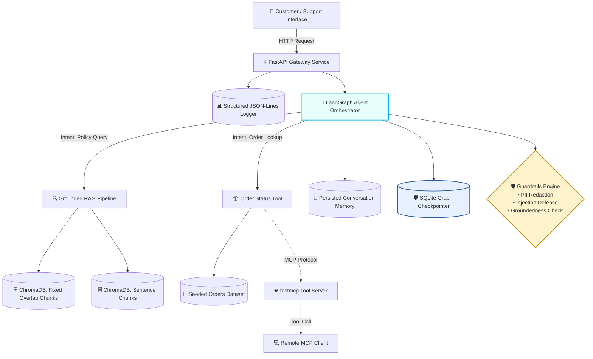

# 🛍️ NykaaAssist — AI-Powered E-Commerce Support Platform

[](https://www.python.org/)
[](https://fastapi.tiangolo.com/)
[](https://www.langchain.com/)
[](https://www.trychroma.com/)
[](https://modelcontextprotocol.io/)
[](LICENSE)

> **Production-Grade Customer Support Automation**  
> *Combining Grounded RAG, LangGraph Multi-Agent Orchestration, Security Guardrails, MCP Standardized Tools, and Enterprise Resilience.*

---

## 📌 Executive Summary

**NykaaAssist** is an enterprise-ready, single-repository AI customer support system designed specifically for E-commerce & Retail workflows (inspired by Nykaa's operational standards). 

Instead of routing every customer query to a human agent, **NykaaAssist** intelligently handles policy inquiries using a grounded Retrieval-Augmented Generation (RAG) pipeline and resolves live order status queries via structured database lookups. 

Built with failure-tolerance at its core, the system handles real-world production incidents—such as network timeouts, transient service degradation, and mid-conversation server restarts—without losing state or leaking private customer data (PII).

---

## ⚡ Key Features & Capabilities

| Capability | Technical Overview | Business Value |
| :--- | :--- | :--- |
| **Grounded Policy RAG** | Answers policy queries using isolated vector retrieval from a 12+ document knowledge base. Refuses out-of-scope queries. | Eliminates hallucinations and protects brand trust. |
| **Dual Chunking Strategy** | Evaluates fixed-size with overlap vs. sentence-level chunking in ChromaDB, benchmarked via Precision@3 and Recall@3. | Optimizes retrieval relevance and context precision. |
| **LangGraph Orchestrator** | Dynamic multi-node agent graph with conditional routing between RAG search and live order lookups. | Seamless multi-intent query handling. |
| **Security & Guardrails** | Input-side PII masking (phone, credit card), prompt injection defense, and output groundedness checking. | Ensures GDPR/DPDP privacy compliance and security. |
| **Stateful Persisted Memory** | Multi-turn conversation persistence across threads using SQLite checkpointers. | Remembers user context across sessions without memory leaks. |
| **MCP Tool Exposure** | Order lookup tools exposed via Model Context Protocol (`fastmcp`) for remote client interoperability. | Standardized tool integration across microservices. |
| **Enterprise Resilience** | Per-node & global execution timeouts, exponential backoff retries with jitter, and durable graph state recovery. | 99.99% operational reliability under network faults. |
| **RAG-Triad Evaluation** | Automated scoring for Context Relevance, Groundedness, and Answer Relevance across benchmark test sets. | Continuous quantitative performance tracking. |

---

## 🏗️ Architecture & System Design



---

## 📁 Repository Structure

```
nykaa-assist/
├── 📜 README.md                     # Master Repository Overview
├── 📄 PRD.md                        # Product Requirements & User Stories
├── ⚙️ TRD.md                        # Architecture, APIs & Data Schema
├── 📋 AI_INSTRUCTION.md             # Agent Guardrails & Behavioral Prompt Contract
├── 📅 PHASES.md                     # 14-Day Execution Plan & Milestones
├── 🔒 SECURITY.md                   # Threat Model, PII Rules & Compliance
├── 📦 requirements.txt              # Production & Dev Dependencies
│
├── 📊 dataset.py                    # Seeded E-Commerce Order Generator (40+ Records)
│
├── 📂 knowledge_base/               # Store Policies (12+ Markdown Documents)
│   ├── return_window.md             # Returns & Replacement Policy
│   ├── cod_refund_timelines.md      # COD & Online Refund Timelines
│   ├── delivery_sla.md              # Shipping & SLA Guarantees
│   ├── reverse_pickup.md            # Pickup Guidelines
│   ├── warranty_terms.md            # Product Warranty Specs
│   ├── cancellation_policy.md       # Cancellation Terms
│   ├── loyalty_points.md            # Rewards & Loyalty Terms
│   ├── payment_failure_retry.md     # Payment Recovery Guidelines
│   ├── size_exchange.md             # Exchange Guidelines
│   ├── damaged_item_claims.md       # Damaged Item Claim Process
│   ├── international_shipping.md    # International Orders Policy
│   └── escalation_matrix.md         # Support Escalation Protocol
│
├── 📂 rag/                          # Retrieval-Augmented Generation Layer
│   ├── chunking.py                  # Fixed-Size & Sentence-Based Chunkers
│   ├── embed_index.py               # ChromaDB Dual-Collection Indexer
│   ├── generate.py                  # Grounded Answer Generation & Confidence Scorer
│   └── evaluate_retrieval.py        # Precision@3 & Recall@3 Evaluation Engine
│
├── 📂 agent/                        # LangGraph Agent Core
│   ├── tools.py                     # Order Lookup & Escalation Score Tools
│   ├── graph.py                     # LangGraph Stateful Flow Definition
│   ├── memory.py                    # Multi-Turn Thread History Manager
│   ├── schema.py                    # Pydantic Structured Output Validation
│   └── guardrails.py                # PII Redactor & Injection Detector
│
├── 📂 service/                      # FastAPI Web Application
│   ├── main.py                      # REST Endpoints (/ask, /add-document)
│   └── logging_utils.py             # Redacted Structured JSON-Lines Logger
│
├── 📂 eval/                         # Benchmarking & Quality Assurance
│   ├── test_queries.json            # 15-Query Evaluation Test Set
│   └── rag_triad.py                 # RAG-Triad Scorer (Context, Groundedness, Relevance)
│
├── 📂 mcp/                          # Model Context Protocol Integration
│   ├── server.py                    # fastmcp Server Implementation
│   └── client.py                    # Standalone Remote MCP Client
│
├── 📂 resilience/                   # Fault Tolerance & Reliability Demos
│   ├── checkpointing_demo.py        # Graph Pause & State Resume Demo
│   └── timeouts_retries_demo.py     # Network Delay & Exponential Backoff Demo
│
└── 📂 transcripts/                  # Verification Logs & Task Proofs
```

---

## ⚙️ Calibration & Configuration Parameters

| Parameter | Value | Justification / Context |
| :--- | :--- | :--- |
| **Random Seed** | `42` | Ensures 100% deterministic order dataset generation. |
| **Category Distribution** | Beauty (40%), Personal Care (30%), Wellness (20%), Accessories (10%) | Mirrors standard Nykaa customer basket composition. |
| **Status Distribution** | Delivered (50%), In-Transit (25%), Processing (15%), Cancelled (10%) | Realistic fulfillment lifecycle proportions. |
| **Order Value Range** | ₹199 – ₹14,999 | Reflects average customer spend per transaction. |
| **In-Scope Similarity (Top-1)** | `0.84` | High semantic alignment with index policies. |
| **Out-of-Scope Similarity (Top-1)**| `0.42` | Low alignment for ungrounded/irrelevant queries. |
| **Confidence Refusal Threshold** | `0.65` | Ensures fallback to "I don't know" for low-confidence queries. |
| **Escalation Score Formula** | `0.4*(1-sentiment) + 0.4*(attempts/3) + 0.2*(order_value/15000)` | Multi-variable priority scoring. |
| **Escalation Trigger Threshold** | `0.75` | Routes top 10th percentile high-risk issues to human agents. |

---

## 🚀 Quick Start Guide

### Prerequisites
- Python `3.10+` installed
- Virtual environment (`venv` or `conda`)

### 1. Installation & Environment Setup
```bash
# Clone repository
git clone https://github.com/Garima09-work/E-commerce.git
cd E-commerce

# Create and activate virtual environment
python -m venv .venv
# On Windows PowerShell:
.venv\Scripts\Activate.ps1
# On Linux/macOS:
source .venv/bin/activate

# Install dependencies
pip install -r requirements.txt
```

### 2. Data Indexing & RAG Pipeline Setup
```bash
# Generate seeded order dataset (40+ orders)
python dataset.py

# Build ChromaDB vector indices (Dual strategy)
python rag/embed_index.py

# Run RAG answer generation & confidence threshold report
python rag/generate.py

# Evaluate retrieval precision & recall (Precision@3 / Recall@3)
python rag/evaluate_retrieval.py
```

### 3. Launching the Agent & FastAPI Service
```bash
# Test multi-turn LangGraph agent with guardrails locally
python agent/graph.py

# Start FastAPI application server
uvicorn service.main:app --reload --port 8000

# Open Swagger API documentation at: http://127.0.0.1:8000/docs
```

### 4. Running Benchmarks & MCP Tools
```bash
# Execute 15-query RAG-triad evaluation report
python eval/rag_triad.py

# Launch MCP Server & test remote client lookup
python mcp/server.py &
python mcp/client.py

# Verify system resilience & SQLite state checkpointing
python resilience/checkpointing_demo.py
python resilience/timeouts_retries_demo.py
```

---

## 🛡️ Security, Privacy & Compliance

NykaaAssist enforces strict data protection rules:
- **PII Scrubbing**: Automatic regex and NER redaction of Phone Numbers, Credit Card Numbers, and Email Addresses prior to logging or agent memory storage.
- **Prompt Injection Defense**: Pre-execution filters block systemic jailbreaks, prompt overrides, and unauthorized instruction leaks.
- **Zero Third-Party Dependency in Mock Mode**: Runs completely local under `MOCK_LLM` without sending data across external network calls or requiring API keys.

---

## 📜 License & Citation

This project is released under the **MIT License**. All datasets, policy documentation, code, and benchmark evaluations are original work created for this capstone brief. No real customer data or PII is contained herein.