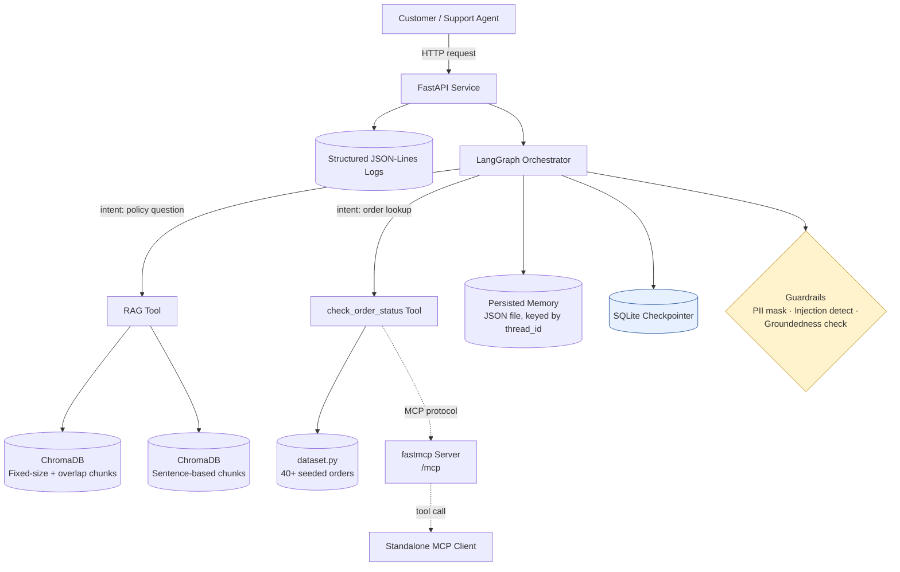

# NykaaAssist — AI-Powered E-commerce Support Agent

**Track:** E-commerce & Retail (Nykaa) · **Mode:** Deterministic `MOCK_LLM` (zero API keys, zero network) · **Duration:** 14 days

NykaaAssist is a production-minded, single-repo support agent that answers policy questions
from a hand-authored knowledge base and looks up live order status from a self-generated
dataset — combining RAG, LangGraph orchestration, guardrails, evaluation, resilience, and
protocol standardization (MCP) into one deployable FastAPI service.

> Instead of escalating every customer message to a human, NykaaAssist gives instant,
> grounded answers for policy questions and real-time order-status lookups — and is built
> to survive the kind of failures a real production incident would throw at it (timeouts,
> transient errors, restarts mid-conversation).

---

## 1. Architecture at a Glance



Full details: system design in [`TRD.md`](./TRD.md), agent behavior contract in
[`AI_INSTRUCTION.md`](./AI_INSTRUCTION.md), threat model in [`SECURITY.md`](./SECURITY.md).

---

## 2. What It Does

| Capability | Summary |
|---|---|
| **Grounded RAG** | Answers policy questions using only retrieved context from a 12+ document knowledge base; refuses when it doesn't know. |
| **Dual chunking comparison** | Fixed-size-with-overlap vs. sentence-based chunking, each in its own ChromaDB collection, scored with Precision@3 / Recall@3. |
| **Two-tool LangGraph agent** | ≥4 nodes, ≥1 conditional edge routing between the RAG tool and `check_order_status`. |
| **Persisted memory** | Multi-turn conversation state survives across turns for a `thread_id`; fresh threads start clean. |
| **Structured output** | Every response validated against a declared JSON Schema. |
| **Guardrails** | Input-side PII masking (phone, card last-4) + prompt-injection detection; output-side groundedness refusal. |
| **FastAPI deployment** | ≥2 endpoints, Pydantic models, JSON-Lines structured logs with trace IDs (PII masked before write). |
| **RAG-triad evaluation** | Context relevance, groundedness, answer relevance scored across 15 test queries. |
| **MCP interoperability** | `check_order_status` exposed as an MCP tool via `fastmcp`, called from a separate client process. |
| **Resilience** | SQLite-checkpointed graph, per-node + global timeouts, exponential-backoff retry with jitter. |

---

## 3. Tech Stack

| Layer | Choice | Why |
|---|---|---|
| Orchestration | LangGraph | Native conditional routing, checkpointing, node-level control |
| Embeddings | SentenceTransformers `all-MiniLM-L6-v2` | Free, local, fast, no API key |
| Vector store | ChromaDB (2 collections) | Lightweight, local, supports per-collection isolation |
| LLM calls | `MOCK_LLM` deterministic stub (real LLM optional behind env flag) | Reproducible grading, zero cost |
| API layer | FastAPI + Pydantic | Typed request/response contracts |
| Tool protocol | `fastmcp` | Standardized, reusable tool exposure |
| Checkpointing | `langgraph-checkpoint-sqlite` | Durable, resumable graph state |
| Logging | JSON-Lines (`jsonlines`/stdlib `json`) | Structured, trace-able, machine-parseable |

---

## 4. Repository Structure

```
nykaa-assist/
├── README.md
├── PRD.md
├── TRD.md
├── AI_INSTRUCTION.md
├── PHASES.md
├── SECURITY.md
├── requirements.txt
├── dataset.py                 # Task 1 — seeded order generator
├── knowledge_base/            # Task 2 — 12+ policy documents
│   ├── return_window.md
│   ├── cod_refund_timelines.md
│   ├── delivery_sla.md
│   ├── reverse_pickup.md
│   ├── warranty_terms.md
│   ├── cancellation_policy.md
│   ├── loyalty_points.md
│   ├── payment_failure_retry.md
│   ├── size_exchange.md
│   ├── damaged_item_claims.md
│   ├── international_shipping.md
│   └── escalation_matrix.md
├── rag/
│   ├── chunking.py            # Task 3 — fixed + sentence chunkers
│   ├── embed_index.py         # Task 3 — dual ChromaDB collections
│   ├── generate.py            # Task 4 — grounded generation + threshold
│   └── evaluate_retrieval.py  # Task 5 — Precision@3 / Recall@3
├── agent/
│   ├── tools.py                # Task 6 — check_order_status + escalation_score
│   ├── graph.py                 # Task 7 — LangGraph graph definition
│   ├── memory.py                # Task 8 — persisted conversation history
│   ├── schema.py                # Task 9 — structured output JSON Schema
│   └── guardrails.py            # Task 10 — PII mask, injection, groundedness
├── service/
│   ├── main.py                  # Task 11 — FastAPI app (/ask, /add-document)
│   └── logging_utils.py         # Task 12 — masked JSON-Lines logger
├── eval/
│   ├── test_queries.json        # Task 13 — 15-query test set
│   └── rag_triad.py              # Task 13 — LLM-as-judge scorer (MOCK_LLM)
├── mcp/
│   ├── server.py                 # Task 14 — fastmcp server
│   └── client.py                  # Task 14 — standalone MCP client
├── resilience/
│   ├── checkpointing_demo.py      # Task 15 — SQLite checkpoint + resume
│   └── timeouts_retries_demo.py   # Task 16 — timeout + retry demo
└── transcripts/                    # Saved run outputs proving every task
    └── ...
```

---

## 5. Quick Start (under `MOCK_LLM`)

```bash
git clone <your-repo-url> && cd nykaa-assist
python -m venv .venv && source .venv/bin/activate
pip install -r requirements.txt

# Part 1
python dataset.py                       # generates + validates 40+ orders
python rag/embed_index.py               # builds both ChromaDB collections
python rag/generate.py                  # grounded Q&A demo + threshold report
python rag/evaluate_retrieval.py        # Precision@3 / Recall@3 for both strategies

# Part 2
python agent/graph.py                   # multi-turn + guardrail demo

# Part 3
uvicorn service.main:app --reload       # POST /ask, POST /add-document
python eval/rag_triad.py                # 15-query RAG-triad report

# Part 4
python mcp/server.py &                  # http://127.0.0.1:8000/mcp
python mcp/client.py                    # calls check_order_status remotely
python resilience/checkpointing_demo.py
python resilience/timeouts_retries_demo.py
```

No API keys or paid accounts are required for any command above.

---

## 6. Deterministic Reproduction

To let a grader reproduce the exact dataset and thresholds, this section must be filled in
once `dataset.py` and the retrieval calibration are finalized:

| Parameter | Value |
|---|---|
| Random seed | `TBD` |
| Category weights | `TBD` |
| Status weights | `TBD` |
| Order value range (₹) | `TBD` — reasoning: `TBD` |
| Measured in-scope top-1 similarity (n=5) | `TBD` |
| Measured out-of-scope top-1 similarity (n=2) | `TBD` |
| Chosen "I don't know" threshold | `TBD` |
| Escalation score formula | `TBD` |
| Escalation threshold | `TBD` (justified against dataset percentile) |

## 7. Documentation Map

| Doc | Purpose |
|---|---|
| [`PRD.md`](./PRD.md) | Problem, users, requirements, acceptance criteria |
| [`TRD.md`](./TRD.md) | Architecture, data models, sequence diagrams, API spec |
| [`AI_INSTRUCTION.md`](./AI_INSTRUCTION.md) | Agent behavior contract — routing, generation, guardrail responses |
| [`PHASES.md`](./PHASES.md) | 14-day execution plan with Gantt chart and daily checklist |
| [`SECURITY.md`](./SECURITY.md) | Threat model, PII policy, guardrail architecture, data handling |

## 8. License & Originality

All dataset records, knowledge-base text, code, and analysis in this repository are
original work produced for this capstone brief. No real customer data, PII, or payment
information is used anywhere — all examples are fabricated.
# E-commerce

