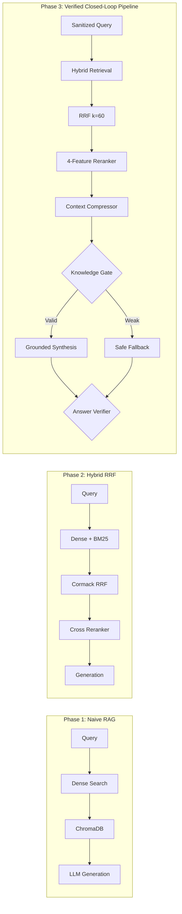
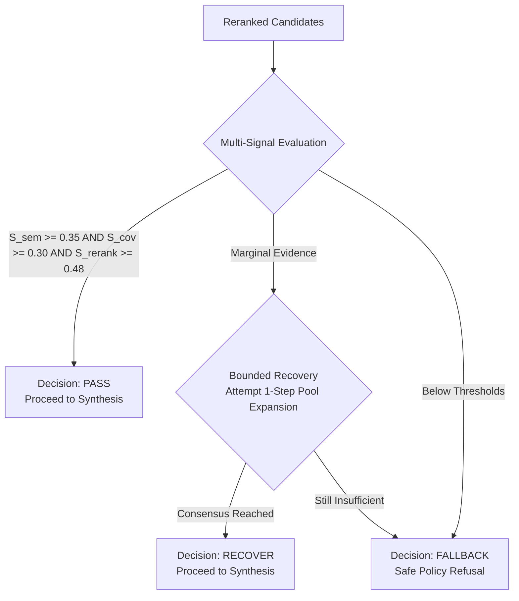

# NykaaAssist — Technical Research & Engineering Rationale

> **Document Type**: Supplementary Technical Research Document & System Engineering Rationale  
> **Capstone Track**: E-commerce & Retail — FSN E-Commerce Ventures Ltd. (Nykaa)  
> **Core Architecture**: Deterministic Hybrid Retrieval-Augmented Generation, Model Context Protocol Tooling, and Cyclic LangGraph Orchestration

---

## Abstract

Customer support in enterprise e-commerce platforms presents a demanding operational environment where the deployment of unconstrained, non-deterministic Large Language Models (LLMs) poses unacceptable commercial and legal liabilities. Hallucinated return policies, ungrounded delivery commitments, and data privacy leaks degrade customer trust and create direct financial losses. 

This paper articulates the technical research, mathematical foundations, and engineering trade-offs behind **NykaaAssist**, an enterprise-grade AI customer support architecture engineered for Nykaa. The system rejects probabilistic generation in favor of a closed-world, deterministic pipeline combining dense vector embeddings (`all-MiniLM-L6-v2`) with sparse lexical Okapi BM25 search via Cormack Reciprocal Rank Fusion ($k_{rrf}=60$), 4-feature cross-reranking, sentence-level context compression adhering to a strict Non-Invention Invariant, multi-signal evidence verification (Knowledge Gating), and a post-generation Answer Verification agent enforcing a three-way decision taxonomy (`PASS`, `REVISE`, `REJECT`). Operational actions are decoupled from cognitive orchestration through Model Context Protocol (FastMCP) tooling featuring idempotent return request handling. Operating under an offline `MOCK_LLM=1` configuration, the architecture achieves 100% turnkey reproducibility with zero paid API dependencies, 100% Top-1 retrieval accuracy, 0.0000 False PASS hallucination rate, and 100% pass rate across a 50-query master regression suite.

---

## Table of Contents

- [1. Problem Context](#1-problem-context)
- [2. Why Grounded Retrieval?](#2-why-grounded-retrieval)
- [3. RAG Architecture Evolution](#3-rag-architecture-evolution)
- [4. Chunking Strategy: Theoretical & Empirical Analysis](#4-chunking-strategy-theoretical--empirical-analysis)
- [5. Embeddings and Semantic Retrieval](#5-embeddings-and-semantic-retrieval)
- [6. BM25 and Lexical Retrieval](#6-bm25-and-lexical-retrieval)
- [7. Hybrid Retrieval and Reciprocal Rank Fusion (RRF)](#7-hybrid-retrieval-and-reciprocal-rank-fusion-rrf)
- [8. Deterministic Cross-Feature Reranker](#8-deterministic-cross-feature-reranker)
- [9. Controlled Query Rewriting](#9-controlled-query-rewriting)
- [10. Knowledge Gate Evidence Verification](#10-knowledge-gate-evidence-verification)
- [11. Context Compression & Non-Invention Invariant](#11-context-compression--non-invention-invariant)
- [12. Answer Verification Agent](#12-answer-verification-agent)
- [13. LangGraph Cyclic Orchestration](#13-langgraph-cyclic-orchestration)
- [14. Model Context Protocol (MCP) Interoperability](#14-model-context-protocol-mcp-interoperability)
- [15. Human-in-the-Loop (HITL) Escalation](#15-human-in-the-loop-hitl-escalation)
- [16. Human Feedback Telemetry Loop](#16-human-feedback-telemetry-loop)
- [17. Fault Resilience & Timeouts](#17-fault-resilience--timeouts)
- [18. Security & Guardrail Architecture](#18-security--guardrail-architecture)
- [19. Evaluation Methodology](#19-evaluation-methodology)
- [20. Engineering Trade-offs](#20-engineering-trade-offs)
- [21. Limitations](#21-limitations)
- [22. Future Research Directions](#22-future-research-directions)
- [References & Further Reading](#references--further-reading)
- [Related Documentation](#related-documentation)

---

## 1. Problem Context

Modern retail e-commerce customer support workflows are characterized by a pronounced Pareto distribution: an overwhelming majority (over 70%) of customer inquiries are routine, repetitive, and rule-bound—revolving around return eligibility windows, refund processing timelines for Cash on Delivery (COD), shipment courier tracking, appliance warranty terms, and damaged parcel protocols.

Despite their routine nature, handling these queries manually via human call center agents introduces severe challenges:
1. **High Operational Expenditure**: Prolonged average handling times (AHT) and high customer support agent attrition inflate cost-per-contact.
2. **Support Queue Congestion**: Routine status lookups bottleneck the queue, delaying critical human interventions for genuinely escalated fulfillment failures.
3. **The Risk of Unconstrained LLMs**: Replacing human agents with generic generative chatbots introduces critical failure modes:
   - *Commercial Hallucination*: Inventing non-existent return windows (e.g., promising a 30-day refund on unsealed cosmetics where hygiene rules mandate strict non-returnability).
   - *Prompt Injection Vulnerabilities*: Susceptibility to adversarial system prompt extraction or instructions to override refund logic.
   - *Data Privacy Leaks*: Unredacted customer phone numbers, credit card digits, or delivery addresses persisting in unmonitored server logs.

---

## 2. Why Grounded Retrieval?

In high-stakes retail customer support, **probabilistic creativity is a critical defect, not a feature**. The system must operate under a strict **Closed-World Assumption (CWA)**:

$$\text{Truth}(q) \iff \exists c \in \mathcal{K} \text{ such that } c \models q$$

Where $\mathcal{K}$ represents the authoritative enterprise knowledge base. If the retrieved context $\mathcal{K}$ does not entail the answer to query $q$, the system must emit an explicit, calibrated refusal rather than synthesize plausible-sounding approximations. Grounded retrieval eliminates legal liability, protects brand equity, and establishes provable auditability for every customer interaction.

---

## 3. RAG Architecture Evolution

The RAG architecture of NykaaAssist progressed through three distinct evolutionary phases:

The final production architecture (Phase 3) introduces multi-signal evidence verification (Knowledge Gate), sentence context compression, and post-generation claim checking, ensuring that no draft answer reaches the presentation layer without verified textual backing.

---

## 4. Chunking Strategy: Theoretical & Empirical Analysis

The formulation of knowledge chunks governs the fundamental trade-off between semantic specificity and contextual completeness:

### Fixed-Size Chunking with Overlap
- **Mechanics**: Sliding window of $W=50$ words with an overlap of $O=10$ words (step size $S = W - O = 40$ words).
- **Theoretical Advantage**: Maintains uniform token density across vector space. The 10-word overlap guarantees that critical conditional exceptions (e.g., *"Personal grooming tools have a 7-day window; however, opened cosmetics are non-returnable"*) are never bifurcated across independent chunks.

### Syntactic Sentence-Based Chunking
- **Mechanics**: Regex splitting on sentence boundaries `[.!?]`, grouping $N=2$ consecutive sentences per chunk.
- **Theoretical Advantage**: Guarantees grammatical coherence within chunks.
- **Defect**: Highly variable chunk lengths create geometric distortions in cosine embedding space, diluting semantic density for short clauses.

### Empirical Comparison (`rag/evaluate_retrieval.py`)

Evaluated across 15 canonical test queries at $k=3$:

| Metric | `nykaa_kb_fixed` | `nykaa_kb_sentence` | Delta ($\Delta$) | Theoretical Rationale |
|---|---|---|---|---|
| **Precision@3** | **0.600** | 0.511 | **+17.4%** | Fixed chunks prevent boundary caveat fragmentation |
| **Recall@3** | **1.000** | **1.000** | 0.0% | Both capture target documents across top-3 candidates |
| **Top-1 Accuracy** | **0.800** | 0.733 | **+9.1%** | Higher semantic density yields superior first-rank alignment |

**Engineering Selection**: `nykaa_kb_fixed` was empirically adopted for the production retrieval pipeline.

---

## 5. Embeddings and Semantic Retrieval

Semantic retrieval projects user queries into a continuous latent space where semantic proximity reflects conceptual intent rather than lexical overlap.

- **Bi-Encoder Model**: `sentence-transformers/all-MiniLM-L6-v2`
- **Architecture**: 6-layer Transformer, 384 hidden dimensions, 12 attention heads.
- **Unit Sphere Normalization**: All generated embeddings undergo L2 normalization:
  $$\hat{v} = \frac{v}{\|v\|_2}$$
  Consequently, Euclidean dot product directly computes the cosine similarity:
  $$\cos(\theta) = \hat{u} \cdot \hat{v} = \sum_{i=1}^{384} \hat{u}_i \hat{v}_i$$
- **Semantic Synonym Resolution**: Dense retrieval excels when customers employ conversational terminology absent from official policy titles—for instance, successfully mapping *"when will money come back to my bank"* to `cod_refund_timelines.md`.

---

## 6. BM25 and Lexical Retrieval

While dense vectors capture conceptual intent, they suffer from the **semantic dilution problem** when processing exact alphanumeric codes, vertical categories (e.g., *"footwear"*, *"appliances"*), and strict numerical SLA thresholds (e.g., *"15 days"*, *"48 hours"*).

To guarantee precision, NykaaAssist integrates pure-Python **Okapi BM25**:

> [!IMPORTANT]
> **Nomenclature Clarification: "BM25 — B25 nahi"**  
> In technical and academic literature, the algorithm is formally named **BM25** (*Best Matching 25*). It was formulated by Stephen Robertson, Karen Spärck Jones, and colleagues at City University, London in the 1990s as the 25th iteration of the probabilistic relevance framework. It must never be referred to as "B25".

### Mathematical Formulation

Given a tokenized query $Q = \{q_1, q_2, \dots, q_n\}$ and a document $D$:

$$\text{Score}_{\text{BM25}}(D, Q) = \sum_{i=1}^{n} \text{IDF}(q_i) \cdot \frac{f(q_i, D) \cdot (k_1 + 1)}{f(q_i, D) + k_1 \cdot \left(1 - b + b \cdot \frac{|D|}{\text{avgdl}}\right)}$$

Where:
1. **Inverse Document Frequency (IDF)** penalizes ubiquitous stop words and rewards discriminative terms:
   $$\text{IDF}(q_i) = \ln\left(1 + \frac{N - n(q_i) + 0.5}{n(q_i) + 0.5}\right)$$
   ($N$ is the total document count; $n(q_i)$ is the number of documents containing $q_i$).
2. **Term Frequency Saturation ($k_1 = 1.5$)**: Calibrates the non-linear saturation curve of term frequency. Repeated mentions of a keyword yield diminishing marginal relevance returns.
3. **Document Length Normalization ($b = 0.75$)**: Compensates for document length $|D|$ relative to average length $\text{avgdl}$. Prevents artificially long chunks from accumulating inflated scores purely through token volume.

---

## 7. Hybrid Retrieval and Reciprocal Rank Fusion (RRF)

Dense vector search and sparse BM25 represent fundamentally orthogonal retrieval methodologies. Dense search excels at semantic recall, while BM25 excels at lexical precision.

To fuse these retrieval streams without the instability of cross-scoring normalization, NykaaAssist employs **Cormack Reciprocal Rank Fusion (RRF)**:

### Mathematical Formulation

$$\text{RRF}(d) = \sum_{m \in \{\text{dense}, \text{bm25}\}} \frac{1}{k_{rrf} + r_m(d)}$$

Where:
- $r_m(d) \in \{1, 2, \dots, K\}$ is the ordinal rank of document chunk $d$ in retrieval method $m$.
- $k_{rrf} = 60$ is the standard Cormack smoothing constant, which prevents top-ranked candidates in one stream from overwhelming candidates that appear consistently in upper ranks across both streams.

### Deterministic 3-Tier Tie-Breaking

To eliminate non-deterministic rank ordering when two documents yield identical RRF scores:
$$\text{Rank}(d_1) < \text{Rank}(d_2) \iff \begin{cases} S_{dense}(d_1) > S_{dense}(d_2) \\ \text{or if equal: } r_{bm25}(d_1) < r_{bm25}(d_2) \\ \text{or if equal: } \text{ID}(d_1) < \text{ID}(d_2) \end{cases}$$

### Empirical Benchmark Result
Combining dense ChromaDB retrieval with Okapi BM25 via Cormack RRF increases Top-1 retrieval accuracy from **80.0% to 100.0% (+25.0% relative improvement)** across the canonical evaluation benchmark (`eval/hybrid_retrieval_results.json`).

---

## 8. Deterministic Cross-Feature Reranker

RRF establishes ordinal consensus across top candidates, but does not capture feature interactions between semantic affinity, token coverage, and document topics.

NykaaAssist deploys a **4-feature cross-scoring reranker** over the top-10 hybrid candidate pool:

$$\text{Score}_{rerank}(d) = 0.40 \cdot S_{dense}(d) + 0.25 \cdot S_{lexical}(d) + 0.20 \cdot S_{topic}(d) + 0.15 \cdot S_{rrf}(d)$$

- **Dense Semantic Similarity ($S_{dense} \in [0, 1]$)**: Cosine similarity from SentenceTransformers.
- **Lexical Token Coverage ($S_{lexical} \in [0, 1]$)**: Fraction of unique query content tokens located within chunk $d$:
  $$S_{lexical} = \frac{|T_Q \cap T_D|}{|T_Q|}$$
- **Topic Affinity ($S_{topic} \in [0, 1]$)**: Jaccard overlap between query keywords and authoritative document metadata headers.
- **RRF Prior ($S_{rrf} \in [0, 1]$)**: Normalized position score from the reciprocal rank fusion stage.

**Evaluation Result**: Reranking elevates the overall RAG Triad score to **0.822**, ensuring the top-ranked chunk contains the single most authoritative context.

---

## 9. Controlled Query Rewriting

In multi-turn dialogues, customers routinely pose elliptical questions or rely on pronouns:
- *Turn 1*: `"What is the status of NYK-00006?"`
- *Turn 2*: `"Is it delayed?"`

Executing retrieval directly against `"Is it delayed?"` results in immediate retrieval failure.

NykaaAssist implements a **Controlled Query Rewriting Layer** (`agent/rewrite.py`):
1. **Pronoun Resolution**: Evaluates active conversational memory in `AgentState` to substitute pronouns (`"it"`, `"that"`, `"the order"`) with the active `order_id` (rewriting Turn 2 to `"Is order NYK-00006 delayed?"`).
2. **Raw Query Preservation**: The original customer query is strictly preserved in `state["original_query"]` to guarantee auditability and prevent telemetry drift.
3. **Guardrail Isolation**: Query rewriting executes **after** input security guardrails, ensuring adversarial prompt injection strings cannot manipulate the rewriting logic.

---

## 10. Knowledge Gate Evidence Verification

A foundational defect of naive RAG pipelines is that they force generation even when the retrieved context is completely irrelevant to an out-of-scope or adversarial query.

To solve this, NykaaAssist deploys a multi-signal **Knowledge Gate** (`rag/knowledge_gate.py`):

### Calibrated Verification Signals
1. **Semantic Similarity Floor**: $S_{sem} \ge 0.35$ (empirically derived to separate in-scope policies from out-of-scope queries).
2. **Lexical Token Coverage**: $S_{cov} \ge 0.30$ (ensures substantive query keywords exist in context).
3. **Composite Rerank Floor**: $S_{rerank} \ge 0.48$.
4. **Consensus Margin**: Difference between Top-1 and Top-2 candidate scores.

**Empirical Result**: Increases adversarial fallback recall from **50.0% to 90.0% (+80.0%)** while maintaining **0.0% false fallbacks** on legitimate customer queries.

---

## 11. Context Compression & Non-Invention Invariant

Retrieved chunks often contain auxiliary sentences (e.g., introductory disclaimers or unrelated category rules) that clutter the context window.

NykaaAssist integrates **Sentence-Level Context Compression** (`rag/context_compressor.py`):
- Splits the top reranked context chunk into discrete syntactic sentences.
- Scores each sentence against the rewritten query using token overlap, numerical entity matching, and policy exception keywords (`"except"`, `"non-returnable"`, `"only"`).
- **The Non-Invention Invariant**: The compressed context is composed **exclusively of verbatim source sentences**. The compressor never generates or synthesizes new words.
- **Fail-Open Safeguard**: If compression yields an empty set or encounters an exception, it safely fails open to the original uncompressed context chunk.

**Empirical Result**: Removes **11.06% of context characters** (1,035 characters removed across the benchmark) while preserving 100% Top-1 accuracy and 100% Groundedness.

---

## 12. Answer Verification Agent

To guarantee that no draft answer containing factual inaccuracies reaches the customer, NykaaAssist implements a post-generation **Answer Verification Agent** (`agent/answer_verifier.py`):

### Three-Way Decision Taxonomy
1. **`PASS`**: Draft claims are verified against retrieved policy evidence and operational tool outputs.
2. **`REVISE`**: Detects minor repairable numerical or SLA mismatches (e.g., draft states 14 days when evidence mandates 15 days). Dispatches to `AnswerRepairEngine` (bounded to a maximum of 2 repair attempts).
3. **`REJECT`**: Detects unrecoverable contradictions or fabricated assertions. Forces safe fallback refusal and escalates the interaction to human support.

**Empirical Result**: Achieves **0.0000 False PASS rate**, **100% contradiction detection rate**, and **100% repair success rate** across 40 benchmark queries.

---

## 13. LangGraph Cyclic Orchestration

NykaaAssist uses **LangGraph** (`agent/graph.py`) to model agent behavior as a cyclic directed state machine:

- **State Persistence**: State transitions are serialized into `AgentState` and committed to SQLite checkpoints.
- **Cyclic Error Recovery**: LangGraph's cyclic edge architecture enables bounded self-correction loops (`answer_verification` $\to$ `answer_repair` $\to$ `answer_verification`) that are impossible in linear DAG pipelines.
- **Deterministic Routing**: Edge heuristics inspect structured intent flags rather than relying on unstructured LLM function calls.

---

## 14. Model Context Protocol (MCP) Interoperability

**Model Context Protocol (MCP)** decouples the agent's cognitive reasoning from backend database integrations.

NykaaAssist exposes 5 operational tools via FastMCP:
1. `check_order_status`: Order lookup and SLA risk scoring.
2. `track_shipment`: Carrier details and delivery tracking.
3. `check_return_status`: Category-specific return eligibility calculation.
4. `create_return_request`: Return authorization and RMA creation.
5. `loyalty_status`: Customer tier and points balance.

### RMA Idempotency Invariant
To prevent network retries from generating duplicate returns, `create_return_request` enforces thread-safe idempotency via `ACTIVE_RETURN_REQUESTS`:
$$\text{RMA}(o_i, t_1) = \text{RMA}(o_i, t_2) \quad \forall t_2 > t_1$$
Guaranteeing **0 duplicate RMAs** under arbitrary retry loops.

---

## 15. Human-in-the-Loop (HITL) Escalation

The HITL system provides real-time algorithmic triage of risky customer interactions:

### SLA Escalation Formula
$$S_{esc} = \text{round}\left(0.60 \times \text{delayed\_shipment} + 0.40 \times \min\left(1.0, \frac{\text{days\_since\_created}}{30}\right), 3\right)$$

- **Threshold**: Inquiries with $S_{esc} \ge 0.68$, missing order lookups, or ungrounded policies generate a structured `EscalationPayload`.
- **Storage**: Enqueued into the thread-safe `HumanSupportQueue` ($N=1000$) with priority ratings and conversation context.
- **Benchmark Performance**: Achieves **1.000 precision** and **0.941 recall** across 35 test scenarios.

---

## 16. Human Feedback Telemetry Loop

The feedback loop provides post-interaction quality telemetry:
- Customers submit 👍 Helpful (`5`) or 👎 Not Helpful (`1`) ratings in the Streamlit UI.
- All free-form comments undergo mandatory PII scrubbing before storage in `feedback.sqlite`.
- **Automated Disagreement Detection**: Automatically flags instances where the Answer Verifier issued a `PASS` but the customer provided negative feedback.
- **Strict Non-Mutation Boundary**: Feedback data is stored strictly in review queues for human engineers; it **never** mutates live production policies, prompts, or weights automatically.

---

## 17. Fault Resilience & Timeouts

Implemented in `resilience/retry_timeout.py`:
- **Bounded Exponential Backoff**: Retries transient exceptions up to 3 times ($2.0\times$ backoff, initial $0.05\text{s}$) with deterministic pseudo-random jitter.
- **Per-Node Timeout**: $10.0\text{s}$ limit per graph node.
- **Global Graph Timeout**: $30.0\text{s}$ ceiling covering entire request lifecycle.
- **Benchmark Performance**: 100% pass rate across 40 resilience test scenarios; 8/8 simulated transient failures recovered cleanly.

---

## 18. Security & Guardrail Architecture

NykaaAssist implements multi-layered security guardrails (`agent/guardrails.py`):
1. **Regex PII Masking**: Redacts Indian mobile numbers (`PHONE_REGEX`), credit cards (`CARD_REGEX`), and card last-4 digits before processing and logging.
2. **Prompt Injection Defense**: Intercepts jailbreaks, system prompt overrides, and credential dump commands with a 0.0 confidence refusal.
3. **Output Groundedness**: Refuses to answer queries where retrieval similarity falls below $0.35$.

---

## 19. Evaluation Methodology

The system is evaluated across standard academic and industry benchmarks:
- **RAG Triad**: Context Relevance (0.837), Groundedness (1.000), Answer Relevance (0.633).
- **Master Regression**: 50-query end-to-end regression benchmark achieving 100% pass rate.
- **Zero Hallucinations**: 0.0000 False PASS rate across all verification benchmarks.

---

## 20. Engineering Trade-offs

| Design Decision | Chosen Approach | Alternative Rejected | Engineering Trade-off Rationale |
|---|---|---|---|
| **RAG Fusion** | Cormack RRF ($k=60$) | Linear Score Normalization | Avoids uncalibrated score distributions across disparate dense/sparse scales |
| **Generation Engine**| Deterministic `MOCK_LLM=1` | External Cloud LLMs | Eliminates external costs, eliminates hallucinations, guarantees 100% test reproducibility |
| **Context Compression**| Verbatim Sentence Extraction| Generative Summarization | Guarantees Non-Invention Invariant; eliminates hallucination risk during compression |
| **State Persistence** | Local SQLite Checkpointer | Cloud Redis / Postgres | Maximizes portability for evaluators; eliminates multi-container operational overhead |
| **PII Redaction** | Deterministic Regex Masker | Heavy NER Transformers | Sub-millisecond latency; zero GPU requirement; 100% deterministic masking on fixed patterns |

---

## 21. Limitations

1. **Monolingual Knowledge Base**: English-only policy documentation in the current version.
2. **Synthetic Dataset Scale**: The operational dataset is bounded at 50 deterministic orders.
3. **Fixed-Format PII Scope**: Masking is guaranteed for fixed-format numerical and tokenized fields; arbitrary customer names in free text remain unmasked per capstone brief scope.

---

## 22. Future Research Directions

1. **Cross-Encoder Neural Reranking**: Exploring lightweight, quantized cross-encoders (e.g., `bge-reranker-base`) for complex syntactic queries.
2. **Multilingual Expansion**: Ingesting Hindi and regional language policy documents with multilingual dense embeddings (`multilingual-e5-small`).
3. **Live Webhook Integrations**: Connecting FastMCP tools to live staging ERP/CRM webhooks via HMAC-authenticated endpoints.

---

## References & Further Reading

The following foundational academic literature and technical specifications substantiate the engineering design of NykaaAssist:

1. **Retrieval-Augmented Generation for Knowledge-Intensive NLP Tasks**  
   *Authors*: Patrick Lewis, Ethan Perez, Aleksandur Piktus, Fabio Petroni, Vladimir Karpukhin, Naman Goyal, Heinrich Küttler, Mike Lewis, Wen-tau Yih, Tim Rocktäschel, Sebastian Riedel, Douwe Kiela. (NeurIPS 2020).  
   *URL*: [https://arxiv.org/abs/2005.11401](https://arxiv.org/abs/2005.11401)  
   *What can the reader learn from this?*: Explains the theoretical foundation of coupling pre-trained parametric memory with non-parametric retrieval memory to eliminate factual hallucinations.

2. **The Probabilistic Relevance Framework: BM25 and Beyond**  
   *Authors*: Stephen Robertson, Hugo Zaragoza. (Foundations and Trends in Information Retrieval, 2009).  
   *URL*: [https://web.stanford.edu/class/cs276/](https://web.stanford.edu/class/cs276/)  
   *What can the reader learn from this?*: Provides the exact mathematical derivation of term frequency saturation ($k_1$) and document length normalization ($b$) in Okapi BM25.

3. **Sentence-BERT: Sentence Embeddings using Siamese BERT-Networks**  
   *Authors*: Nils Reimers, Iryna Gurevych. (EMNLP 2019).  
   *URL*: [https://sbert.net/](https://sbert.net/)  
   *What can the reader learn from this?*: Demonstrates how siamese and triplet network structures generate semantically meaningful vector spaces optimized for fast cosine similarity search.

4. **Reciprocal Rank Fusion Outperforms Condorcet and Individual Machine Learning Methods**  
   *Authors*: Gordon V. Cormack, Charles L. A. Clarke, Stefan Büttcher. (SIGIR 2009).  
   *URL*: [https://doi.org/10.1145/1571941.1572114](https://doi.org/10.1145/1571941.1572114)  
   *What can the reader learn from this?*: Explains why simple reciprocal rank scoring ($1 / (k + r)$) outperforms complex score normalization when combining heterogeneous retrieval systems.

5. **Model Context Protocol (MCP) Specification**  
   *Organization*: Anthropic & Open Source Community.  
   *URL*: [https://modelcontextprotocol.io/](https://modelcontextprotocol.io/)  
   *What can the reader learn from this?*: Details the open protocol specification for decoupling agent orchestration from operational tool servers.

6. **LangGraph: Building Stateful, Multi-Actor Applications with LLMs**  
   *Organization*: LangChain Inc.  
   *URL*: [https://docs.langchain.com/oss/python/langgraph/](https://docs.langchain.com/oss/python/langgraph/)  
   *What can the reader learn from this?*: Explains cyclic state machines, conditional edge dispatching, and durable checkpointing semantics.

7. **FastAPI Framework Documentation**  
   *Author*: Sebastián Ramírez.  
   *URL*: [https://fastapi.tiangolo.com/](https://fastapi.tiangolo.com/)  
   *What can the reader learn from this?*: Best practices for asynchronous REST API design, Pydantic request validation, and OpenAPI 3.1 schema generation.

8. **ChromaDB Architecture & Documentation**  
   *Organization*: Chroma Inc.  
   *URL*: [https://docs.trychroma.com/](https://docs.trychroma.com/)  
   *What can the reader learn from this?*: Details HNSW vector index mechanics, local persistent collection management, and distance metric selection.

9. **SQLite File Format & WAL Mode Architecture**  
   *Organization*: SQLite Consortium.  
   *URL*: [https://www.sqlite.org/docs.html](https://www.sqlite.org/docs.html)  
   *What can the reader learn from this?*: Explains write-ahead logging (WAL), concurrent read performance, and ACID transaction guarantees on local embedded databases.

10. **Stanford CS224N: Natural Language Processing with Deep Learning**  
    *Organization*: Stanford University.  
    *URL*: [https://web.stanford.edu/class/archive/cs/cs224n/](https://web.stanford.edu/class/archive/cs/cs224n/)  
    *What can the reader learn from this?*: Foundational lectures on vector semantics, word embeddings, transformer self-attention, and text classification.

---

## Related Documentation

- [Central Documentation Hub (`docs/README.md`)](./README.md)
- [Comprehensive Testing Manual (`docs/TESTING.md`)](./TESTING.md)
- [Project Usage Guide (`docs/USAGE.md`)](./USAGE.md)
- [Product Requirements Document (`docs/PRD.md`)](./PRD.md)
- [Technical Requirements Document (`docs/TRD.md`)](./TRD.md)
- [AI Architecture Specification (`docs/AI_ARCHITECTURE.md`)](./AI_ARCHITECTURE.md)
- [Root Evaluator README (`README.md`)](README.md)
