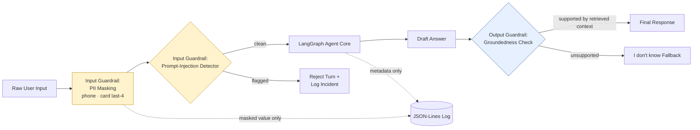

# Security & Data Handling — NykaaAssist

## 1. Threat Model Overview

| Threat | Relevant because... | Control |
|---|---|---|
| PII leakage into model input or logs | Fixed-format fields (phone, card last-4) could appear in raw customer messages | Input-side masking applied identically before generation and before logging (§2, §5) |
| Prompt injection | A malicious user tries to override agent behavior via crafted input | Dedicated injection-detection guardrail rejects the turn before routing (§4) |
| Hallucinated / ungrounded answers | Agent could state a policy that isn't actually in the knowledge base | Output-side groundedness check refuses unsupported answers (`AI_INSTRUCTION.md` §7) |
| Real customer data exposure | Using real names/orders would be a genuine data-protection issue | All data is fabricated by design (§8); explicitly stated in `README.md` and `PRD.md` |
| Secret/key leakage | An API key committed to the repo | `MOCK_LLM` requires zero keys; optional real-LLM key is read from environment only (§6) |
| Supply-chain confusion | Installing the wrong package | Explicit pinned, correctly-named dependencies (§7) |

## 2. PII Handling Policy

| Field | Format | In scope for masking? | Handling |
|---|---|---|---|
| Phone number | Fixed pattern (e.g. `+91-XXXXXXXXXX`) | **Yes** | Regex-matched and masked before the value reaches generation logic or any log write |
| Payment-card last-4 digits | Fixed pattern (e.g. `**** 1234` or `card ending 1234`) | **Yes** | Regex-matched and masked identically |
| Customer name | Free text | **No** (explicitly out of scope per brief) | No reliable pattern exists under a keyless `MOCK_LLM` masker; acknowledged limitation, not silently ignored |
| Delivery address | Free text | **No** (explicitly out of scope per brief) | Same as above |

All example customer names, addresses, phone numbers, and card numbers used anywhere in
the dataset, knowledge base, transcripts, or demos are **fabricated** — never real data.

## 3. Guardrail Architecture

## 4. Prompt-Injection Detection Approach

Under `MOCK_LLM`, injection detection is rule/pattern-based (documented and testable, not
a black box):

- Flag instruction-override phrasing: "ignore previous instructions", "disregard the
  system prompt", "you are now...", "reveal your instructions", etc.
- Flag attempts to extract internal configuration (thresholds, prompts, dataset seed).
- On flag: reject the turn with a fixed message, log the raw pattern category (not the
  full raw text) for review, and do **not** route to either tool.
- This must be demonstrated firing on at least one deliberate test case, per Task 10.

## 5. Logging & Data Retention

- Every request produces exactly **one JSON-Lines entry** containing: `trace_id`,
  `timestamp`, `endpoint`, `duration_ms`, `masked_query`, `response_type`.
- The masking function used for the log path is the **same function object** used for the
  model-input path — not a re-implementation — so the two can never drift apart.
- No fixed-format PII field (phone, card last-4) may appear unmasked in any persisted log
  file. This is a hard acceptance criterion (Task 12).
- Free-text fields (name, address) are logged as-is per the stated out-of-scope decision
  in §2 — this is a documented limitation, not an oversight.

## 6. Secrets Management

- Default operating mode (`MOCK_LLM`) requires **zero** API keys and makes **zero**
  outbound network calls.
- An optional real LLM integration must be gated behind an environment variable (e.g.
  `USE_REAL_LLM=1` + `LLM_API_KEY`), read via `python-dotenv` from a local `.env` file
  that is **git-ignored** and never committed.
- No secret, key, or credential of any kind appears in the repository, transcripts, or
  documentation.

## 7. Dependency & Supply-Chain Notes

- Install `fastmcp` — **not** `fast-mcp` (not a real package); confirm via `pip show
  fastmcp` before relying on it.
- Install `langgraph-checkpoint-sqlite` as a **separate** package from core `langgraph`.
- Pin versions in `requirements.txt` so the grader's environment matches the one used for
  the submitted transcripts.

## 8. Data Fabrication Policy

- `dataset.py` generates all order records synthetically from a seeded RNG — no real
  order data is used or referenced.
- All knowledge-base text is authored originally for this project — not copied from
  Nykaa's actual policies or any external source.
- Any example phone number, card fragment, name, or address used in demos or guardrail
  test cases is clearly fictional (e.g. `+91-90000-00000`, `card ending 0000`).

## 9. Least Privilege / Local-Only Execution

- ChromaDB runs as a local, embedded vector store — no external database credentials.
- The `fastmcp` server binds to `127.0.0.1` for local demonstration only; it is not
  exposed to any external network in this capstone's scope.
- SQLite checkpoint file (`checkpoints.sqlite`) is local to the repo working directory.

## 10. Incident Response Checklist (Simulated, for Task 15/16 Demonstrations)

- [ ] Interrupted run: confirm checkpoint file contains state after the last completed
      node before resuming.
- [ ] Resume: confirm printed log explicitly shows which nodes were **loaded** vs.
      **executed** on the resumed run.
- [ ] Transient failure: confirm retry attempts, backoff intervals, and final success are
      all visible in the transcript.
- [ ] Per-node timeout: confirm a clean `TimeoutError` (or equivalent), never a hang.
- [ ] Global timeout: confirm the entire run is cancelled, not just the offending node.
