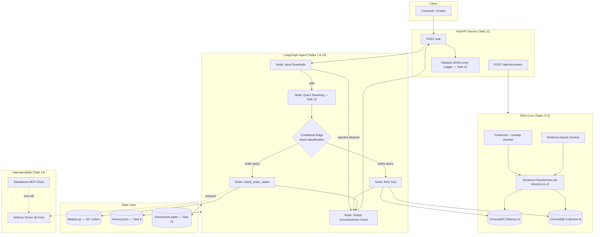
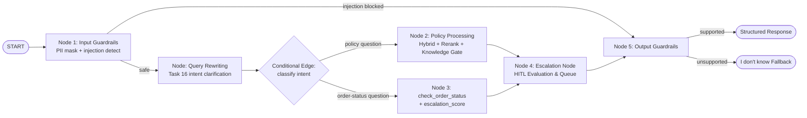
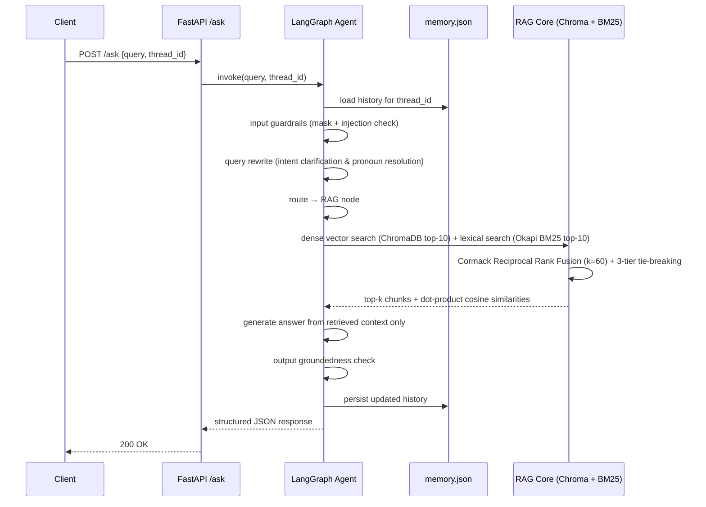
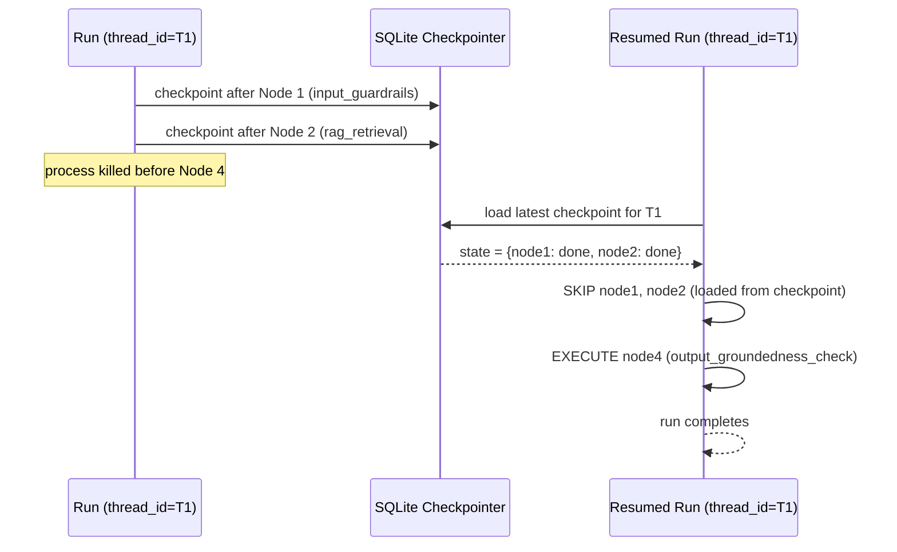
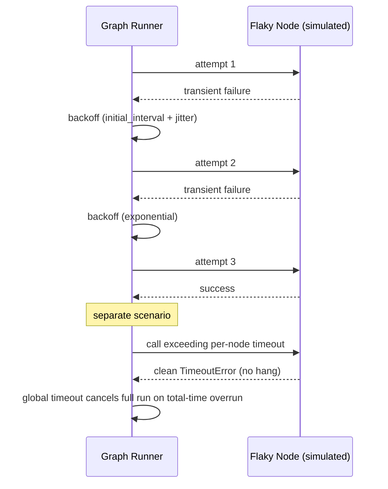

# Technical Requirements Document (TRD) — NykaaAssist

## 1. System Architecture



## 2. Component Breakdown

| Component | Responsibility | Key file |
|---|---|---|
| Dataset generator | Seeded, reproducible order records; structural validation & reporting | `dataset.py` |
| Knowledge base | 12+ original policy documents covering every required topic | `knowledge_base/*.md` |
| Dual chunker | Fixed-size-with-overlap and sentence-based splitting | `rag/chunking.py` |
| Embedding/index | Embeds both chunk sets, writes to two isolated Chroma collections | `rag/embed_index.py` |
| Grounded generator | Top-k retrieval → answer using only retrieved context, empirical fallback threshold | `rag/generate.py` |
| Retrieval evaluator | Precision@3 / Recall@3 at document level, per query, per collection | `rag/evaluate_retrieval.py` |
| Order tool | `check_order_status(record_id)` + designed `escalation_score` | `agent/tools.py` |
| Graph | ≥4-node LangGraph with conditional routing | `agent/graph.py` |
| Memory | Persisted JSON conversation history keyed by `thread_id` | `agent/memory.py` |
| Structured output | JSON Schema + validation | `agent/schema.py` |
| Guardrails | PII masking, injection detection, groundedness refusal | `agent/guardrails.py` |
| Query rewriter | Pure deterministic intent clarification & pronoun resolution; raw query preservation | `agent/rewrite.py` |
| API | FastAPI endpoints + Pydantic models | `service/main.py` |
| Logging | JSON-Lines, trace ID, PII masked before write | `service/logging_utils.py` |
| Evaluation | RAG-triad judge (MOCK_LLM) over 15 queries | `eval/rag_triad.py` |
| MCP server/client | Standardized tool exposure + independent client round trip | `mcp/server.py`, `mcp/client.py` |
| Resilience | Checkpointing, resume semantics, crash recovery verification | `resilience/*.py` |
| Reranker | Deterministic cross-feature scoring over top-10 hybrid pool | `rag/reranker.py` |

## 3. Data Model

### 3.1 Order Record (`dataset.py`)

| Field | Type | Notes |
|---|---|---|
| `record_id` | `str` | Unique, e.g. `NYK-00001` |
| `category` | `enum` | Apparel · Electronics · Home · Footwear · Beauty (+ optional extras) |
| `status` | `enum` | Placed · Shipped · Delivered · Returned · Refunded (+ optional extras) |
| `order_value_inr` | `float` | Realistic INR range — reasoning stated in `README.md` §6 |
| `days_since_created` | `int` | 0–30 |
| `delayed_shipment` | `bool` | Population-level rate must land 10–30% |

### 3.2 Knowledge Base Document

| Field | Type | Notes |
|---|---|---|
| `doc_id` | `str` | Stable identifier |
| `topic` | `str` | One of the 12 required topics |
| `text` | `str` | 2–5 original sentences |

### 3.3 AgentState Schema (`agent/graph.py`)

| Field | Type | Description |
|---|---|---|
| `original_query` | `str` | Raw original user query, strictly preserved and immutable |
| `rewritten_query` | `str` | Intent-clarified and pronoun-resolved query for retrieval |
| `query` | `str` | Backwards-compatible query representation |
| `route` | `str` | Selected route (`policy`, `order`, or `blocked`) |
| `order_id` | `Optional[str]` | Extracted order ID (e.g. `NYK-00007`) |
| `thread_id` | `str` | Conversation session identifier |
| `trace_id` | `str` | Unique request trace ID |
| `is_blocked` | `bool` | Security flag set if prompt injection detected |

### 3.4 Structured Agent Response (Task 9 schema, illustrative)

```json
{
  "type": "object",
  "required": ["response_type", "answer", "sources", "confidence", "trace_id"],
  "properties": {
    "response_type": { "type": "string", "enum": ["policy_answer", "order_status", "fallback", "guardrail_block"] },
    "answer": { "type": "string" },
    "sources": { "type": "array", "items": { "type": "string" } },
    "escalation_score": { "type": ["number", "null"], "minimum": 0, "maximum": 1 },
    "confidence": { "type": "number", "minimum": 0, "maximum": 1 },
    "trace_id": { "type": "string" },
    "escalation_payload": {
      "type": ["object", "null"],
      "properties": {
        "requires_human": { "type": "boolean" },
        "escalation_id": { "type": "string" },
        "category": { "type": "string", "enum": ["policy_uncertainty", "order_delay", "order_not_found", "customer_request", "guardrail_flag"] },
        "priority": { "type": "string", "enum": ["high", "medium", "low"] },
        "reason": { "type": "string" },
        "conversation_context": { "type": "string" },
        "recommended_action": { "type": "string" },
        "order_id": { "type": ["string", "null"] },
        "escalation_score": { "type": ["number", "null"] },
        "confidence": { "type": ["number", "null"] },
        "trace_id": { "type": "string" }
      },
      "required": ["requires_human", "escalation_id", "category", "priority", "reason", "conversation_context", "recommended_action", "trace_id"]
    }
  }
}
```

## 4. LangGraph State Graph



Minimum nodes satisfied: `input_guardrails → query_rewrite → {policy | order} → escalation → output_guardrails`.

## 5. Sequence Diagrams

### 5.1 In-scope policy query



### 5.2 Checkpointed run — interrupt and resume



### 5.3 Resilience — retry then timeout



## 6. Chunking Strategy Comparison Design

| Aspect | Fixed-size + overlap | Sentence-based |
|---|---|---|
| Split unit | N-token windows with overlap | Natural sentence boundaries |
| Collection | `nykaa_kb_fixed` | `nykaa_kb_sentence` |
| Expected strength | Consistent chunk size, robust to long paragraphs | Semantically coherent, cleaner topical boundaries |
| Expected weakness | May split a sentence mid-thought | Uneven chunk lengths |
| Scored via | Precision@3 / Recall@3 at document level (dedup chunks → parent doc) on the same ≥5 queries | same |

Recommendation is written in `README.md`/`rag/evaluate_retrieval.py` output, citing the
actual measured numbers — not asserted a priori.

## 6.1 Hybrid Retrieval & Reciprocal Rank Fusion (Task 17)

To eliminate vector-only semantic confusion on keyword-critical queries (acronyms like "COD", specific failure conditions like "damaged/broken seal", or action triggers like "cancel at doorstep"), a deterministic hybrid retrieval layer operates as follows:

1. **Dense Vector Search**: ChromaDB HNSW cosine similarity using `all-MiniLM-L6-v2` embeddings, candidate depth $k_{cand} = 10$.
2. **Sparse Lexical Search**: Pure-Python Okapi BM25 ($k_1=1.5, b=0.75$) with regex tokenization and custom stopword filtration, candidate depth $k_{cand} = 10$.
3. **Canonical Reciprocal Rank Fusion (RRF)**:
   $$RRF(d) = \sum_{m \in \{vec, bm25\}} \frac{1}{k_{rrf} + rank_m(d)}$$
   where $k_{rrf} = 60$, with a 3-tier deterministic tie-breaking:
   $$(-\text{round}(RRF, 6), -\text{round}(sim, 4), chunk\_id)$$
4. **Confidence Calibration**: For all candidate chunks, cosine similarities are computed via dot product against cached normalized chunk vectors, ensuring the grounding confidence threshold (0.35) remains rigorously calibrated.

## 6.2 Deterministic Cross-Feature Reranking (Task 18)

To refine hybrid candidate context, eliminate noisy secondary chunks, and maximize context purity without requiring heavy external models, a pure-Python deterministic cross-feature reranker operates as follows:

1. **Candidate Pool**: Operates over the top-$N$ fused candidates from Hybrid Retrieval ($N=10$).
2. **Four Feature Dimensions**:
   - **Dense Semantic Similarity ($S_{sem}$)**: Cosine similarity between query embedding and normalized chunk embedding $\in [0, 1]$.
   - **Lexical Token Coverage ($S_{cov}$)**: Ratio of query terms (excluding stopwords) present in chunk text $\in [0, 1]$.
   - **Topic/Source Affinity ($S_{topic}$)**: Keyword overlap between query terms and chunk source metadata filename $\in [0, 1]$.
   - **Normalized RRF Score ($S_{rrf}$)**: Normalized rank-prior from Task 17 hybrid fusion $\in [0, 1]$.
3. **Calibrated Scoring Function**:
   $$\text{Rerank Score} = 0.45 \cdot S_{sem} + 0.25 \cdot S_{cov} + 0.10 \cdot S_{topic} + 0.20 \cdot S_{rrf}$$
   Weights are calibrated to prevent false lexical matches on generic delivery words while preserving 100% Top-1 accuracy and improving Context Relevance (+4.5% over hybrid).
4. **Deterministic Three-Tier Tie-Breaking**:
   $$(-\text{round}(\text{Score}, 6), -\text{round}(S_{sem}, 6), chunk\_id)$$
5. **Grounding Evaluation Invariance**: The reranker score NEVER replaces or alters dense cosine similarity for the grounding check (`DEFAULT_SIMILARITY_THRESHOLD = 0.35`). Queries falling below this threshold strictly trigger the verified grounding fallback.
6. **Fail-Safe Fallback**: Any malformed candidate or unexpected exception gracefully falls back to the Task 17 hybrid RRF ordering.

## 6.3 Knowledge Gate Evidence Verification (Task 19)

Positioned strictly downstream of the deterministic Reranker and upstream of Grounded Answer Generation, the Knowledge Gate evaluates retrieved and reranked evidence to decide whether it is sufficient to ground generation or must trigger a graceful fallback.

1. **Architecture & Pipeline Position**:
   ```text
   Input Guardrails -> Query Rewriting -> Router -> Hybrid Retrieval -> Reranker -> Knowledge Gate -> Grounded Generation -> Output Guardrails
   ```
   The Knowledge Gate consumes existing retrieval and reranking outputs (`fused_candidates`), evaluating quality without re-running retrieval or modifying public schemas.

2. **Signals Evaluated**:
   - **Dense Semantic Similarity ($S_{sem}$)**: Top candidate cosine similarity, strictly enforcing the immutable $0.35$ grounding floor.
   - **Lexical Token Coverage ($S_{cov}$)**: Ratio of query content terms matched in candidate text.
   - **Rerank Score ($S_{rerank}$)**: Top candidate Task 18 composite reranker score.
   - **Topic Affinity ($S_{topic}$)**: Keyword overlap between query terms and parent document source filename.
   - **Candidate Consensus & Margin**: Score margin between rank-1 and rank-2 candidates, and flag indicating whether rank-1 and rank-2 share the same parent source (`same_source_consensus`).

3. **Empirically Calibrated Thresholds**:
   - `DEFAULT_MIN_SIMILARITY_FLOOR = 0.35`: Immutable hard floor; rejects out-of-scope queries (e.g., France, Delhi, Quicksort, Inception, Apple stock with similarities $\le 0.279$).
   - `DEFAULT_STRONG_SIMILARITY_THRESHOLD = 0.42`: Calibrated above lowest in-scope benchmark query ($0.439$).
   - `DEFAULT_STRONG_COVERAGE_THRESHOLD = 0.30`: Minimum lexical coverage required for direct `PASS`; blocks fabricated policy queries lacking document terms.
   - `DEFAULT_STRONG_RERANK_THRESHOLD = 0.48`: Minimum rerank score for direct `PASS` ($0.48$).
   - `DEFAULT_RECOVERY_COVERAGE_THRESHOLD = 0.25`: Calibrated threshold for bounded recovery.

4. **Three Decision States**:
   - `PASS`: Direct pass to generation when $S_{sem} \ge 0.42$, $S_{cov} \ge 0.30$, and $S_{rerank} \ge 0.48$.
   - `RECOVER`: Entered when borderline evidence satisfies $S_{sem} \ge 0.35$ but misses primary thresholds.
   - `FALLBACK`: Safely returned when candidate pool is empty, malformed, $S_{sem} < 0.35$, or recovery is exhausted. Emits exact customer response: `"I don't have enough grounded information from the knowledge base to answer that confidently. Could you rephrase, or would you like this escalated to a support agent?"`.

5. **Bounded 1-Step Recovery Sequence**:
   - Step 1 (Original-Query Cross-Check): Tests evidence against immutable, PII-sanitized `original_query`. If $S_{cov}(\text{orig}) \ge 0.25$ and $S_{sem} \ge 0.35 \to$ `PASS`.
   - Step 2 (Rank-2 Consensus Check): If rank-1 and rank-2 share same parent source, $\max(S_{cov}, S_{cov2}) \ge 0.25$, $S_{rerank2} \ge 0.48$, and $S_{sem2} \ge 0.35 \to$ `PASS`.
   - If both checks fail $\to$ `FALLBACK`. Exactly 1 bounded recovery sequence per turn with zero loops, zero external calls, and zero MCP access.

6. **Safety & Security Boundaries**:
   - Prompt injection blocked at Node 1 before retrieval or gate evaluation.
   - PII masked prior to gate signal computation.
   - Pure, deterministic, zero-external-dependency Python implementation compatible with `MOCK_LLM=1` and SQLite checkpoint/resume.

## 6.4 Human-in-the-Loop Escalation Architecture (Task 20)

Positioned strictly downstream of policy and order processing and upstream of output guardrails, the dedicated LangGraph `escalation_node` evaluates multi-source triage criteria to generate structured escalation payloads and manage enqueuing into a bounded in-memory queue.

1. **Escalation Triggers**:
   - **Trigger 1 (Policy Uncertainty)**: Knowledge Gate `decision == "FALLBACK"` or dense semantic similarity $< 0.35$. Category: `policy_uncertainty`, Priority: `medium`.
   - **Trigger 2 (Severe Order Delay)**: Order found in MCP and `escalation_score >= 0.68`. Category: `order_delay`, Priority: `high`.
   - **Trigger 3 (Missing Order)**: Order queried and lookup returns `status == "Not Found"`. Category: `order_not_found`, Priority: `medium`.
   - **Trigger 4 (Explicit Customer Request)**: Customer explicitly requests human intervention, live agent, or supervisor. Category: `customer_request`, Priority: `high`.
   - **Anti-Spam / Injection Defense**: Requests blocked at Node 1 (`input_guardrails`) generate 0 escalation payloads and enqueue 0 tickets.

2. **PII Scrubbing & Context Sanitization**:
   Before constructing `conversation_context`, all text is scrubbed for:
   - Phone numbers (`PHONE_REGEX`)
   - Email addresses (`EMAIL_REGEX`)
   - Credit card numbers (`CREDIT_CARD_REGEX`)
   - CVV codes (`CVV_REGEX`)
   - Passwords (`PASSWORD_PATTERN`)
   - Internal API secrets (`HF_TOKEN`, authorization tokens)

3. **In-Memory Human Support Queue (`HumanSupportQueue`)**:
   - Pure-Python thread-safe bounded FIFO queue ($N = 1000$).
   - Synchronized with `threading.Lock`.
   - Operations: `enqueue()`, `dequeue()`, `peek()`, `list_pending()`, `clear()`.
   - Overflow safety: Rejects new tickets cleanly if maximum capacity is reached.

4. **Resilience & Idempotency**:
   - Checkpoint resume preserves `escalation_payload` in SQLite state without duplicate enqueueing upon resume.
   - Thread isolation ensures interrupted threads do not leak escalation state to concurrent conversations.

## 6.5 Multi-Tool Operational Layer & MCP Gateway Architecture (Task 21)

Task 21 expands the operational capability from a single `check_order_status` tool to a controlled 5-tool MCP ecosystem with an internal operational dispatcher node inside LangGraph:

1. **Five Approved MCP Tools**:
   - `check_order_status(record_id: str)`: Read-only order status and delay/escalation score calculation.
   - `track_shipment(order_id: str)`: Read-only granular courier, location, delivery timeline, and transit checkpoint event tracking.
   - `check_return_status(order_id: str)`: Read-only return eligibility evaluator based on product category, delivery status, and 15-day return window.
   - `create_return_request(order_id: str, reason: str)`: Controlled side-effecting return creation with eligibility validation, idempotent deduplication, and deterministic RMA generation (`RMA-{ORDER_HASH}-{REASON_HASH}`).
   - `loyalty_status(customer_id: str)`: Read-only customer loyalty status with deterministic customer spend mapping (`CUST-XXXXX` $\to$ `NYK-XXXXX`), tier calculation, and points formula ($\lfloor \text{lifetime\_spend} / 100 \rfloor$).

2. **Dispatcher Invariant**:
   - The LangGraph node name remains strictly `"order"`, serving as the internal multi-tool operational dispatcher.
   - Preserves complete compatibility with existing SQLite checkpoint resume test suites and node history.

3. **Strict Validation & Extra Prohibition**:
   - Every result model (`ShipmentTrackingResult`, `ReturnEligibilityResult`, `ReturnRequestResult`, `LoyaltyStatusResult`) enforces `ConfigDict(extra="forbid")`.
   - Any unexpected fields trigger Pydantic validation failure and safe fallback.

4. **In-Memory Thread-Safe Idempotency Registry**:
   - Side effects managed in `ACTIVE_RETURN_REQUESTS` protected by `threading.Lock`.
   - Idempotent execution: Repeated calls with identical parameters return the existing RMA with `status="Duplicate Request"`, preventing multiple returns for the same order.
   - Zero modifications to the seeded disk dataset (`orders.json`).

5. **Security Isolation & Guardrails**:
   - Input guardrail injection and PII blocks stop execution at Node 1 with 0 MCP tool calls.
   - Unknown tools rejected by an explicit whitelist in the MCP client.
   - Malformed order or customer IDs rejected prior to MCP invocation.

## 6.6 Operational Resilience, Timeouts & Retries (Task 22)

To ensure fault-tolerant execution across distributed network tools and local graph node processing without deadlocks or thread pool starvation:

1. **Bounded Exponential Backoff with Jitter (`RetryPolicy`)**:
   - Class `resilience.retry_timeout.RetryPolicy` encapsulates `max_attempts` (default 3), `initial_interval` (default 0.05s), `backoff_factor` (default 2.0), `max_interval` (default 30.0s), and optional deterministic RNG `seed`.
   - Formula for attempt $i \in [1, \text{max\_attempts}-1]$:
     $$\text{interval}_i = \min(\text{max\_interval}, \text{initial\_interval} \times \text{backoff\_factor}^{i-1})$$
   - Full jitter when enabled: $\text{interval} \sim U(0, \text{interval}_i)$.
   - Only explicitly configured retryable exceptions (`ConnectionError`, `TimeoutError`, `ResilienceError`) trigger retries; all other exceptions fail immediately on attempt 1.
   - Raises `RetryExhaustedError` when all attempts are exhausted.

2. **Clean Timeout Boundaries (`execute_with_timeout`)**:
   - Thread isolation via single-worker `ThreadPoolExecutor`.
   - On `future.result(timeout=...)` expiration, worker executor is shutdown with `wait=False` to prevent blocking the caller thread.
   - Raises typed `NodeTimeoutError` (with `node_name` and `timeout_seconds`) or `GlobalTimeoutError`.
   - Note on Python thread semantics: While `wait=False` releases the calling thread immediately, Python threads cannot be forcefully killed mid-instruction; therefore, timeout error handling strictly isolates state by ignoring tardy results, never creating duplicate RMAs or mutating checkpoints after timeout.

3. **Multi-Level Timeout Protection**:
   - **Per-Node Timeout**: Configured via `DEFAULT_NODE_TIMEOUT` (10.0s, override via `NYKAA_NODE_TIMEOUT`). Protects heavy RAG embedding and generation nodes from unbounded hangs, cleanly failing closed to safe fallback.
   - **MCP Tool Timeout**: Configured via `DEFAULT_MCP_TIMEOUT` (3.0s). Protects external operational tool dispatches; times out cleanly into structured status dictionaries (`{"status": "Timeout", "error": "..."}`).
   - **Global Graph Timeout**: Configured via `DEFAULT_GLOBAL_TIMEOUT` (30.0s, override via `NYKAA_GLOBAL_TIMEOUT`). Wraps `safe_invoke` with `GlobalTimeoutGuard` ensuring entire request lifecycle strictly honors customer latency SLAs.

4. **Operational Escalation Triage**:
   - All timeouts and retry-exhausted errors in `order_node` or `policy_node` are routed through `escalation_node`.
   - Automatically converted to `EscalationPayload` with `category=POLICY_UNCERTAINTY`, `priority=HIGH`, and `action="investigate_timeout"`, and enqueued to `HumanSupportQueue`.

5. **Structured Resilience Event Logging**:
   - Thread-safe in-memory ring-buffer captures `ResilienceEvent` instances containing `event_type`, `trace_id`, `timestamp`, and diagnostic metadata.

## 6.7 Master System Integration & Final Regression (Task 23)

Task 23 integrates all preceding capabilities into a hardened production service verified by end-to-end integration tests and an exhaustive 50-query master regression benchmark:

1. **FastAPI Service Polish (`service/main.py`)**:
   - Dynamic operational route mapping: maps all 5 operational response types (`ORDER_STATUS`, `SHIPMENT_TRACKING`, `RETURN_STATUS`, `RETURN_REQUEST`, `LOYALTY_STATUS`) to `route="order"`.
   - Dynamic tool attribution: precisely attributes `tool_used` to the executed MCP tool (`check_order_status`, `track_shipment`, `check_return_status`, `create_return_request`, `loyalty_status`).
   - PII-safe structured logging: applies `mask_pii(req.query)` prior to logging to `logs/nykaa_service.jsonl`, preventing customer phone numbers and payment card numbers from reaching disk.
   - Preserves `X-Trace-ID` propagation and HTTP status code contracts.

2. **Master End-to-End Integration Suite (`agent/integration_tests.py`)**:
   - 16 deterministic integration tests (T23-1 through T23-16) covering:
     - Grounded policy retrieval and citation verification.
     - Operational order status, shipment tracking, return eligibility, return request creation, and loyalty status.
     - Deterministic customer loyalty tiers (Platinum for `CUST-00006`, Gold for `CUST-00001` and `CUST-00002`, Silver fallback for unknown customer).
     - Knowledge Gate out-of-scope fallback refusal.
     - HITL escalation triggers (order delay $S_{esc} \ge 0.68$, missing orders, operational timeouts).
     - Input guardrail prompt-injection zero-call isolation and PII masking.
     - Multi-turn conversation memory across turns.
     - SQLite checkpoint resume without re-executing completed operations.
     - Flaky MCP tool retry recovery with strict return request idempotency.
     - Operational timeout clean abort and fallback response.

3. **Master 50-Query Regression Benchmark (`eval/final_regression.py`)**:
   - Evaluated across 50 diverse queries spanning all 7 project phases.
   - Authoritative verification: 50/50 overall pass rate (100.0%), 50/50 schema validity, 15/15 in-scope policy accuracy, 10/10 fallback recall, 19/19 operational routing accuracy, 3/3 security isolation, 0 duplicate RMAs, 0 PII leaks, HITL precision = 1.000, and HITL recall = 1.000.

4. **Historical Test Suite Regression Matrix**:
   - Validated zero breaking changes across all 8 existing test suites (`agent/resilience_tests.py`, `agent/mcp_integration_tests.py`, `agent/escalation_tests.py`, `agent/knowledge_gate_tests.py`, `agent/reranker_tests.py`, `agent/hybrid_retrieval_tests.py`, `agent/query_rewriting_tests.py`, `resilience/checkpoint_resume.py`).

## 6.8 Context Compression for Grounded RAG (Task 24)

Task 24 introduces an offline-safe, deterministic sentence-level context compression layer into the NykaaAssist RAG pipeline between the Reranker and the Knowledge Gate:

1. **Pipeline Placement**:
   ```text
   Hybrid Retrieval (BM25 + Chroma Dense via RRF)
         │
         ▼
     Reranker (Top-k Candidates)
         │
         ▼
   Context Compressor (Sentence-level evidence reduction)   ← TASK 24
         │
         ▼
    Knowledge Gate (Multi-signal evidence verification)
         │
         ▼
   Grounded Generation
   ```

2. **Input and Output Contracts (`rag/context_compressor.py`)**:
   - `safe_compress_candidates(query: str, candidates: List[Dict[str, Any]], ...)` takes the rewritten query and reranked candidate chunks.
   - For each candidate dictionary, it preserves:
     - `id`: Unique chunk identifier.
     - `text`: Verbatim compressed evidence sentences.
     - `original_text`: Original full candidate chunk text.
     - `similarity`: Dense semantic similarity (preserved intact for Knowledge Gate).
     - `rrf_score`: Prior RRF score.
     - `rerank_score`: Reranker score.
     - `coverage_score`: Query token coverage.
     - `topic_affinity`: Topic match score.
     - `metadata`: Original chunk metadata dictionary.
     - `compression_audit`: Granular compression diagnostics (`original_len`, `compressed_len`, `compression_ratio`, `kept_count`, `total_count`).
   - The ordering of candidates is strictly preserved.

3. **Deterministic Sentence Reduction Algorithm**:
   - **Sentence Segmentation**: Deterministic boundary splitting on terminal punctuation (`.`, `!`, `?`) followed by whitespace or linebreaks.
   - **Query Token Overlap**: Tokenizes query and candidate sentences into lowercase alphanumeric tokens.
   - **Category & Topic Relevance**: Automatically awards relevance bonuses to sentences matching target product categories (`beauty`, `apparel`, `footwear`, `personal_care`) or topic keywords (`return`, `refund`, `shipping`, `warranty`, `cancellation`, `loyalty`).
   - **Critical Constraint Detection**: Detects numerical constraints, time windows, and monetary limits using regex patterns (e.g. `\d+\s*(?:days?|hours?|business days?|months?|years?|inr|rs\.?|%)`).
   - **Exception and Exclusion Preservation**: Detects strict negative policy rules and exceptions (e.g. `non-returnable`, `hygiene`, `final sale`, `opened seal`, `tampered`, `void`, `cannot be`).
   - **Deterministic Sentence Selection**: Sentences meeting scoring thresholds are retained in their original chronological order. If no sentences meet the threshold, the candidate fails open to the complete original text.

4. **Safety Contracts & Non-Invention Invariant**:
   - **Verbatim Selection Only**: 100% of characters in the compressed context originate verbatim from the source candidate chunk.
   - **Zero Hallucination**: The compressor never invents new rules, numbers, dates, prices, or conditions.
   - **Fail-Open Fallback**: If an exception occurs, or inputs are empty or malformed, the system returns the original uncompressed candidates.
   - **Authoritative Knowledge Gate**: The Knowledge Gate similarity floor (`DEFAULT_MIN_SIMILARITY_FLOOR = 0.35`) and dense signals remain authoritative.

5. **Configuration**:
   - Feature flag: `ENABLE_CONTEXT_COMPRESSION` (default `"1"`).
   - Configurable per-call via `use_compressor` boolean parameter in `rag/generate.py` and `rag/hybrid.py`.

6. **Empirical Evaluation**:
   - Verified across 18 unit/integration tests (`agent/context_compression_tests.py`).
   - Benchmark evaluation (`eval/context_compression_evaluation.py`) demonstrates an 11.1% character reduction (-1,035 chars) and 11.1% word reduction (-155 words) across benchmark queries, preserving 100% Groundedness and Top-1 accuracy while improving Answer Relevance (+0.003) and Overall Triad (+0.001).

## 6.9 Answer Verification Agent (Task 25)

Task 25 introduces a deterministic, offline-safe Answer Verification Agent into the LangGraph state graph immediately after draft answer generation and before final response delivery / human escalation:

1. **Pipeline Placement & Flow**:
   ```text
   Policy Node / Order Node (Draft Answer Generation)
         │
         ▼
   Answer Verification Node (PASS / REVISE / REJECT)   ← TASK 25
         │
         ├────────────────────────────┬─────────────────────────────┐
         ▼ (PASS)                     ▼ (REVISE, attempt < 2)       ▼ (REJECT or max attempts)
   Escalation Node             Answer Repair Node           Safe Rejection Node
                                      │                             │
                                      ▼                             ▼
                           Answer Verification Node          Escalation Node
   ```

2. **Decision Taxonomy (`agent/answer_verifier.py`)**:
   - `PASS`: All claims grounded & supported; 0 contradictions; 0 unsupported claims; operational truth preserved; safe fallback preserved.
   - `REVISE`: Partially grounded answer or contains repairable details (unsupported auxiliary sentence or repairable numerical mismatch). Triggers deterministic evidence-based repair and re-verification (bounded to max 2 attempts).
   - `REJECT`: Direct contradiction against authoritative evidence or tool results, major unsupported claims, missing evidence, prompt injection detected, or repair failure after 2 attempts. Emits safe fallback refusal and triggers human escalation.

3. **Verification Rules & Invariants**:
   - **Authoritative Operational Verification**: For operational tool results (`check_order_status`, `track_shipment`, `check_return_status`, `create_return_request`, `loyalty_status`), tool results are treated as authoritative ground truth. Order IDs, statuses, monetary amounts, carriers, RMA codes, and loyalty points/tiers are verified strictly against tool output dictionaries.
   - **Policy Evidence Grounding**: Policy claims are split into sentence-level claims and evaluated against retrieved & compressed evidence chunks for token coverage, numerical consistency, and negative exclusion rules (e.g. non-returnable categories).
   - **Mixed Route Partitioning**: In mixed queries, operational entities and status claims are verified against tool results while policy claims are verified against retrieved evidence.
   - **Safe Fallback Invariant**: Standard safe fallback responses ("I don't have enough grounded information...") are verified as containing zero ungrounded factual claims and pass without unnecessary re-escalation.
   - **Deterministic Repair**: Removes unsupported auxiliary sentences while preserving verified claims; corrects numerical mismatches to match authoritative evidence units; re-submits repaired draft for attempt 2 verification.
   - **Bounded Execution**: Hard cap of 2 verification attempts per request.

4. **Observability & Security**:
   - Every verification event is logged via `log_verification_event()` in `service/logging_utils.py` to `logs/audit.jsonl` with `trace_id`, `decision`, `verification_mode`, `verification_attempt`, claim counts, and PII masking.
   - SQLite checkpointer serialization is 100% backward-compatible, storing verification result dictionaries and attempts in graph state.

5. **Empirical Evaluation**:
   - 20 / 20 unit and integration tests passed (`agent/answer_verification_tests.py`).
   - 40-query benchmark evaluation (`eval/answer_verification_evaluation.py`) demonstrates 0.0000 False PASS Rate, 100.0% Contradiction Detection, 100.0% Safe Rejection, and 100.0% Successful Repair Rate with 384.8 ms average turn latency.

## 6.10 Human Feedback / Verification Loop (Task 26)

Task 26 introduces a structured human feedback collection, SQLite persistence, and review-only triage loop correlated with Task 25 verification traces:

1. **System Flow & Strict Security Boundary**:
   ```text
   Customer Feedback (POST /feedback)
         │
         ▼
   Strict Pydantic Validation (extra='forbid')
         │
         ▼
   PII Scrubbing (Phone, Email, Cards, CVV → [REDACTED])
         │
         ▼
   Trace Correlation (Link to Task 25 Verification Context & Evidence)
         │
         ▼
   Disagreement Detection (Task 25 PASS + Human Dissatisfaction)
         │
         ▼
   Review-Only Improvement Candidate Generation (knowledge_gap / routing_defect / verifier_gap)
         │
         ▼
   SQLite Persistence (feedback.sqlite / human_feedback)
         │
         ▼
   Structured Observability (JSON-Lines audit log without raw comment text)
         │
         ▼
   Safe Acknowledgement (FeedbackAcknowledgement without internal review metadata)
         │
   ═══════════════════════════════════════════════════════════════
   STRICT HUMAN/DEVELOPER BOUNDARY (ZERO AUTOMATED PRODUCTION MUTATION)
   ═══════════════════════════════════════════════════════════════
         │
         ▼
   Human Support / Dev Review Queue (GET/PATCH /feedback)
         │
         ▼
   Explicit Human Decision (Manual KB Update, Prompt Edit, or Model Retraining)
   ```

2. **SQLite Schema (`feedback.sqlite`)**:
   ```sql
   CREATE TABLE IF NOT EXISTS human_feedback (
       feedback_id TEXT PRIMARY KEY,
       trace_id TEXT NOT NULL,
       session_id TEXT,
       user_id TEXT,
       rating INTEGER,
       feedback_type TEXT NOT NULL,
       sanitized_comment TEXT,
       aspects TEXT,
       metadata_json TEXT,
       verification_status TEXT,
       verification_decision TEXT,
       route TEXT,
       tool_called TEXT,
       evidence_chunk_ids TEXT,
       disagreement_flag INTEGER DEFAULT 0,
       review_status TEXT DEFAULT 'pending',
       review_notes TEXT,
       candidate_type TEXT,
       created_at TEXT NOT NULL,
       updated_at TEXT NOT NULL
   );
   CREATE INDEX IF NOT EXISTS idx_feedback_trace ON human_feedback(trace_id);
   CREATE INDEX IF NOT EXISTS idx_feedback_review_status ON human_feedback(review_status);
   CREATE INDEX IF NOT EXISTS idx_feedback_created ON human_feedback(created_at);
   ```

3. **PII Scrubbing Policy**:
   - Sanitizes phone numbers, email addresses, 13–19 digit payment card numbers (with spaces/dashes), and CVV security codes before storage or logging.
   - Uses replacement marker `[REDACTED]`.
   - Verified 0.000 PII leak rate across unit tests and benchmark evaluation.

4. **Trace Correlation & Disagreement Detection**:
   - When `/ask` runs, `record_trace_context()` automatically captures the execution context: `trace_id`, `route`, `tool_called`, `evidence_chunk_ids`, `verification_status`, and `verification_decision`.
   - Upon feedback submission, `lookup_trace_context()` links feedback to the corresponding execution.
   - If Task 25 evaluated an answer as `PASS` but customer feedback indicates dissatisfaction (`rating <= 2` or `feedback_type == "incorrect"`), `disagreement_flag` is set to `True`.

5. **Review-Only Improvement Candidates**:
   - For low ratings (`rating <= 2`), `incorrect`, or disagreement signals, `generate_improvement_candidate()` deterministically classifies candidate type:
     - `knowledge_gap`: Empty evidence chunks, policy route with missing context, or specific policy inaccuracy.
     - `routing_defect`: Customer notes wrong tool used, order routing failure, or inappropriate policy deflection.
     - `verifier_gap`: Disagreement detected where Task 25 Answer Verifier passed a draft that the customer identified as erroneous.
   - Provides concrete, structured `recommended_action` for human reviewers.

6. **Review Queue State Transitions**:
   - Allowed statuses: `pending` -> `in_review` -> `resolved` or `dismissed`.
   - Modifiable only via `PATCH /feedback/{feedback_id}`.
   - Invalid status transitions are rejected with HTTP 400.

7. **Empirical Evaluation**:
   - 25 / 25 unit and integration tests passed (`agent/human_feedback_tests.py`).
   - 20-case evaluation benchmark (`eval/human_feedback_evaluation.py`) demonstrates 100% validation accuracy, 100% PII scrubbing rate, 0.000 PII leak rate, 100% persistence success, 100% review transition success, 100% improvement candidate precision, and 100% disagreement detection.

## 7. Threshold Calibration Methodology (Task 4)

1. Run ≥3 in-scope queries and ≥2 deliberately out-of-scope queries against a collection.
2. Record top-1 cosine similarity for each.
3. Plot/inspect the two observed clusters.
4. Set the "I don't know" threshold **between** the clusters actually observed — not a
   tutorial default (0.5 / 0.6 / 0.7 are explicitly disallowed as unverified presets).
5. Record the measured values and chosen threshold in `README.md` §6.

## 8. API Specification (Tasks 11 & 26)

| Endpoint | Method | Request model | Response model | Purpose |
|---|---|---|---|---|
| `/ask` | POST | `AskRequest {query: str, thread_id: str}` | `AgentResponse` (§3.3 schema) | Main conversational entry point |
| `/add-document` | POST | `AddDocumentRequest {doc_id: str, topic: str, text: str}` | `AddDocumentResponse {status: str, indexed_chunks: int}` | Extend the knowledge base at runtime |
| `/feedback` | POST | `FeedbackSubmission` | `FeedbackAcknowledgement` | Ingest customer feedback with PII scrubbing & trace correlation |
| `/feedback` | GET | Query params (`status`, `trace_id`, `min_rating`, `has_disagreement`, `candidate_type`, `limit`, `offset`) | `dict {items: List[FeedbackRecord], total: int, limit: int, offset: int}` | Triage and filter feedback review queue |
| `/feedback/{feedback_id}` | GET | Path param `feedback_id: str` | `FeedbackRecord` | Retrieve a single feedback record by ID |
| `/feedback/{feedback_id}` | PATCH | `FeedbackReviewUpdate {review_status: ReviewStatus, review_notes: Optional[str]}` | `FeedbackRecord` | Advance review status with notes |

Every request/response is a Pydantic model; every request is logged as one JSON-Lines
entry with a `trace_id` and timing (`request_start`, `duration_ms`). Feedback logging uses `log_feedback_event()` to write structured metadata without persisting raw customer comment text.

## 9. Non-Functional Requirements

| Category | Requirement |
|---|---|
| Determinism | Identical seed + weights → identical dataset; `MOCK_LLM` responses reproducible run-to-run |
| Cost | Zero paid dependencies; no API key required for any acceptance criterion |
| Latency | Local embedding + retrieval only; no external network calls under `MOCK_LLM` |
| Resilience | Graph survives node-level transient failures and interruption/resume without data loss |
| Observability | Every request traceable end-to-end via `trace_id` in logs |
| Privacy | No fixed-format PII (phone, card last-4) reaches disk or model input unmasked |

## 10. Dependencies

```
langgraph
langgraph-checkpoint-sqlite
langchain-core
sentence-transformers
chromadb
fastapi
uvicorn
pydantic
fastmcp
python-dotenv
```
