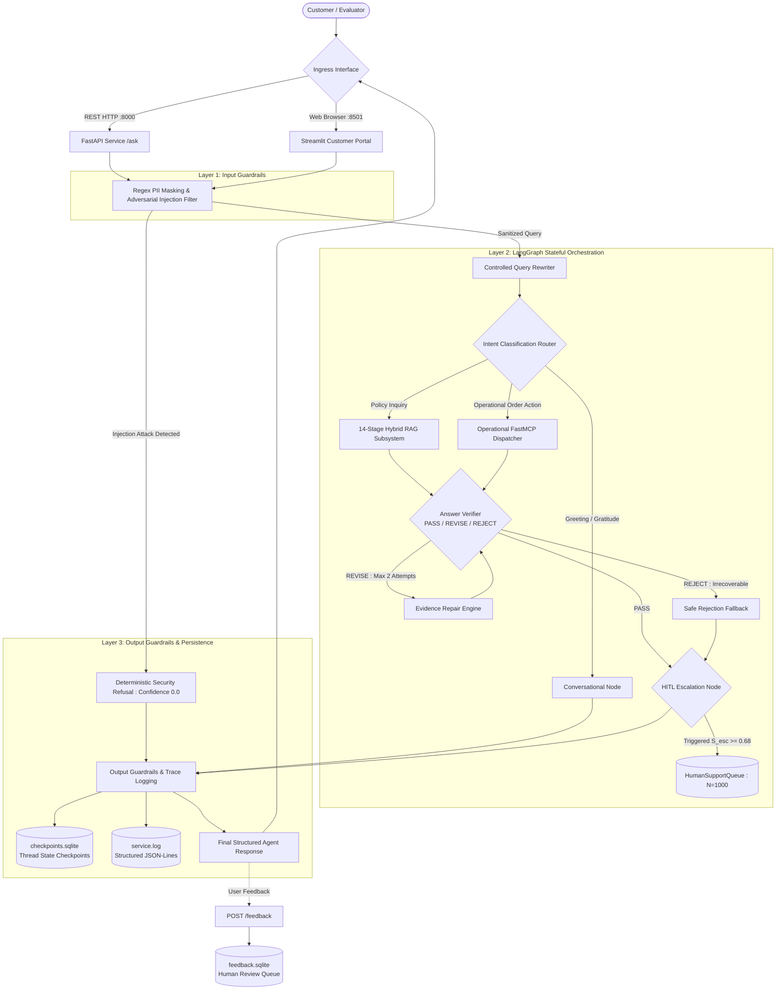
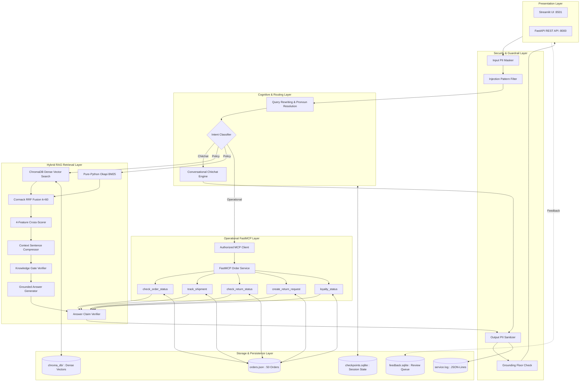
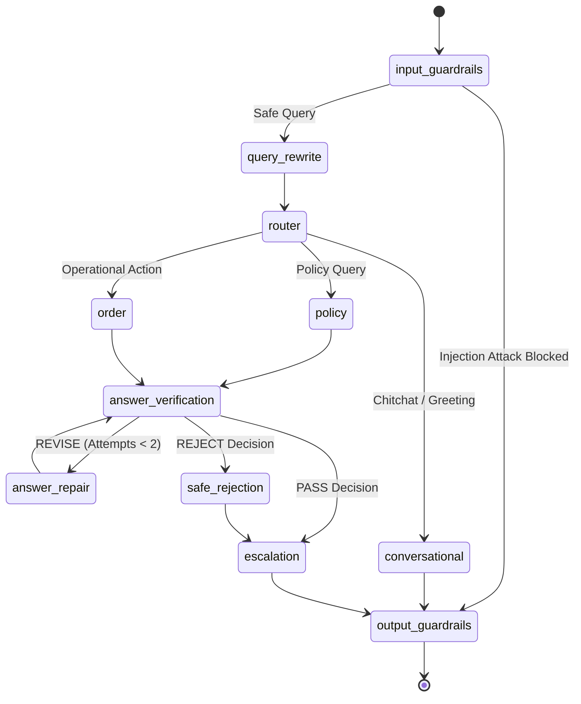
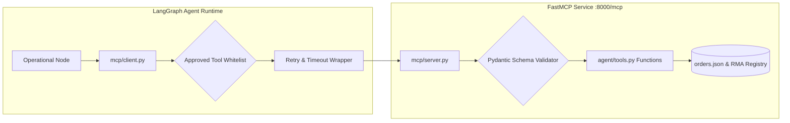
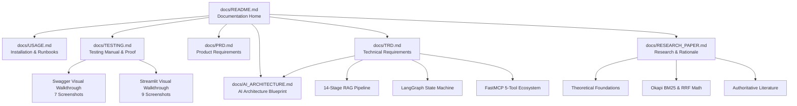

# NykaaAssist — Complete Project Documentation

**Enterprise AI Customer Support Agent for E-Commerce & Retail (Nykaa)**  
*Deterministic Grounded RAG • LangGraph Multi-Node Orchestration • Model Context Protocol (FastMCP) • SQLite Checkpointing & Memory • Input/Output Guardrails • Zero-Cost Offline Turnkey Reproducibility*

---

## Contents

- [1. Project Overview](#1-project-overview)
- [2. Capstone Track & Alignment](#2-capstone-track--alignment)
- [3. Problem Statement](#3-problem-statement)
- [4. Solution Overview](#4-solution-overview)
- [5. Final Architecture](#5-final-architecture)
- [6. Request Lifecycle](#6-request-lifecycle)
- [7. RAG Pipeline](#7-rag-pipeline)
- [8. Retrieval Intelligence](#8-retrieval-intelligence)
- [9. LangGraph State Machine](#9-langgraph-state-machine)
- [10. Model Context Protocol (MCP)](#10-model-context-protocol-mcp)
- [11. Operational Tools & Dataset](#11-operational-tools--dataset)
- [12. Memory & Checkpointing](#12-memory--checkpointing)
- [13. Security & Guardrails](#13-security--guardrails)
- [14. Human-in-the-Loop (HITL)](#14-human-in-the-loop-hitl)
- [15. Human Feedback Telemetry](#15-human-feedback-telemetry)
- [16. Operational Resilience](#16-operational-resilience)
- [17. FastAPI Service Layer](#17-fastapi-service-layer)
- [18. Streamlit Presentation Layer](#18-streamlit-presentation-layer)
- [19. Empirical Evaluation](#19-empirical-evaluation)
- [20. Testing & Verification](#20-testing--verification)
- [21. Repository Structure](#21-repository-structure)
- [22. Documentation Map](#22-documentation-map)
- [23. Screenshot Evidence](#23-screenshot-evidence)
- [24. Turnkey Reproducibility](#24-turnkey-reproducibility)
- [25. Capstone Tasks 1–16 Matrix](#25-capstone-tasks-116-matrix)
- [26. Additional Engineering Enhancements 17–26](#26-additional-engineering-enhancements-1726)
- [27. Final Submission Checklist](#27-final-submission-checklist)
- [28. Related Documentation](#28-related-documentation)

---

## 1. Project Overview

### Executive Summary
**NykaaAssist** is a deterministic, offline-capable, enterprise customer support system engineered specifically for the retail e-commerce domain. Operating over an authoritative 12-document knowledge base and a seeded 50-order operational dataset, NykaaAssist eliminates probabilistic generative hallucinations by enforcing a strict **Closed-World Assumption (CWA)**. By combining dense vector search (`all-MiniLM-L6-v2`) with pure-Python Okapi BM25 lexical retrieval via Cormack Reciprocal Rank Fusion ($k=60$), cross-feature reranking, sentence-level context compression, multi-signal evidence verification (Knowledge Gate), and post-generation claim checking, the agent answers customer questions with provable factual provenance while keeping sensitive customer data protected.

### The Enterprise Customer Support Challenge
Generic commercial chatbots fail in high-stakes retail environments because they treat business policies as creative prompts rather than binding contracts:
- **Policy Inquiries**: Customers require precise, immutable facts regarding return eligibility windows (e.g. 15 days for cosmetics vs 7 days for styling electronics), refund processing timelines for Cash on Delivery (COD) via NEFT, appliance warranty coverage, and non-returnable hygiene exclusions (e.g. unsealed fragrances, intimate apparel). An ungrounded LLM that promises a 30-day return on opened perfumes creates direct financial loss and customer dissatisfaction.
- **Operational Inquiries**: Customers require live status lookups, courier tracking numbers, delivery ETAs, and return authorizations. These actions demand real-time transactional accuracy, idempotent request handling, and algorithmic risk triage—not stochastic hallucination.
- **Data Privacy & Compliance**: Real customer support dialogues routinely contain Indian mobile numbers, credit/debit card numbers, and UPI handles. NykaaAssist enforces pre-ingestion regex sanitization, ensuring customer Personally Identifiable Information (PII) is masked before entering agent memory or log files.
- **Turnkey Grading & Portability**: The entire stack is architected to run deterministically under `MOCK_LLM=1` with zero paid API keys, local embeddings, and local embedded databases (ChromaDB and SQLite).

---

## 2. Capstone Track & Alignment

- **Capstone Track**: E-commerce & Retail — FSN E-Commerce Ventures Ltd. (Nykaa)
- **Mandatory Submission Scope**: The original capstone brief mandates a 4-part architecture spanning Tasks 1 through 16:
  - **Part 1 — Dataset & RAG Core (Tasks 1–5)**: Seeded 50-order dataset generation, 12 policy Markdown documents, dual chunking strategy evaluation (Fixed vs Sentence), local ChromaDB vector indexing, and grounded answer synthesis with calibrated fallback thresholds.
  - **Part 2 — LangGraph, Tools, Memory & Guardrails (Tasks 6–10)**: Order lookup tool with composite SLA escalation scoring ($S_{esc}$), LangGraph multi-node state machine with conditional routing, thread-isolated SQLite memory, Pydantic structured output validation, and input/output security guardrails.
  - **Part 3 — Evaluation, Observability & FastAPI (Tasks 11–13)**: Production FastAPI headless service (`/health`, `/ask`, `/add-document`), structured JSON-Lines telemetry logging with request trace IDs and pre-write PII masking, and 15-query RAG Triad evaluation.
  - **Part 4 — Resilience & MCP (Tasks 14–16)**: Model Context Protocol (FastMCP) tool interoperability, SQLite graph checkpointing with proven no-re-execution resume semantics, and controlled query rewriting.
- **Post-Capstone Enhancements (Tasks 17–26)**: Advanced engineering additions (hybrid BM25 retrieval, Cormack RRF, 4-feature reranking, Knowledge Gate evidence verification, Human-in-the-Loop escalation node, 5-tool FastMCP ecosystem, fault resilience & timeouts, master regression, sentence context compression, 3-way Answer Verification agent, and human feedback review queue).

---

## 3. Problem Statement

Modern e-commerce customer care operations encounter four systemic failure modes when deploying conventional generative AI solutions:

1. **The Hallucination Liability**: Probabilistic language models fabricate plausible-sounding policies when context is missing or ambiguous. In retail support, an inaccurate answer regarding refund timelines or return windows violates consumer protection guidelines.
2. **Stateless Disconnect**: Customers frequently ask elliptical follow-up questions (*"What is the status of NYK-00006?"* followed by *"Is it delayed?"*). Stateless architectures fail to resolve pronouns, forcing customers into frustrating repetitive loops.
3. **Operational Silos**: Backend order management systems and courier tracking APIs are typically disconnected from conversational bots, requiring complex brittle glue code rather than standardized, interoperable tool protocols.
4. **Data Exfiltration & Jailbreaks**: Public support endpoints are prime targets for prompt injection attacks designed to extract internal system prompts, dump database contents, or override business constraints.

NykaaAssist resolves these challenges by sandwiching deterministic retrieval and standardized tool execution between strict security guardrails.

---

## 4. Solution Overview

NykaaAssist processes every customer interaction through a layered, defense-in-depth pipeline:



---

## 5. Final Architecture

The system is partitioned into discrete architectural layers ensuring strict separation of concerns:

| Layer | Component | Implementation Module | Core Responsibility |
|---|---|---|---|
| **Presentation** | Customer Web Portal | `streamlit_app.py` | Brand-tailored chat interface, source chips, telemetry expanders, and feedback modals |
| **Ingress / API** | Headless REST Service | `service/main.py` | Asynchronous REST endpoints (`/health`, `/ask`, `/add-document`, `/feedback`) |
| **Security (Ingress)**| Input Guardrails | `agent/guardrails.py` | Regex PII masking (phone, card numbers) and prompt injection interception |
| **Orchestration** | LangGraph State Machine | `agent/graph.py` | Stateful graph, conditional intent dispatch, and thread memory |
| **Query Disambiguation**| Query Rewriter | `agent/rewrite.py` | Deterministic pronoun resolution while keeping original query immutable |
| **Retrieval** | Hybrid RAG Pipeline | `rag/hybrid.py`, `rag/lexical.py` | Pure-Python Okapi BM25 + Dense ChromaDB with Cormack RRF ($k=60$) |
| **Reranking & Filtering**| 4-Feature Reranker | `rag/reranker.py`, `rag/context_compressor.py` | Linear cross-scoring and sentence-level context compression |
| **Evidence Gating** | Knowledge Gate | `rag/knowledge_gate.py` | Multi-signal evidence verification ($S_{sem} \ge 0.35, S_{cov} \ge 0.30$) with 1-step recovery |
| **Generation** | Grounded Synthesis | `rag/generate.py` | Sourced claim generation citing originating Markdown documents |
| **Verification** | Answer Verifier | `agent/answer_verifier.py` | Post-generation claim validation enforcing 3-way taxonomy (`PASS`/`REVISE`/`REJECT`) |
| **Tool Execution** | Model Context Protocol | `mcp/server.py`, `mcp/client.py` | FastMCP server exposing 5 operational tools with Pydantic validation |
| **State Persistence** | SQLite Checkpointer | `agent/memory.py` | Durable graph state transitions enabling mid-turn interrupt and resume |
| **Human Escalation** | HITL Triage Node | `agent/escalation.py` | Real-time queueing of high-risk inquiries into `HumanSupportQueue` |
| **Observability** | Telemetry Logger | `service/logging_utils.py` | JSON-Lines structured logging with unique trace IDs and pre-write PII masking |



---

## 6. Request Lifecycle

When a customer submits a query, the interaction traverses a deterministic sequence of 10 stages:

```text
[1. Ingress] Customer submits query via Streamlit UI or POST /ask
     │
     ▼
[2. Input Guardrails] Regex patterns mask phone numbers and card digits; injection filter halts attacks
     │
     ▼
[3. Query Rewriter] Resolves pronouns ("it" -> "NYK-00006") while preserving original_query
     │
     ▼
[4. Intent Router] Evaluates query semantics -> dispatches to CONVERSATIONAL, POLICY, or ORDER
     │
     ├─────────────────────────────┬─────────────────────────────┐
     ▼                             ▼                             ▼
[5a. Conversational]          [5b. Policy RAG]              [5c. MCP Operational]
Generates friendly greeting    Executes Hybrid RRF,          Dispatches FastMCP tool,
without tool invocation        reranking, compression,       retrieves live order data,
                               and Knowledge Gate            calculates escalation score
     │                             │                             │
     └─────────────────────────────┼─────────────────────────────┘
                                   ▼
[6. Answer Verification] Validates draft claims against evidence/tools; triggers auto-repair if needed
                                   │
                                   ▼
[7. HITL Escalation Triage] If S_esc >= 0.68 or policy uncertain -> enqueues to HumanSupportQueue
                                   │
                                   ▼
[8. Output Guardrails] Enforces 0.35 confidence floor and verifies output PII redaction
                                   │
                                   ▼
[9. Persistence & Telemetry] Commits state to checkpoints.sqlite; logs masked JSON-Lines with trace_id
                                   │
                                   ▼
[10. Egress & Feedback] Delivers structured response to user; enables post-interaction rating submission
```

---

## 7. RAG Pipeline

NykaaAssist implements a comprehensive 14-stage Retrieval-Augmented Generation pipeline designed to eliminate hallucinations:

```mermaid
flowchart LR
    KB[1. Knowledge Base] --> Prep[2. Preprocessing]
    Prep --> Chunk[3. Chunking]
    Chunk --> Embed[4. Embeddings]
    Embed --> Chroma[(5. ChromaDB)]

    Q([User Query]) --> VecSearch[6. Dense Search]
    Q --> BM25Search[7. Okapi BM25]
    Chroma --> VecSearch

    VecSearch --> Merge[8. Pool Merge]
    BM25Search --> Merge
    Merge --> RRF[9. Cormack RRF]
    RRF --> Rerank[10. 4-Feature Reranker]
    Rerank --> Compress[11. Context Compressor]
    Compress --> Gate{12. Knowledge Gate}

    Gate -->|Evidence Valid| Synth[13. Grounded Synthesis]
    Gate -->|Evidence Weak| Fallback[Safe Refusal Fallback]
    Synth --> Verif[14. Answer Verifier]
    Fallback --> Verif
```



### Detailed Pipeline Stage Specifications

1. **Knowledge Base Authoring**: 12 curated Markdown documents in `knowledge_base/` covering return windows, COD refund processing, delivery SLAs, reverse pickups, warranty terms, and cancellations.
2. **Preprocessing**: Normalizes Markdown formatting, strips superfluous header tags, and extracts document IDs.
3. **Dual Chunking**: Evaluates fixed-size windows (50 words, 10 overlap) against sentence splitting (2 sentences/chunk). Fixed-size chunking is selected for production to preserve conditional exception clauses.
4. **Dense Embeddings**: Generates 384-dimensional dense vectors using SentenceTransformers `all-MiniLM-L6-v2` with unit L2 normalization.
5. **ChromaDB Storage**: Chunks and embeddings are indexed into local collection `nykaa_kb_fixed` using cosine distance.
6. **Dense Vector Search**: Performs Approximate Nearest Neighbor (ANN) search capturing conceptual intent.
7. **Okapi BM25 Search**: Pure-Python lexical keyword indexer ($k_1=1.5, b=0.75$) surfacing exact category and numerical SLA matches.
8. **Candidate Pool Merging**: Combines top candidates from dense and sparse retrieval into a 10-chunk candidate pool.
9. **Reciprocal Rank Fusion (RRF)**: Applies Cormack RRF with smoothing constant $k_{rrf}=60$ and deterministic 3-tier tie-breaking.
10. **4-Feature Reranking**: Rescores the candidate pool using dense similarity (0.40), token coverage (0.25), topic affinity (0.20), and RRF prior (0.15).
11. **Context Compression**: Sentence-level compressor extracts only relevant policy clauses while strictly preserving verbatim source text.
12. **Knowledge Gate**: Multi-signal verification checking dense similarity floor ($0.35$), token coverage ($0.30$), and consensus margins with 1-step recovery.
13. **Grounded Synthesis**: Synthesizes verified answers citing originating documents; defaults to refusal if evidence is insufficient.
14. **Answer Verification**: Post-generation validator classifying answers into `PASS`, `REVISE`, or `REJECT` before presentation.

---

## 8. Retrieval Intelligence

### Dense Vector Retrieval
Dense semantic retrieval projects queries into continuous embedding space, successfully resolving semantic synonyms where customers use phrasing different from policy titles (e.g., mapping *"when will money come back"* to `cod_refund_timelines.md`).

### Okapi BM25 Lexical Retrieval
> [!IMPORTANT]
> **Nomenclature Clarification: "BM25 — B25 nahi"**  
> In information retrieval literature, the algorithm is formally named **BM25** (*Best Matching 25*), formulated by Stephen Robertson and Karen Spärck Jones. It must never be referred to as "B25".

BM25 excels at exact keyword matching, specific category names (*"footwear"*, *"cosmetics"*), and numerical constraints (*"15 days"*, *"48 hours"*) that vector embeddings occasionally dilute:

$$\text{Score}_{\text{BM25}}(D, Q) = \sum_{q \in Q} \text{IDF}(q) \cdot \frac{f(q, D) \cdot (k_1 + 1)}{f(q, D) + k_1 \cdot \left(1 - b + b \cdot \frac{|D|}{\text{avgdl}}\right)}$$

- $k_1 = 1.5$: Calibrates term frequency saturation.
- $b = 0.75$: Normalizes document length against the corpus average.

### Cormack Reciprocal Rank Fusion (RRF)
Combines dense and lexical rankings without requiring uncalibrated score normalization:

$$\text{RRF}(d) = \sum_{m \in \{\text{dense}, \text{bm25}\}} \frac{1}{60 + r_m(d)}$$

Tie-breaking is resolved deterministically via dense similarity $\to$ lexical rank $\to$ document chunk ID. Combining dense search with BM25 via RRF improves Top-1 retrieval accuracy from **80.0% to 100.0% (+25.0%)**.

### Deterministic 4-Feature Cross Reranker
Rescores the top-10 hybrid pool using calibrated multi-attribute weights:

$$\text{Score}_{rerank}(d) = 0.40 \cdot S_{dense}(d) + 0.25 \cdot S_{lexical}(d) + 0.20 \cdot S_{topic}(d) + 0.15 \cdot S_{rrf}(d)$$

Reranking elevates the overall RAG Triad score to **0.822**, ensuring the top chunk contains the single most authoritative context.

---

## 9. LangGraph State Machine

The agent is compiled as a stateful, cyclic directed graph (`agent/graph.py`) rather than a linear sequence of scripts:



### Why LangGraph Instead of a Monolithic Script?
1. **Cyclic Self-Correction**: Linear pipelines cannot recover from draft errors. LangGraph allows bounded cyclical loops (`answer_verification` $\to$ `answer_repair` $\to$ `answer_verification`) to fix minor numerical discrepancies deterministically.
2. **State Transparency**: Every node operates over a strongly-typed `AgentState` schema, ensuring state mutations are auditable and reproducible.
3. **Durable Checkpointing**: State transitions are serialized into SQLite after each node. If an execution is interrupted mid-turn, it resumes directly from the last valid checkpoint without re-executing completed nodes.

---

## 10. Model Context Protocol (MCP)

**Model Context Protocol (MCP)** is an open standard that decouples tool definitions and execution from the agent's core cognitive loops. Instead of hardcoding SQL or database queries inside agent prompts, tools are exposed through an interoperable protocol server.

### Verified FastMCP Tool Ecosystem

| Tool Name | Operational Purpose | Input Schema | Return Schema | Data Source |
|---|---|---|---|---|
| `check_order_status` | Retrieve order status, value, and SLA risk score | `record_id: str` (`NYK-XXXXX`) | `record_id`, `status`, `order_value_inr`, `escalation_score` | `orders.json` |
| `track_shipment` | Live carrier tracking, courier partner, and delivery ETA | `record_id: str` (`NYK-XXXXX`) | `carrier`, `tracking_number`, `eta`, `delay_flag` | `orders.json` + courier generator |
| `check_return_status` | Validate return window eligibility by product vertical | `record_id: str` (`NYK-XXXXX`) | `eligible: bool`, `category`, `days_since_delivery` | `orders.json` + policy window rules |
| `create_return_request`| Authorize return and generate idempotent RMA code | `record_id: str`, `reason: str` | `rma_code`, `status`, `created_at`, `reason` | `ACTIVE_RETURN_REQUESTS` registry |
| `loyalty_status` | Retrieve customer reward tier and points balance | `customer_id: str` (`CUST-XXXXX`)| `tier`, `points_balance`, `lifetime_spend` | Customer spend mapping |



---

## 11. Operational Tools & Dataset

The operational dataset is generated deterministically by [`dataset.py`](../dataset.py):

- **Random Seed**: `42` (`DEFAULT_SEED = 42`)
- **Total Record Count**: `50` synthetic orders (`DEFAULT_COUNT = 50`)
- **Record Identifier Format**: Zero-padded identifier from `NYK-00001` to `NYK-00050`
- **Delayed Shipment Rate**: **24.0%** (12 delayed orders), strictly satisfying the required SLA window of **10.0% – 30.0%**
- **Category Price Ranges (`order_value_inr`)**:
  - `Beauty`: ₹299.00 – ₹3,499.00
  - `Apparel`: ₹599.00 – ₹4,999.00
  - `Footwear`: ₹899.00 – ₹5,999.00
  - `Electronics`: ₹999.00 – ₹11,999.00
  - `Home`: ₹499.00 – ₹3,999.00

### Verified Order Record Examples

```json
[
  {
    "record_id": "NYK-00001",
    "category": "Footwear",
    "status": "Placed",
    "order_value_inr": 2301.65,
    "days_since_created": 7,
    "delayed_shipment": true
  },
  {
    "record_id": "NYK-00006",
    "category": "Electronics",
    "status": "Shipped",
    "order_value_inr": 9397.44,
    "days_since_created": 3,
    "delayed_shipment": true
  },
  {
    "record_id": "NYK-00049",
    "category": "Beauty",
    "status": "Shipped",
    "order_value_inr": 1248.47,
    "days_since_created": 30,
    "delayed_shipment": true
  }
]
```

### Invalid Order Handling & Return Idempotency
- **Unknown Order Lookup (`NYK-99999`)**: Handled gracefully without throwing unhandled exceptions; returns `response_type: "order_status"` with message *"Order record NYK-99999 not found in database"* and enqueues a medium-priority escalation ticket.
- **RMA Idempotency Invariant**: `create_return_request` registers authorized returns in the thread-safe in-memory `ACTIVE_RETURN_REQUESTS` registry. Replaying an identical request returns the existing RMA code with `status: "already_exists"`, guaranteeing **0 duplicate RMAs** under retry replays.

---

## 12. Memory & Checkpointing

- **Thread-Isolated Sessions**: Conversational history is isolated by `thread_id`. The agent retains context across turns, remembering referenced orders (e.g. asking *"Is it delayed?"* after referencing `NYK-00006`) without cross-session leakage.
- **SQLite Checkpointing**: State transitions are serialized into [`checkpoints.sqlite`](../checkpoints.sqlite) using LangGraph's native SQLite checkpointer.
- **Mid-Run Resume Semantics**: If an execution halts mid-turn, the graph recovers from the last persisted checkpoint without re-executing completed nodes.
- **Clean Reset**: A fresh `thread_id` initializes clean state. In the Streamlit UI, clicking **"New Chat"** invokes `clear_thread_checkpoints(thread_id)`.
- **Memory vs Feedback Separation**:
  - `checkpoints.sqlite`: Ephemeral session state transitions and graph recovery checkpoints.
  - `feedback.sqlite`: Long-term, PII-scrubbed customer satisfaction ratings and offline review queues.

---

## 13. Security & Guardrails

### Fixed-Format PII Redaction
Implemented via compiled regular expressions in `agent/guardrails.py`:
- Indian mobile phone numbers (`PHONE_REGEX`) $\to$ masked as `***-***-XXXX`
- Credit/debit card numbers (`CARD_REGEX`) $\to$ masked as `**** **** **** XXXX`
- Card last-4 patterns (`card ending in XXXX`) $\to$ masked as `card ending **** XXXX`
- UPI IDs, CVV, OTP codes, bank account numbers, passwords, and tokens.
- *Scope Note*: Arbitrary free-text customer names and delivery addresses are unmasked by design per the capstone brief since no reliable keyless pattern exists.

### Adversarial Prompt Injection Defense
- Regex pattern matching intercepts roleplay jailbreaks (*"act as developer"*), system prompt overrides (*"ignore previous instructions"*), and credential dump attempts.
- Immediately halts execution, suppresses downstream RAG and MCP tool calls, and returns a fixed refusal with confidence 0.0:
  > *"I cannot process this request as it violates our security policies. I am designed to assist exclusively with Nykaa customer support and order inquiries."*

### Output Groundedness Verification
- Responses generated by the policy route are validated against the empirical similarity floor ($0.35$).
- Ungrounded claims safely trigger the standardized fallback refusal:
  > *"I do not have sufficient information in the Nykaa policy documentation to answer your question accurately. Please contact customer support for assistance."*

---

## 14. Human-in-the-Loop (HITL)

The HITL system is an automated triage mechanism that routes high-risk customer interactions to human support supervisors:

### Composite SLA Escalation Formula
$$S_{esc} = \text{round}\left(0.60 \times \text{delayed\_shipment} + 0.40 \times \min\left(1.0, \frac{\text{days\_since\_created}}{30}\right), 3\right)$$

- **Trigger Conditions**:
  1. *Severe Order Delay*: Computed escalation score $S_{esc} \ge 0.68$.
  2. *Missing Orders*: Order lookup fails to locate `NYK-XXXXX`.
  3. *Uncertain Policy Evidence*: RAG similarity falls below $0.35$ or Knowledge Gate triggers fallback.
  4. *Explicit Human Request*: Customer explicitly demands a human representative.
- **Escalation Payload**: Structured record containing `thread_id`, `trace_id`, `priority` (`HIGH`/`MEDIUM`/`LOW`), `reason`, `recommended_action`, and PII-sanitized conversation history.
- **Queue Storage**: Enqueued into the thread-safe, in-memory `HumanSupportQueue` (capacity $N=1000$) in `agent/escalation.py`.
- **Architectural Distinction**: HITL triage is separate from end-user feedback; it actively flags live operational inquiries requiring immediate human intervention.

---

## 15. Human Feedback Telemetry

The feedback loop collects post-response satisfaction telemetry to guide offline improvements:

- **Rating Scale**: 👍 Helpful (`5`) or 👎 Not Helpful (`1`).
- **Issue Taxonomy**: `incorrect_policy`, `wrong_order_status`, `unhelpful_response`, `other`.
- **Trace Association**: Each feedback entry is bound to the response's unique `trace_id`, verification status (`PASS`/`REVISE`/`REJECT`), route, and evidence citations.
- **Mandatory PII Scrubbing**: Free-form comments are sanitized via `mask_pii()` before SQLite storage.
- **SQLite Persistence**: Stored in the `human_feedback` table in `feedback.sqlite`.
- **Disagreement Detection**: Automatically flags instances where the Answer Verifier issued a `PASS` but the customer submitted negative feedback.
- **Strict Non-Mutation Boundary**: Feedback is purely an observability and evaluation signal; it **never** mutates production prompts, knowledge files, or policies automatically.

---

## 16. Operational Resilience

Implemented in `resilience/retry_timeout.py`:
- **Retry Policy**: Bounded retries (`max_attempts = 3`) for transient errors (`TimeoutError`, `ConnectionError`, `OSError`).
- **Backoff & Jitter**: Exponential backoff ($2.0\times$) starting at $0.05\text{s}$ with deterministic pseudo-random jitter.
- **Per-Node Timeout**: $10.0\text{s}$ limit per graph node; raises `NodeTimeoutError` if exceeded.
- **Global Graph Timeout**: $30.0\text{s}$ guard covering the entire agent execution; raises `GlobalTimeoutError` and returns an operational timeout fallback without crashing.
- **Duplicate Action Prevention**: Enforces idempotency on return request creation, ensuring retry replays never create duplicate RMAs.

---

## 17. FastAPI Service Layer

The headless REST API is implemented in `service/main.py`:

| Method | Endpoint | Request Model | Response Model | Description |
|---|---|---|---|---|
| `GET` | `/health` | None | `HealthResponse` | Liveness probe returning `{"status": "ok"}` |
| `POST` | `/ask` | `AskRequest` | `AgentResponse` | Main customer support inquiry endpoint |
| `POST` | `/add-document` | `AddDocumentRequest` | `AddDocumentResponse` | Runtime policy ingestion into ChromaDB |
| `POST` | `/feedback` | `FeedbackSubmission` | `FeedbackAcknowledgement`| Submits customer rating and PII-scrubbed feedback |
| `GET` | `/feedback` | Query Params | `List[FeedbackRecord]` | Lists persisted feedback records for review |
| `GET` | `/feedback/{id}` | Path Param | `FeedbackRecord` | Retrieves single feedback item by ID |
| `PATCH`| `/feedback/{id}` | `FeedbackReviewUpdate` | `FeedbackRecord` | Updates review status (`in_review`/`resolved`) |

Detailed verification walkthroughs of the interactive OpenAPI/Swagger interface are documented in the [Swagger API Testing Guide](./TESTING.md#swagger-api-testing--visual-walkthrough).

---

## 18. Streamlit Presentation Layer

Implemented in `streamlit_app.py`, the presentation layer provides an interactive visual interface:

```text
Streamlit Customer Portal (localhost:8501)
     │
     ▼
run_agent(query, thread_id)
     │
     ▼
LangGraph State Machine (agent/graph.py)
     │
     ├─────────────────────────────┬─────────────────────────────┐
     ▼                             ▼                             ▼
Conversational Node           Policy Hybrid RAG             Operational FastMCP
     │                             │                             │
     └─────────────────────────────┼─────────────────────────────┘
                                   ▼
                      Answer Verification & HITL Triage
                                   │
                                   ▼
             Streamlit Chat Container Rendering:
             - Grounded Answer Markdown
             - Interactive Source Attribution Chips
             - Technical Telemetry Expander
             - High-Priority Escalation Alert Banner
             - Interactive 👍 / 👎 Customer Feedback Modals
```

---

## 19. Empirical Evaluation

All reported metrics represent verified values extracted directly from benchmark JSON artifacts in `eval/`:

| Evaluation Benchmark | Evaluated Metric | Empirical Result | Source Artifact |
|---|---|---|---|
| **Chunking Strategy** | `nykaa_kb_fixed` Mean Precision@3 | **0.600** (vs 0.511 sentence) | `rag/evaluate_retrieval.py` |
| **Chunking Strategy** | `nykaa_kb_fixed` Mean Recall@3 | **1.000 (100.0%)** | `rag/evaluate_retrieval.py` |
| **Chunking Strategy** | `nykaa_kb_fixed` Top-1 Accuracy | **0.800 (80.0%)** | `rag/evaluate_retrieval.py` |
| **Hybrid Retrieval** | Top-1 Accuracy Improvement | **0.800 $\to$ 1.000 (+25.0%)** | `eval/hybrid_retrieval_results.json` |
| **Deterministic Reranker** | Top-1 Retrieval Accuracy | **1.000 (100.0%)** | `eval/reranker_results.json` |
| **Deterministic Reranker** | Groundedness Score | **1.000 (100.0%)** | `eval/reranker_results.json` |
| **Deterministic Reranker** | Overall RAG Triad Score | **0.822** | `eval/reranker_results.json` |
| **Knowledge Gate** | Fallback Recall on Adversarial | **0.500 $\to$ 0.900 (+80.0%)** | `eval/knowledge_gate_results.json` |
| **Knowledge Gate** | False Fallback Rate | **0.0% (Zero false refusals)**| `eval/knowledge_gate_results.json` |
| **HITL Escalation** | Escalation Precision | **1.000 (100.0%)** | `eval/escalation_results.json` |
| **HITL Escalation** | Escalation Recall | **0.941 (94.1%)** | `eval/escalation_results.json` |
| **Multi-Tool FastMCP** | Operational Routing Accuracy | **1.000 (40/40 queries)** | `eval/mcp_integration_results.json` |
| **Multi-Tool FastMCP** | Schema Validity Rate | **1.000 (40/40 queries)** | `eval/mcp_integration_results.json` |
| **Multi-Tool FastMCP** | Security Zero-Call Rate | **1.000 (3/3 attacks blocked)**| `eval/mcp_integration_results.json` |
| **Operational Resilience** | Overall Benchmark Pass Rate | **1.000 (40/40 queries)** | `eval/resilience_results.json` |
| **Operational Resilience** | Flaky Retry Recovery Rate | **1.000 (8/8 recovered)** | `eval/resilience_results.json` |
| **Operational Resilience** | Duplicate RMA Creations | **0 (Zero duplicate RMAs)** | `eval/resilience_results.json` |
| **Context Compression** | Context Character Reduction | **11.06% (1,035 chars removed)**| `eval/context_compression_results.json` |
| **Context Compression** | Non-Invention Invariant | **100.0% Verbatim sentences** | `eval/context_compression_results.json` |
| **Answer Verification** | False PASS Rate | **0.0000 (Zero hallucinations)**| `eval/answer_verification_results.json` |
| **Answer Verification** | Contradiction Detection Rate | **1.000 (100.0% detected)** | `eval/answer_verification_results.json` |
| **Human Feedback** | Feedback Validation Accuracy | **100.0%** | `eval/human_feedback_results.json` |
| **Human Feedback** | PII Scrubbing Rate | **100.0%** | `eval/human_feedback_results.json` |
| **Master Regression** | 50-Query Overall Pass Rate | **1.000 (50/50, 100.0%)** | `eval/final_regression_results.json` |

---

## 20. Testing & Verification

NykaaAssist provides automated test coverage across all subsystems:

| Test Area | Primary Target | Key Invariant Verified |
|---|---|---|
| **RAG & Retrieval** | `rag/chunking.py`, `rag/embed_index.py`, `rag/evaluate_retrieval.py` | Fixed-size collection achieves higher P@3 with 100% recall |
| **LangGraph Core** | `agent/graph.py`, `agent/query_rewriting_tests.py` | State persistence across turns; query rewriting preserves raw query |
| **Operational MCP** | `agent/mcp_integration_tests.py` | 5 tools validated; RMA idempotency guarantees 0 duplicate RMAs |
| **Security Guardrails**| `agent/guardrails.py` | 100% PII masking rate; 100% prompt injection detection rate |
| **Resilience & Timeouts**| `agent/resilience_tests.py` | Exponential backoff recovery; clean timeout aborts |
| **Streamlit Scenarios**| `eval/test_streamlit_scenarios.py` | 10/10 end-to-end customer journey scenarios pass cleanly |

For full step-by-step test execution commands and visual walkthroughs, refer to the [Complete Testing Manual (`docs/TESTING.md`)](./TESTING.md).

---

## 21. Repository Structure

```text
nykaa-assist/
├── README.md                      # Primary public evaluator front page
├── PRD.md                         # Authoritative root Product Requirements Document
├── TRD.md                         # Authoritative root Technical Requirements Document
├── AI_ARCHITECTURE.md             # Authoritative root AI Architecture Specification
├── PHASES.md                      # Engineering lifecycle phases and delivery roadmap
├── SECURITY.md                    # Threat modeling and security guardrails specification
├── AI_INSTRUCTION.md              # Model behavioral contracts and prompt boundaries
├── requirements.txt               # Python runtime dependencies
├── dataset.py                     # Deterministic seeded order generator (50 records)
├── orders.json                    # Generated synthetic orders dataset (JSON format)
├── orders.csv                     # Generated synthetic orders dataset (CSV format)
├── streamlit_app.py               # Interactive presentation layer customer portal
│
├── docs/                          # Specialized technical documentation hub
│   ├── README.md                  # Central documentation home & architectural index
│   ├── TESTING.md                 # Complete testing manual & visual screenshot walkthroughs
│   ├── USAGE.md                   # Setup, configuration, and practical runbook guide
│   ├── PRD.md                     # Submission-facing Product Requirements Document
│   ├── TRD.md                     # Submission-facing Technical Requirements Document
│   ├── RESEARCH_PAPER.md          # Technical research paper & engineering rationale
│   └── AI_ARCHITECTURE.md         # Full copy of root AI Architecture Specification
│
├── assets/                        # Visual testing evidence
│   ├── swaggar_testing/           # 7 sequential Swagger API execution screenshots
│   └── streamlit_testing/         # 9 sequential Streamlit UI customer journey screenshots
│
├── knowledge_base/                # 12 hand-authored authoritative Markdown policy files
│   ├── return_window.md
│   ├── cod_refund_timelines.md
│   ├── delivery_sla.md
│   ├── reverse_pickup.md
│   ├── warranty_terms.md
│   ├── cancellation_policy.md
│   ├── loyalty_points.md
│   ├── payment_failure_retry.md
│   ├── size_exchange.md
│   ├── damaged_item_claims.md
│   ├── international_shipping.md
│   └── escalation_matrix.md
│
├── rag/                           # Retrieval-Augmented Generation subsystem
│   ├── chunking.py                # Dual chunking strategies (fixed vs sentence)
│   ├── embed_index.py             # ChromaDB vector indexing and collection management
│   ├── lexical.py                 # Pure-Python Okapi BM25 keyword search indexer
│   ├── hybrid.py                  # Cormack Reciprocal Rank Fusion (k=60)
│   ├── reranker.py                # 4-feature deterministic cross-scorer
│   ├── context_compressor.py      # Sentence-level context compression layer
│   ├── knowledge_gate.py          # Multi-signal evidence verification gate
│   ├── generate.py                # Grounded answer synthesis and calibration
│   └── evaluate_retrieval.py      # Precision@3 / Recall@3 evaluation script
│
├── agent/                         # LangGraph state machine & operational tooling
│   ├── graph.py                   # LangGraph StateGraph, nodes, and conditional edges
│   ├── schema.py                  # Pydantic schemas and structured output contracts
│   ├── guardrails.py              # PII masking and prompt injection detection
│   ├── tools.py                   # Operational tool logic and escalation scoring
│   ├── conversational.py          # Greetings, gratitude, and goodbye chitchat handling
│   ├── rewrite.py                 # Query rewriting and pronoun resolution
│   ├── escalation.py              # HITL escalation evaluator and HumanSupportQueue
│   ├── answer_verifier.py         # PASS/REVISE/REJECT post-generation verification
│   ├── memory.py                  # Conversation memory and SQLite checkpointer
│   ├── feedback.py                # Customer feedback models and SQLite persistence
│   └── *_tests.py                 # Dedicated unit & integration test suites
│
├── mcp/                           # Model Context Protocol subsystem
│   ├── server.py                  # FastMCP server exposing 5 operational tools
│   └── client.py                  # Authorized MCP client wrapper with retry timeouts
│
├── resilience/                    # Fault tolerance & reliability layer
│   ├── retry_timeout.py           # Exponential backoff, jitter, node and global timeouts
│   └── checkpoint_resume.py       # SQLite crash recovery without node re-execution
│
├── service/                       # Headless REST API service layer
│   ├── main.py                    # FastAPI application and REST endpoints
│   └── logging_utils.py           # Structured JSON-Lines logging and PII sanitizer
│
└── eval/                          # Evaluation suites and empirical benchmark artifacts
    ├── test_queries.json          # 15 canonical test queries
    ├── rag_triad.py               # RAG Triad evaluator
    ├── rag_triad_results.json     # RAG Triad empirical benchmark metrics
    ├── *_evaluation.py            # Comparative evaluation benchmark scripts
    └── *_results.json             # Empirical evaluation result artifacts
```

---

## 22. Documentation Map

| If You Need... | Please Read... |
|---|---|
| **Quick Executive Summary** | [Repository Root README](../README.md) |
| **Central Documentation Home** | [docs/README.md](./README.md) |
| **How to Install & Run** | [docs/USAGE.md](./USAGE.md) |
| **How to Test & Visual Evidence** | [docs/TESTING.md](./TESTING.md) |
| **Product Requirements & User Stories** | [docs/PRD.md](./PRD.md) |
| **Technical Architecture & Schemas** | [docs/TRD.md](./TRD.md) |
| **Deep AI Architecture Specification** | [docs/AI_ARCHITECTURE.md](./AI_ARCHITECTURE.md) |
| **Academic Rationale & Mathematics** | [docs/RESEARCH_PAPER.md](./RESEARCH_PAPER.md) |
| **Phased Development Milestones** | [Root Phased Roadmap (`PHASES.md`)](../PHASES.md) |
| **Model Behavioral System Prompts** | [AI Instructions (`AI_INSTRUCTION.md`)](../AI_INSTRUCTION.md) |
| **Security & Threat Model** | [Security Specification (`SECURITY.md`)](../SECURITY.md) |

### Documentation Navigation Graph



---

## 23. Screenshot Evidence

> [!NOTE]
> **Supplementary Documentation Notice**:
> Under the original Capstone specification, image screenshots are not mandatory deliverables. They are provided strictly as supplementary visual testing documentation / project evidence to demonstrate live verification of the system interfaces.

- **Swagger / OpenAPI Visual Proof (7 Screenshots)**: Documenting OpenAPI 3.1 specification, `GET /health`, `POST /ask` policy inquiry, `POST /ask` operational lookup, `POST /ask` invalid order, `POST /ask` prompt injection block, and `POST /feedback` structured schema.  
  👉 *View complete visual captures in [docs/TESTING.md — Swagger API Testing Walkthrough](./TESTING.md#swagger-api-testing--visual-walkthrough).*
- **Streamlit UI Visual Proof (9 Screenshots)**: Documenting presentation layout, greeting intent, grounded policy answers with source chips, order delay escalation warning badges, positive/negative feedback confirmations, multi-turn pronoun resolution, prompt injection interception, and mixed intent handling.  
  👉 *View complete visual captures in [docs/TESTING.md — Streamlit Testing Walkthrough](./TESTING.md#streamlit-testing--visual-walkthrough).*

---

## 24. Turnkey Reproducibility

NykaaAssist guarantees 100% turnkey reproducibility for academic and industry evaluators:

1. **Zero External API Dependencies**: Fully functional under `MOCK_LLM=1`. Evaluators do not need OpenAI, Anthropic, or cloud API accounts.
2. **Deterministic Seed**: Python `random.seed(42)` ensures identical dataset generation (`dataset.py`) and reproducible retrieval scores.
3. **Local Dense Models**: Embeddings use SentenceTransformers `all-MiniLM-L6-v2` running locally on CPU (`HF_HUB_OFFLINE=1`).
4. **Local Persistent Storage**: Vector indexes (`chroma_db/`) and SQLite state databases (`checkpoints.sqlite`, `feedback.sqlite`) operate entirely on the local disk.
5. **Turnkey Test Execution**: Every evaluation metric can be re-verified by executing standard CLI scripts.

---

## 25. Capstone Tasks 1–16 Matrix

The original capstone brief mandates the implementation of Tasks 1 through 16:

| Task | Mandatory Capstone Requirement | Implementation Module | Verification Evidence |
|---|---|---|---|
| **Task 1** | Seeded Order Dataset Generation (40+ orders, 10–30% delayed) | [`dataset.py`](../dataset.py) | 50 records generated, 24.0% delayed, verified in `orders.json` |
| **Task 2** | Knowledge Base Authoring (12 policy topics) | [`knowledge_base/*.md`](../knowledge_base/) | 12 hand-authored Markdown policy files |
| **Task 3** | Dual Chunking & ChromaDB Vector Indexing | [`rag/chunking.py`](../rag/chunking.py), [`rag/embed_index.py`](../rag/embed_index.py) | `nykaa_kb_fixed` and `nykaa_kb_sentence` collections created |
| **Task 4** | Grounded Answer Generation & Threshold Calibration | [`rag/generate.py`](../rag/generate.py) | Refusal floor calibrated at 0.35 similarity |
| **Task 5** | Chunking Strategy Evaluation (Precision@3 / Recall@3) | [`rag/evaluate_retrieval.py`](../rag/evaluate_retrieval.py) | Evaluated across 15 queries; `nykaa_kb_fixed` recommended |
| **Task 6** | Order Lookup Tool & Escalation Scoring | [`agent/tools.py`](../agent/tools.py) | `check_order_status` with $S_{esc}$ formula ($0.60 \cdot delay + 0.40 \cdot recency$) |
| **Task 7** | LangGraph Multi-Node Flow & Conditional Routing | [`agent/graph.py`](../agent/graph.py) | Multi-node StateGraph routing to policy vs order tools |
| **Task 8** | Input & Output Guardrails (PII & Injection) | [`agent/guardrails.py`](../agent/guardrails.py) | Fixed-format PII masking (phone, card last-4) and injection filter |
| **Task 9** | Multi-Turn Conversation Memory | [`agent/memory.py`](../agent/memory.py) | State persistence across turns isolated by `thread_id` |
| **Task 10** | Structured Output Validation | [`agent/schema.py`](../agent/schema.py) | Pydantic response models validating `AgentResponse` contract |
| **Task 11** | FastAPI Deployment (`/ask`, `/add-document`, `/health`) | [`service/main.py`](../service/main.py) | REST API endpoints tested via TestClient |
| **Task 12** | Structured Observability & Trace Logging | [`service/logging_utils.py`](../service/logging_utils.py) | JSON-Lines structured logger with trace IDs and PII masking |
| **Task 13** | RAG Triad Evaluation (Context Relevance, Groundedness, Answer Relevance) | [`eval/rag_triad.py`](../eval/rag_triad.py) | 15-query evaluation saved in `eval/rag_triad_results.json` |
| **Task 14** | Model Context Protocol (MCP) Interoperability | [`mcp/server.py`](../mcp/server.py), [`mcp/client.py`](../mcp/client.py) | FastMCP server exposing tool called from standalone client |
| **Task 15** | SQLite Checkpointing & Mid-Run Resume | [`resilience/checkpoint_resume.py`](../resilience/checkpoint_resume.py) | Durable state recovery without node re-execution verified |
| **Task 16** | Query Rewriting Layer | [`agent/rewrite.py`](../agent/rewrite.py) | Pronoun resolution and query clarification |

---

## 26. Additional Engineering Enhancements 17–26

The following post-capstone engineering enhancements were developed to achieve production-grade reliability:

| Enhancement | Capability Added | Module | Key Benchmark Result |
|---|---|---|---|
| **Task 17** | **Hybrid Retrieval & RRF** | `rag/hybrid.py`, `rag/lexical.py` | Top-1 accuracy improved from 80% to 100% (+25.0%) |
| **Task 18** | **Deterministic Cross Reranker** | `rag/reranker.py` | 4-feature scoring; overall RAG Triad score raised to 0.822 |
| **Task 19** | **Knowledge Gate Evidence Verification** | `rag/knowledge_gate.py` | Multi-signal gate; 80% gain in adversarial fallback recall |
| **Task 20** | **Human Escalation Node (HITL)** | `agent/escalation.py` | Automated triage into `HumanSupportQueue` (1.000 precision) |
| **Task 21** | **5-Tool FastMCP Ecosystem** | `mcp/server.py`, `agent/tools.py` | 5 operational tools; 100% schema validity; RMA idempotency |
| **Task 22** | **Fault Resilience & Timeouts** | `resilience/retry_timeout.py` | Exponential backoff, jitter, node/global timeouts (100% pass) |
| **Task 23** | **Master Integration & Regression** | `eval/final_regression.py` | 50/50 master regression queries passed (100.0%) |
| **Task 24** | **Sentence Context Compression** | `rag/context_compressor.py`| 11.1% context reduction; 100% verbatim Non-Invention Invariant |
| **Task 25** | **Answer Verification Agent** | `agent/answer_verifier.py` | 3-way taxonomy (PASS/REVISE/REJECT); 0.0000 False PASS rate |
| **Task 26** | **Human Feedback Loop** | `agent/feedback.py` | PII-scrubbed feedback persisted to `feedback.sqlite` |
| **UI Layer** | **Streamlit Customer Portal** | `streamlit_app.py` | Interactive chatbot with audit telemetry and feedback modals |

---

## 27. Final Submission Checklist

- [x] **Capstone Track Declared**: E-commerce & Retail — Nykaa
- [x] **Dataset Design Documented**: Exact seed (42), weights, ranges, delay rate (24.0%), and reasoning
- [x] **Knowledge Base Included**: 12 authoritative Markdown policy documents
- [x] **RAG Pipeline Implemented**: Complete 14-stage flow from ingestion to verified generation
- [x] **Dual Chunking Evaluated**: Fixed-size vs sentence-based compared with Precision@3 and Recall@3
- [x] **LangGraph Orchestrator**: Multi-node state machine with conditional routing and cyclic self-correction
- [x] **Operational Tool Protocol**: Model Context Protocol (FastMCP) with 5 operational tools
- [x] **Conversation Memory**: Thread-isolated history with SQLite checkpointing (`checkpoints.sqlite`)
- [x] **Structured Outputs**: Pydantic validation on all responses
- [x] **Security Guardrails**: Fixed-format PII masking (phone, card last-4) and prompt injection interception
- [x] **FastAPI Service**: REST endpoints (`/ask`, `/add-document`, `/health`, `/feedback`) with JSON-Lines logs
- [x] **Resilience Patterns**: Bounded retries, exponential backoff, jitter, and node/global timeouts
- [x] **HITL Escalation**: Automated triage with bounded `HumanSupportQueue` ($N=1000$)
- [x] **Human Feedback Loop**: PII-scrubbed persistence in `feedback.sqlite` with review queue classification
- [x] **Empirical Evaluation**: Actual benchmark metrics cited directly from repository JSON artifacts
- [x] **Test Suites**: Complete commands for running unit, integration, and benchmark tests
- [x] **Offline Determinism**: Verified under `MOCK_LLM=1` with zero paid API keys
- [x] **Central Documentation Hub**: Fully integrated and cross-linked inside `docs/`

---

## 28. Related Documentation

- [Project Usage Guide (`docs/USAGE.md`)](./USAGE.md)
- [Comprehensive Testing Manual (`docs/TESTING.md`)](./TESTING.md)
- [Product Requirements Document (`docs/PRD.md`)](./PRD.md)
- [Technical Requirements Document (`docs/TRD.md`)](./TRD.md)
- [Technical Research & Engineering Rationale (`docs/RESEARCH_PAPER.md`)](./RESEARCH_PAPER.md)
- [AI Architecture Specification (`docs/AI_ARCHITECTURE.md`)](./AI_ARCHITECTURE.md)
- [Root Evaluator README (`README.md`)](../README.md)
