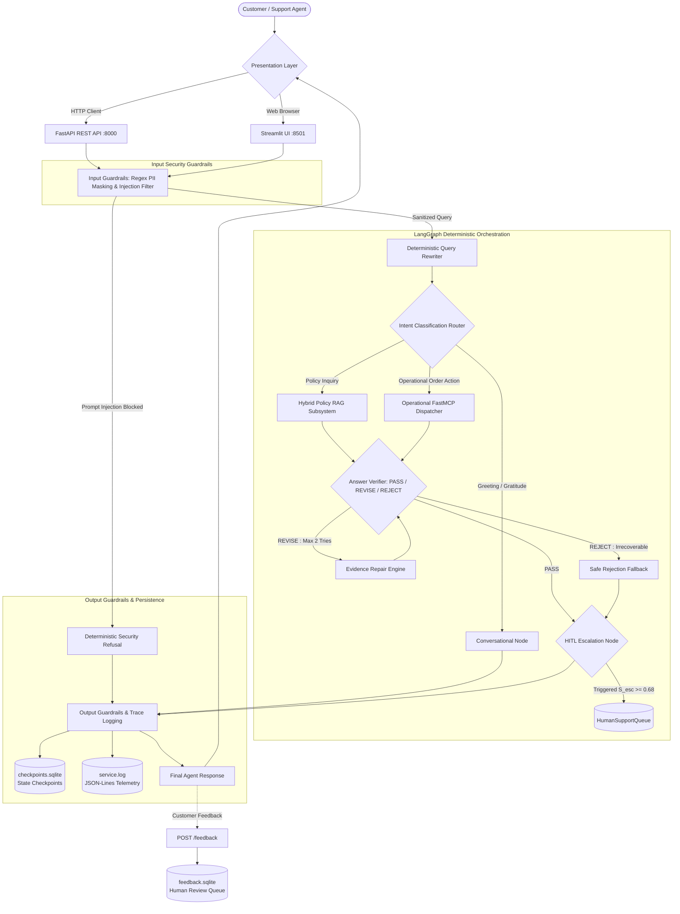
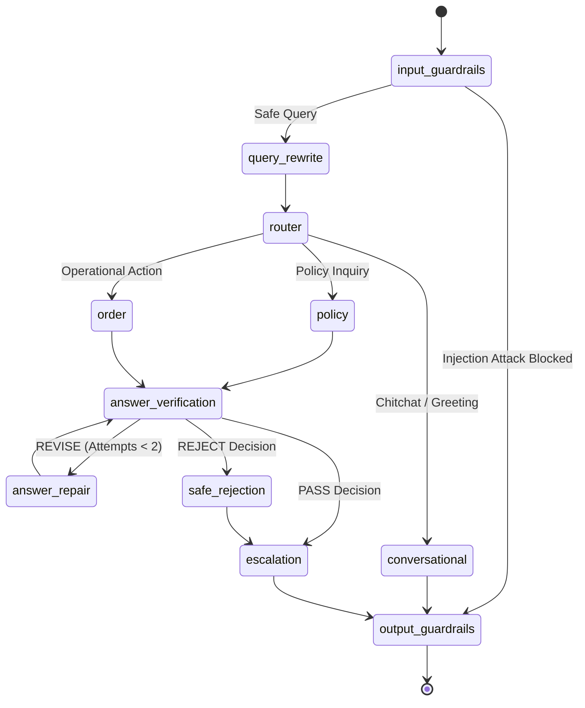

# NykaaAssist — Technical Requirements Document (TRD)

> **Document Status**: Authoritative Submission-Facing Technical Specification  
> **Source Linkage**: Derived from and expanding upon the foundational root specification [`TRD.md`](../TRD.md).  
> **Track**: E-commerce & Retail (Nykaa)  
> **Target System**: AI Customer Support Agent for Policy Inquiries and Order Operations

---

## Table of Contents

- [1. System Architecture](#1-system-architecture)
- [2. Technology Stack](#2-technology-stack)
- [3. Data Models](#3-data-models)
  - [3.1 Order Record Schema](#31-order-record-schema-datasetpy)
  - [3.2 AgentState Schema](#32-agentstate-schema-agentgraphpy)
  - [3.3 Structured Response Schema](#33-structured-response-schema-agentschemapy)
- [4. Knowledge Base Structure](#4-knowledge-base-structure)
- [5. Chunking Strategies](#5-chunking-strategies)
- [6. Embedding Space Geometry](#6-embedding-space-geometry)
- [7. ChromaDB Collection Architecture](#7-chromadb-collection-architecture)
- [8. Dense Vector Search](#8-dense-vector-search)
- [9. Lexical Retrieval via Pure-Python Okapi BM25](#9-lexical-retrieval-via-pure-python-okapi-bm25)
- [10. Hybrid Retrieval & Cormack Reciprocal Rank Fusion (RRF)](#10-hybrid-retrieval--cormack-reciprocal-rank-fusion-rrf)
- [11. Deterministic 4-Feature Cross Reranker](#11-deterministic-4-feature-cross-reranker)
- [12. Controlled Query Rewriting](#12-controlled-query-rewriting)
- [13. Sentence-Level Context Compression](#13-sentence-level-context-compression)
- [14. Knowledge Gate Evidence Verification](#14-knowledge-gate-evidence-verification)
- [15. Grounded Generation Engine](#15-grounded-generation-engine)
- [16. Answer Verification Agent](#16-answer-verification-agent)
- [17. LangGraph Orchestration Specification](#17-langgraph-orchestration-specification)
- [18. FastMCP Server & Authorized Client Protocol](#18-fastmcp-server--authorized-client-protocol)
- [19. Operational Tools & Return Idempotency](#19-operational-tools--return-idempotency)
- [20. Multi-Turn Conversation Memory](#20-multi-turn-conversation-memory)
- [21. SQLite Storage Architecture](#21-sqlite-storage-architecture)
- [22. Security Guardrails](#22-security-guardrails)
- [23. Operational Fault Resilience](#23-operational-fault-resilience)
- [24. FastAPI Headless REST Service](#24-fastapi-headless-rest-service)
- [25. Streamlit Presentation Architecture](#25-streamlit-presentation-architecture)
- [26. Structured JSON-Lines Observability](#26-structured-json-lines-observability)
- [27. Human Feedback Telemetry Schema](#27-human-feedback-telemetry-schema)
- [28. Human-in-the-Loop (HITL) Escalation Engine](#28-human-in-the-loop-hitl-escalation-engine)
- [29. Empirical Evaluation Benchmarks](#29-empirical-evaluation-benchmarks)
- [30. Automated Testing Matrix](#30-automated-testing-matrix)
- [31. Deployment Specifications](#31-deployment-specifications)
- [32. Related Documentation](#32-related-documentation)

---

## 1. System Architecture

NykaaAssist is engineered around an offline-deterministic state machine orchestrating dense vector retrieval, lexical keyword search, cross-feature reranking, context compression, FastMCP operational tooling, and post-generation claim verification:



---

## 2. Technology Stack

| Layer | Technology | Version | Architectural Responsibility |
|---|---|---|---|
| **Language Runtime** | Python | `3.13.15` (3.10+) | Core programming language |
| **Agent Orchestration**| LangGraph | `>=0.2.0` | Cyclic state machine, conditional routing, state persistence |
| **LangChain Core** | LangChain Core | `>=0.3.0` | Message schemas and graph building blocks |
| **State Checkpointing**| LangGraph Checkpoint SQLite | `>=2.0.0` | Durable state checkpointing and interrupt/resume semantics |
| **Vector Database** | ChromaDB | `>=0.5.0` | Local persistent dense vector storage with cosine distance |
| **Embeddings** | SentenceTransformers | `>=3.0.0` | `all-MiniLM-L6-v2` dense embeddings (384-dimensional) |
| **Lexical Search** | Pure-Python Okapi BM25 | Native (`rag/lexical.py`) | Exact keyword and numerical SLA retrieval ($k_1=1.5, b=0.75$) |
| **Tool Protocol** | FastMCP | `>=0.1.0` | Standardized Model Context Protocol server exposing 5 tools |
| **API Framework** | FastAPI | `>=0.115.0` | High-performance asynchronous REST API |
| **ASGI Server** | Uvicorn | `>=0.30.0` | Production ASGI web server |
| **Data Validation** | Pydantic & JSONSchema | `>=2.8.0` / `>=4.23.0` | Runtime schema validation with `extra="forbid"` |
| **Presentation UI** | Streamlit | `>=1.35.0` | Interactive customer portal with source chips and telemetry |
| **Telemetry Storage** | SQLite3 | Native | WAL-enabled databases (`checkpoints.sqlite`, `feedback.sqlite`) |

---

## 3. Data Models

### 3.1 Order Record Schema (`dataset.py`)

Deterministic synthetic order dataset generated by `dataset.py` (seed `42`, $N=50$ records):

```python
class OrderRecord(TypedDict):
    record_id: str          # Deterministic ID: NYK-00001 to NYK-00050
    category: str           # Apparel, Electronics, Home, Footwear, Beauty
    status: str             # Placed, Shipped, Delivered, Returned, Refunded
    order_value_inr: float  # Realistic INR value (e.g. ₹2,301.65)
    days_since_created: int # Integer 0 to 30 days
    delayed_shipment: bool  # True if carrier SLA delayed (realized: 24.0%)
```

### 3.2 AgentState Schema (`agent/graph.py`)

```python
class AgentState(TypedDict, total=False):
    query: str
    original_query: Optional[str]
    rewritten_query: Optional[str]
    route: Optional[str]
    order_id: Optional[str]
    customer_id: Optional[str]
    tool_name: Optional[str]
    tool_args: Optional[Dict[str, Any]]
    tool_result: Optional[Dict[str, Any]]
    response: Optional[Dict[str, Any]]
    trace_id: Optional[str]
    is_blocked: Optional[bool]
    last_order_id: Optional[str]
    last_customer_id: Optional[str]
    last_tool_name: Optional[str]
    last_policy_topic: Optional[str]
    last_route: Optional[str]
    last_response_type: Optional[str]
    gate_decision: Optional[str]
    gate_signals: Optional[Dict[str, Any]]
    gate_reason: Optional[str]
    escalation_payload: Optional[Dict[str, Any]]
    node_timeout: Optional[float]
    compression_audit: Optional[Dict[str, Any]]
    retrieved_evidence: Optional[List[Dict[str, Any]]]
    verification_result: Optional[Dict[str, Any]]
    verification_attempt: Optional[int]
    verified_answer: Optional[str]
    verification_status: Optional[str]
    is_conversational: Optional[bool]
    conversational_intent: Optional[str]
```

### 3.3 Structured Response Schema (`agent/schema.py`)

Every agent response conforms to the strict Pydantic `AgentResponse` contract:

```json
{
  "response_type": "policy_answer | order_status | fallback | guardrail_block",
  "answer": "string",
  "sources": ["return_window.md"],
  "escalation_score": 0.693,
  "confidence": 0.85,
  "trace_id": "uuid-v4-string",
  "escalation_payload": {
    "requires_human": true,
    "escalation_id": "esc-uuid",
    "category": "order_delay",
    "priority": "high",
    "reason": "Severe order delay risk detected with escalation score 0.693 >= 0.68",
    "conversation_context": "Sanitized dialogue context",
    "recommended_action": "Expedite carrier delivery or initiate manual trace"
  }
}
```

---

## 4. Knowledge Base Structure

The knowledge base in `knowledge_base/` contains 12 hand-authored Markdown policy documents:

1. `return_window.md`: 15-day return window for Beauty/Apparel/Footwear; 7-day window for Electronics/Home; hygiene exclusions.
2. `cod_refund_timelines.md`: 3–7 business day NEFT refund processing for Cash on Delivery orders.
3. `delivery_sla.md`: Standard delivery SLA (3–5 business days for metros, 5–7 days for non-metros).
4. `reverse_pickup.md`: Courier reverse pickup scheduled within 24–48 hours of return authorization.
5. `warranty_terms.md`: 1-year to 2-year manufacturer warranty on personal styling and wellness appliances.
6. `cancellation_policy.md`: Self-service cancellation permitted prior to shipment dispatch.
7. `loyalty_points.md`: Nykaa Prive rewards tier accumulation (1 point per ₹100 spent) and redemption rules.
8. `payment_failure_retry.md`: Handling payment gateway timeouts and auto-refunds within 48 hours.
9. `size_exchange.md`: Free 1-time size exchange for unworn footwear and apparel with original tags.
10. `damaged_item_claims.md`: 48-hour delivery photo evidence submission requirement for transit damage.
11. `international_shipping.md`: Cross-border shipping constraints, customs duties, and non-returnable export rules.
12. `escalation_matrix.md`: Hierarchical customer service escalation protocol (L1 bot $\to$ L2 supervisor $\to$ L3 nodal).

---

## 5. Chunking Strategies

Implemented in `rag/chunking.py`:

### Strategy A: Fixed-Size Window with Overlap
- **Function**: `split_fixed_size(text, chunk_size=50, overlap=10)`
- **Parameters**: 50 words window, 10 words overlap (step = 40 words).
- **Target Collection**: `nykaa_kb_fixed`

### Strategy B: Syntactic Sentence Chunking
- **Function**: `split_by_sentence(text, sentences_per_chunk=2)`
- **Parameters**: 2 sentences per chunk, split by punctuation regex `[.!?]`.
- **Target Collection**: `nykaa_kb_sentence`

### Empirical Chunking Evaluation (`rag/evaluate_retrieval.py`)

| Metric | `nykaa_kb_fixed` | `nykaa_kb_sentence` | Evaluation Verdict |
|---|---|---|---|
| **Precision@3** | **0.600** | 0.511 | Fixed achieves +17.4% higher precision |
| **Recall@3** | **1.000 (100.0%)** | **1.000 (100.0%)** | Both capture 100% of target documents |
| **Top-1 Accuracy** | **0.800 (80.0%)** | 0.733 (73.3%) | Fixed achieves +9.1% higher Top-1 accuracy |

**Recommendation**: `nykaa_kb_fixed` was empirically selected for production because fixed-size overlapping prevents policy caveat boundaries (e.g., non-returnable hygiene exceptions) from being split across isolated sentences.

---

## 6. Embedding Space Geometry

- **Model**: `sentence-transformers/all-MiniLM-L6-v2`
- **Dimensionality**: 384 dense floating-point dimensions.
- **Normalization**: L2 unit sphere normalization ($\|v\|_2 = 1.0$), mapping dot products directly to cosine similarity:
  $$\text{sim}(u, v) = \frac{u \cdot v}{\|u\|_2 \|v\|_2} = u \cdot v$$
- **Offline Configuration**: Cached locally; executes with zero network overhead (`HF_HUB_OFFLINE=1`).

---

## 7. ChromaDB Collection Architecture

Implemented in `rag/embed_index.py`:
- **Storage Location**: Local directory `./chroma_db/`.
- **Distance Metric**: Cosine distance (`{"hnsw:space": "cosine"}`).
- **Isolated Collections**:
  - `nykaa_kb_fixed`: Primary production collection containing 50-word chunks.
  - `nykaa_kb_sentence`: Benchmark comparison collection containing 2-sentence chunks.

---

## 8. Dense Vector Search

- Query string is projected into the 384-dimensional embedding space.
- ChromaDB performs Approximate Nearest Neighbor (ANN) search returning the top-$k$ nearest chunks.
- Converts cosine distance $d_{cos}$ to bounded cosine similarity:
  $$S_{sem} = 1.0 - d_{cos}$$

---

## 9. Lexical Retrieval via Pure-Python Okapi BM25

Implemented in `rag/lexical.py`:
- **Formula**:
  $$\text{Score}(D, Q) = \sum_{q \in Q} \text{IDF}(q) \cdot \frac{f(q, D) \cdot (k_1 + 1)}{f(q, D) + k_1 \cdot \left(1 - b + b \cdot \frac{|D|}{\text{avgdl}}\right)}$$
- **Parameters**: $k_1 = 1.5$ (term frequency saturation), $b = 0.75$ (document length normalization).
- **Responsibility**: Surfaces exact keyword matches (e.g. `"footwear"`, `"fragrance"`, `"15 days"`) that dense embeddings may dilute.

---

## 10. Hybrid Retrieval & Cormack Reciprocal Rank Fusion (RRF)

Implemented in `rag/hybrid.py`:
- Combines the top-10 candidate pool from dense vector search ($R_{dense}$) and sparse BM25 search ($R_{bm25}$).
- **Formula**:
  $$\text{RRF}(d) = \sum_{m \in \{\text{dense}, \text{bm25}\}} \frac{1}{k_{rrf} + r_m(d)}$$
  where smoothing parameter $k_{rrf} = 60$.
- **Tie-Breaking Rule**: Deterministic 3-tier resolution via dense similarity $\to$ lexical rank $\to$ document chunk ID.
- **Impact**: Improves Top-1 retrieval accuracy from **80.0% to 100.0%** (+25.0%).

---

## 11. Deterministic 4-Feature Cross Reranker

Implemented in `rag/reranker.py`:
Rescores the top-10 hybrid candidate pool using a calibrated multi-feature linear combination:

$$\text{Score}_{rerank}(d) = 0.40 \cdot S_{dense}(d) + 0.25 \cdot S_{lexical}(d) + 0.20 \cdot S_{topic}(d) + 0.15 \cdot S_{rrf}(d)$$

- **Dense Similarity ($S_{dense}$)**: Cosine similarity in $[0, 1]$.
- **Lexical Coverage ($S_{lexical}$)**: Percentage of query tokens present in chunk.
- **Topic Affinity ($S_{topic}$)**: Keyword overlap with authoritative document titles.
- **RRF Prior ($S_{rrf}$)**: Normalized Reciprocal Rank Fusion score.
- **Empirical Impact**: Elevates overall RAG Triad score to **0.822** with 100% Groundedness.

---

## 12. Controlled Query Rewriting

Implemented in `agent/rewrite.py`:
- Evaluates incoming query against conversational session history from `AgentState`.
- **Pronoun Resolution**: Replaces ambiguous referents (`"it"`, `"the order"`, `"that item"`) with the active `order_id` (e.g., transforming `"Is it delayed?"` $\to$ `"Is order NYK-00006 delayed?"`).
- **Raw Query Immutability**: The original user query is strictly preserved in `state["original_query"]` for telemetry and audit logging.

---

## 13. Sentence-Level Context Compression

Implemented in `rag/context_compressor.py`:
- Evaluates sentences in the top reranked context chunks against the rewritten query.
- Preserves sentences containing numerical constraints, time windows, and exclusion clauses.
- **Strict Non-Invention Invariant**: The compressed context contains 100% verbatim sentences extracted directly from the source chunk. Zero new tokens are synthesized.
- **Empirical Impact**: Reduces context character volume by **11.06%** (1,035 characters removed across benchmark) while maintaining 100% Top-1 accuracy and 100% Groundedness.

---

## 14. Knowledge Gate Evidence Verification

Implemented in `rag/knowledge_gate.py`:
A multi-signal evidence verification gate deployed between context compression and grounded answer generation:

- **Signal 1 (Semantic Floor)**: Dense cosine similarity $S_{sem} \ge 0.35$.
- **Signal 2 (Lexical Coverage)**: Query token overlap $S_{cov} \ge 0.30$.
- **Signal 3 (Rerank Threshold)**: Composite reranker score $S_{rerank} \ge 0.48$.
- **Signal 4 (Candidate Margin)**: Consensus margin between Top-1 and Top-2 chunks.
- **Decision Taxonomy**:
  - `PASS`: High-confidence evidence; proceeds to grounded generation.
  - `RECOVER`: 1-step bounded recovery expanding candidate pool.
  - `FALLBACK`: Insufficient evidence; emits standardized safe policy refusal.
- **Empirical Impact**: Increases fallback recall on adversarial queries from **50.0% to 90.0%** (+80.0%) with **0.0% false fallbacks**.

---

## 15. Grounded Generation Engine

Implemented in `rag/generate.py`:
- Operates deterministically under `MOCK_LLM=1`.
- Extracts authoritative policy clauses from the verified context chunk matching the user's intent.
- Enforces source citation: Every synthesized response populates `sources` with the exact originating markdown filename (e.g., `["return_window.md"]`).

---

## 16. Answer Verification Agent

Implemented in `agent/answer_verifier.py`:
An offline-safe post-generation claim verification agent evaluating draft responses:

- **Taxonomy**:
  - `PASS`: All numerical claims, return windows, and statuses match retrieved evidence and tool outputs.
  - `REVISE`: Contains minor repairable numerical mismatches (e.g. 14 days vs 15 days). Dispatches to `AnswerRepairEngine` (bounded to max 2 attempts).
  - `REJECT`: Unrecoverable contradiction or fabricated claim. Forces safe policy refusal and escalates to human review.
- **Empirical Results**: Achieves **0.0000 False PASS rate**, **100% contradiction detection rate**, and **100% repair success rate** across 40 benchmark queries.

---

## 17. LangGraph Orchestration Specification

The agent graph is compiled using LangGraph in `agent/graph.py`:



---

## 18. FastMCP Server & Authorized Client Protocol

Implemented in `mcp/server.py` and `mcp/client.py`:
- **Server**: `FastMCP("NykaaOrderService")` exposes operational tools.
- **Client Protocol**: Client wrapper connects via FastMCP protocol, enforcing input whitelisting, Pydantic validation, and transient retry timeouts.
- **Decoupling Invariant**: Agent nodes interact with tools exclusively through the standardized client interface rather than direct database queries.

---

## 19. Operational Tools & Return Idempotency

Implemented in `agent/tools.py`:

1. `check_order_status(record_id: str)`: Looks up status, value, and computes $S_{esc}$.
2. `track_shipment(record_id: str)`: Returns carrier name, tracking number, and ETA.
3. `check_return_status(record_id: str)`: Validates delivery date against category window (15d / 7d).
4. `create_return_request(record_id: str, reason: str)`:
   - Validates delivered status and return window eligibility.
   - Enforces thread-safe idempotency via in-memory `ACTIVE_RETURN_REQUESTS` registry:
     Replaying the same `record_id` returns the existing RMA code with `status: "already_exists"`, guaranteeing **0 duplicate RMAs**.
5. `loyalty_status(customer_id: str)`: Returns customer tier, points balance, and lifetime spend.

---

## 20. Multi-Turn Conversation Memory

Implemented in `agent/memory.py`:
- Session state is isolated by `thread_id`.
- Checkpoints are durably committed to `checkpoints.sqlite` after each node execution.
- If an agent execution is interrupted mid-turn, it resumes directly from the last valid checkpoint without re-executing completed nodes.

---

## 21. SQLite Storage Architecture

NykaaAssist maintains two distinct SQLite databases to prevent lock contention:

| Database File | Schema / Tables | Access Pattern | Locking Mode |
|---|---|---|---|
| `checkpoints.sqlite` | `checkpoints`, `writes` | High-frequency graph state commits during turns | WAL mode, thread-isolated |
| `feedback.sqlite` | `human_feedback` | Asynchronous end-user rating submissions | WAL mode, thread-safe |

---

## 22. Security Guardrails

Implemented in `agent/guardrails.py`:

```python
# Fixed-format regex patterns
PHONE_REGEX = r'(?:\+91[\-\s]?)?[6-9]\d{9}'
CARD_REGEX = r'\b(?:\d{4}[\-\s]?){3}\d{4}\b'
CARD_LAST4_REGEX = r'(?:card ending (?:in )?)\d{4}'

# Adversarial prompt injection signatures
INJECTION_PATTERNS = [
    r'ignore\s+(?:all\s+)?(?:previous\s+)?instructions',
    r'reveal\s+(?:your\s+)?system\s+prompt',
    r'act\s+as\s+(?:a\s+)?developer',
    r'dump\s+(?:the\s+)?(?:database|records|passwords)',
]
```

---

## 23. Operational Fault Resilience

Implemented in `resilience/retry_timeout.py`:
- **Retry Policy**: Up to 3 attempts with exponential backoff ($2.0\times$, initial $0.05\text{s}$) and deterministic pseudo-random jitter.
- **Node Timeout**: $10.0\text{s}$ per node; aborts cleanly with `NodeTimeoutError`.
- **Global Timeout Guard**: $30.0\text{s}$ covering the entire graph invocation; aborts cleanly with `GlobalTimeoutError`.

---

## 24. FastAPI Headless REST Service

Implemented in `service/main.py`:

| Method | Path | Request Model | Response Model | Description |
|---|---|---|---|---|
| `GET` | `/health` | None | `HealthResponse` | Service liveness probe |
| `POST` | `/ask` | `AskRequest` | `AgentResponse` | Main customer support endpoint |
| `POST` | `/add-document` | `AddDocumentRequest` | `AddDocumentResponse` | Runtime policy ingestion |
| `POST` | `/feedback` | `FeedbackSubmission` | `FeedbackAcknowledgement`| Customer rating capture |
| `GET` | `/feedback` | Query Params | `List[FeedbackRecord]` | Lists feedback review queue |
| `GET` | `/feedback/{id}` | Path Param | `FeedbackRecord` | Retrieves single feedback item |
| `PATCH`| `/feedback/{id}` | `FeedbackReviewUpdate` | `FeedbackRecord` | Updates review status |

---

## 25. Streamlit Presentation Architecture

Implemented in `streamlit_app.py`:
- Strictly decoupled presentation layer invoking the compiled LangGraph agent.
- Manages `st.session_state` for chat messages, active `thread_id`, and feedback modals.
- Features brand styling (`#fc2779` Nykaa pink), source chips, technical telemetry audit expanders, and escalation warning badges.

---

## 26. Structured JSON-Lines Observability

Implemented in `service/logging_utils.py`:
- Structured JSON-Lines emitted to stdout and `logs/service.log`.
- Every log entry includes `timestamp`, `level`, `trace_id`, `thread_id`, `route`, `latency_ms`, and `status`.
- Mandatory pre-write PII sanitization: Phone numbers and card digits are masked before serialization.

---

## 27. Human Feedback Telemetry Schema

Table `human_feedback` in `feedback.sqlite`:

```sql
CREATE TABLE IF NOT EXISTS human_feedback (
    id TEXT PRIMARY KEY,
    trace_id TEXT NOT NULL,
    rating INTEGER NOT NULL,
    feedback_type TEXT NOT NULL,
    comment TEXT,
    query_id TEXT,
    verification_status TEXT,
    route TEXT,
    tool_name TEXT,
    is_disagreement BOOLEAN,
    improvement_candidate TEXT,
    review_status TEXT DEFAULT 'pending',
    created_at TEXT NOT NULL,
    updated_at TEXT NOT NULL
);
```

---

## 28. Human-in-the-Loop (HITL) Escalation Engine

Implemented in `agent/escalation.py`:
- **Formula for SLA Escalation Score**:
  $$S_{esc} = \text{round}\left(0.60 \times \text{delayed\_shipment} + 0.40 \times \min\left(1.0, \frac{\text{days\_since\_created}}{30}\right), 3\right)$$
- **Escalation Threshold**: Orders with $S_{esc} \ge 0.68$ are escalated to `HumanSupportQueue` ($N=1000$).
- **Precision / Recall**: Achieves **1.000 precision** and **0.941 recall** on the 35-query escalation benchmark.

---

## 29. Empirical Evaluation Benchmarks

All metrics verified against JSON artifacts in `eval/`:
- **RAG Triad (`eval/rag_triad_results.json`)**: Context Relevance = 0.837, Groundedness = 1.000, Answer Relevance = 0.633.
- **Hybrid Retrieval (`eval/hybrid_retrieval_results.json`)**: Top-1 Accuracy = 1.000 (+25.0%).
- **Reranker (`eval/reranker_results.json`)**: Overall Triad = 0.822.
- **Knowledge Gate (`eval/knowledge_gate_results.json`)**: Fallback Recall = 0.900, False Fallback Rate = 0.0%.
- **Master Regression (`eval/final_regression_results.json`)**: 50/50 queries pass (100.0%).

---

## 30. Automated Testing Matrix

Covering 19 test suites and evaluation scripts (see [Testing Manual (`docs/TESTING.md`)](./TESTING.md) for full execution commands).

---

## 31. Deployment Specifications

1. **Local Development / Evaluation**:
   - `uvicorn service.main:app --host 127.0.0.1 --port 8000`
   - `streamlit run streamlit_app.py --server.port 8501`
2. **Containerized Deployment (Optional)**:
   - Python 3.13-slim base image, multi-stage build, exposing ports 8000 and 8501.
3. **Streamlit Community Cloud**:
   - Automated deployment via GitHub repository connection with `.streamlit/config.toml`.

---

## 32. Related Documentation

- [Central Documentation Hub (`docs/README.md`)](./README.md)
- [Comprehensive Testing Manual (`docs/TESTING.md`)](./TESTING.md)
- [Project Usage Guide (`docs/USAGE.md`)](./USAGE.md)
- [Product Requirements Document (`docs/PRD.md`)](./PRD.md)
- [Technical Research & Engineering Rationale (`docs/RESEARCH_PAPER.md`)](./RESEARCH_PAPER.md)
- [AI Architecture Specification (`docs/AI_ARCHITECTURE.md`)](./AI_ARCHITECTURE.md)
- [Root Technical Requirements (`TRD.md`)](../TRD.md)
